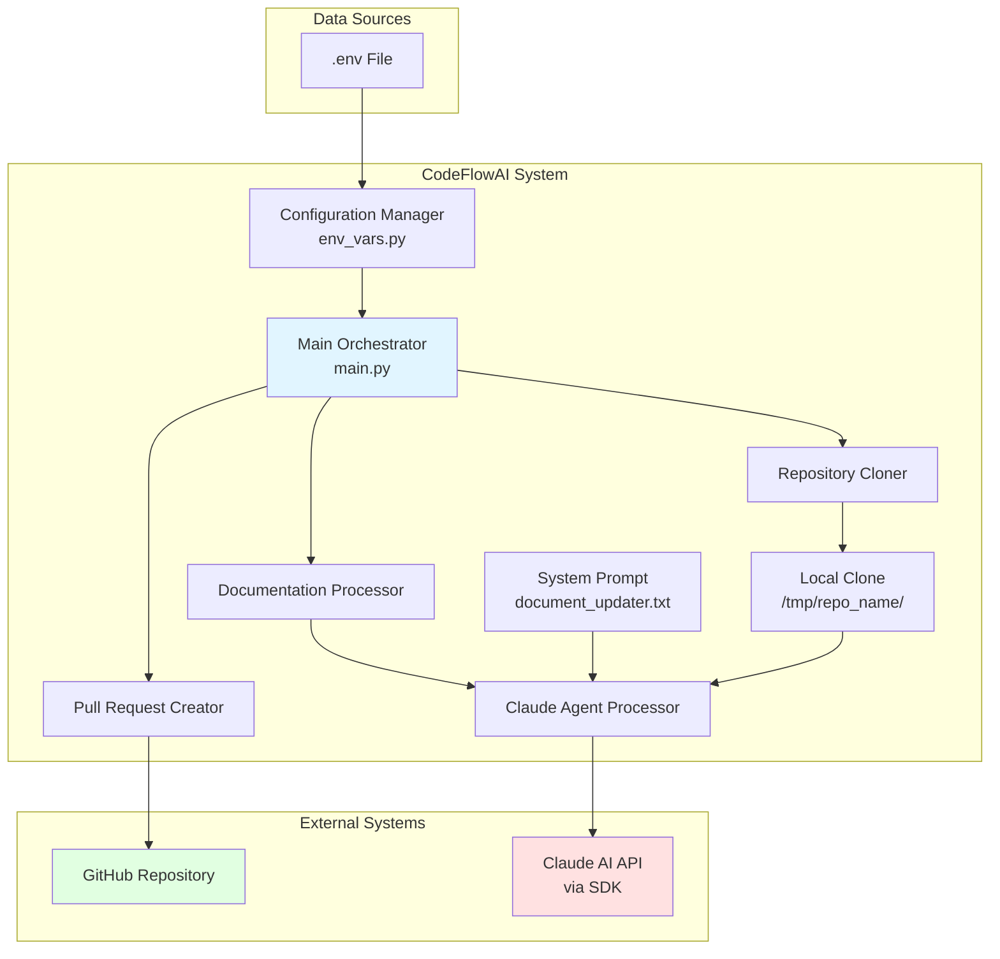
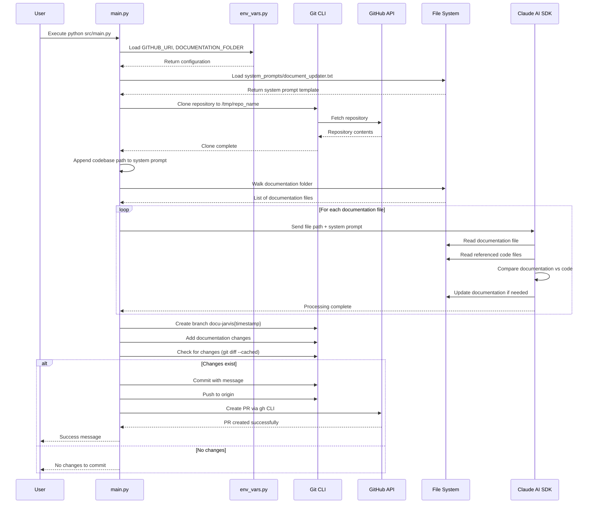

# CodeFlowAI Architecture Overview

## Table of Contents

1. [Overview](#overview)
2. [High-Level Architecture](#high-level-architecture)
3. [Core Components](#core-components)
4. [Data Flow](#data-flow)
5. [Code Implementation](#code-implementation)
6. [Integration Points](#integration-points)
7. [Configuration](#configuration)
8. [Monitoring and Operations](#monitoring-and-operations)

---

## Overview

CodeFlowAI is an automated documentation management system that leverages artificial intelligence to maintain synchronisation between code implementations and their corresponding documentation. The system autonomously analyses documentation files, compares them against actual codebase implementations, and creates GitHub pull requests with suggested updates when discrepancies are detected.

**Key Characteristics:**

- **AI-Powered Analysis**: Utilises Claude AI through the Claude Code SDK to perform intelligent code-documentation comparison
- **Asynchronous Processing**: Employs async/await patterns to efficiently process multiple documentation files concurrently
- **Automated GitHub Integration**: Seamlessly creates branches, commits changes, and opens pull requests without manual intervention
- **Customisable Behaviour**: Uses external system prompts to define and modify AI analysis behaviour
- **Repository-Agnostic**: Can analyse and update documentation for any GitHub repository through environment-based configuration

---

## High-Level Architecture



**Architectural Decisions:**

1. **Temporary Repository Cloning**: The system clones target repositories to `/tmp` to ensure a clean state for each execution and avoid conflicts with existing local repositories.

2. **Async Processing Model**: Asynchronous processing is employed to handle multiple documentation files efficiently, allowing the system to scale with repositories containing numerous documentation files.

3. **SDK-Based AI Integration**: Rather than direct API calls, the system uses the Claude Code SDK which provides higher-level abstractions for code analysis tasks, including tool permissions and context management.

4. **External System Prompts**: Prompts are stored as external files rather than hardcoded, enabling easy customisation of AI behaviour without code changes.

5. **Git-Based Workflow**: The system leverages standard Git workflows (branch creation, commits, push, PR) to ensure compatibility with existing development processes and enable code review of documentation changes.

---

## Core Components

### 1. Main Orchestrator (`src/main.py`)

**Purpose**: Serves as the primary entry point and orchestrates the entire documentation update workflow.

**Responsibilities**:
- Coordinate the clone, process, and PR creation workflow
- Manage global state for folder paths and Claude options
- Load system prompts from external files
- Handle errors and exceptions during execution

**Key Functions**:
- `main()`: Async entry point that orchestrates the workflow
- `clone_repo()`: Clones the target repository and prepares system prompts
- `process_documentation()`: Walks documentation directory and processes files
- `claude_agent_processor()`: Sends individual documentation files to Claude for analysis
- `open_pr()`: Creates Git branch, commits changes, and opens pull request

### 2. Configuration Manager (`src/config/env_vars.py`)

**Purpose**: Centralised management of environment-based configuration.

**Responsibilities**:
- Load environment variables from `.env` file
- Provide configuration constants to other modules
- Set default values for optional configuration

**Exported Variables**:
- `GITHUB_URI`: GitHub repository URL to clone and analyse
- `DOCUMENTATION_FOLDER`: Relative path to documentation folder within repository

### 3. System Prompt Template (`src/system_prompts/document_updater.txt`)

**Purpose**: Defines the instructions and behaviour for Claude's documentation analysis agent.

**Responsibilities**:
- Specify the agent's role as a code validation and synchronisation agent
- Define the analysis methodology (read documentation → locate code → compare → update)
- Establish rules for when to update documentation vs. when to skip
- Provide structured guidance for AI decision-making

**Key Instructions**:
- Analyse documentation to identify referenced code elements
- Locate and examine actual code files in the codebase
- Compare documentation specifications against code implementation
- Update documentation only when discrepancies exist
- Never modify code files, only documentation

### 4. Test Suite (`tests/test_basic.py`)

**Purpose**: Validates basic functionality and ensures dependencies can be imported.

**Test Cases**:
- `test_basic()`: Verifies pytest framework is operational
- `test_imports()`: Attempts to import main module, gracefully handles missing dependencies

### 5. CI/CD Pipeline (`.github/workflows/test.yml`)

**Purpose**: Automates testing on push and pull request events.

**Workflow Steps**:
1. Checkout repository code
2. Set up Python 3.11 environment
3. Install dependencies from requirements.txt
4. Execute pytest test suite

**Triggers**: Runs on push or pull request to main branch

---

## Data Flow

The system follows a sequential data flow with asynchronous processing for documentation files:



**Key Data Transformations**:

1. **Configuration Loading**: Environment variables are loaded and transformed into Python constants that drive system behaviour.

2. **System Prompt Injection**: The base system prompt is augmented with the codebase path to provide Claude with context about where to find code files.

3. **File Path Resolution**: Documentation file paths are constructed by joining the cloned repository path with the configured documentation folder path.

4. **Branch Name Generation**: A timestamp-based branch name is generated to ensure uniqueness for each execution.

5. **Prompt Construction**: For each documentation file, a complete prompt is constructed by combining the system prompt with file-specific instructions.

---

## Code Implementation

This section provides a detailed walkthrough of the complete code execution flow, from entry point to completion.

### Entry Point and Initialisation

**File: `src/main.py`**
```python
if __name__ == "__main__":
    asyncio.run(main())
```

**Explanation:** The application starts by executing the async `main()` function using `asyncio.run()`, which creates an event loop and runs the coroutine to completion.

---

**File: `src/main.py`**
```python
async def main() -> None:
    clone_repo()
    await process_documentation()
```

**Explanation:** The main function orchestrates the two primary operations: cloning the repository (synchronous) and processing documentation files (asynchronous). Note that `open_pr()` is not called here, suggesting it may be invoked separately or this is an incomplete workflow.

---

### Configuration Loading

**File: `src/config/env_vars.py`**
```python
import os

from dotenv import load_dotenv

load_dotenv()

GITHUB_URI = os.getenv("GITHUB_URI", "")
DOCUMENTATION_FOLDER = os.getenv("DOCUMENTATION_FOLDER", "")
```

**Explanation:** Configuration is loaded from a `.env` file using `python-dotenv`. The `load_dotenv()` call searches for a `.env` file in the current directory and parent directories, loading variables into the environment. Default empty strings are provided if variables are not set.

---

### System Prompt Loading

**File: `src/main.py`**
```python
project_root = Path(__file__).resolve().parent.parent
prompt_file = project_root / "src" / "system_prompts" / "document_updater.txt"

try:
    with open(prompt_file, "r", encoding="utf-8") as f:
        SYSTEM_PROMPT = f.read()
    print(f"Successfully loaded system prompt from {prompt_file}")
except FileNotFoundError as e:
    raise FileNotFoundError(
        f"Critical error: System prompt file not found at {prompt_file}"
    )
except Exception as e:
    raise Exception(f"Critical error reading system prompt file: {e}")
```

**Explanation:** The system prompt is loaded at module import time from an external text file. The path is constructed relative to the project root to ensure it works regardless of where the script is executed from. If the prompt file cannot be loaded, the application raises a critical error and terminates, as this file is essential for AI operation.

---

### Repository Cloning

**File: `src/main.py`**
```python
def clone_repo() -> None:
    global FOLDER
    global SYSTEM_PROMPT

    repo_name = GITHUB_URI.rstrip("/").split("/")[-1]
    if repo_name.endswith(".git"):
        repo_name = repo_name[:-4]

    FOLDER = os.path.join("/tmp", repo_name)

    if os.path.exists(FOLDER):
        subprocess.run(["rm", "-rf", FOLDER], check=True)

    subprocess.run(["git", "clone", GITHUB_URI, FOLDER], check=True)
    print("repo cloned successfully")
    SYSTEM_PROMPT += f"""
\nHere is the codebase path where you should look for the relevant code files:
<codebase_path>
{FOLDER}
</codebase_path>
"""
```

**Explanation:** This function extracts the repository name from the GitHub URI, handles both `.git` and non-`.git` suffixed URLs, and clones the repository to `/tmp/{repo_name}`. If the folder already exists (from a previous run), it's forcefully removed to ensure a clean state. After cloning, the codebase path is appended to the system prompt, providing Claude with the location where it should search for code files during analysis.

---

### Documentation Processing

**File: `src/main.py`**
```python
async def process_documentation() -> None:
    global CLAUDE_OPTIONS

    CLAUDE_OPTIONS = ClaudeCodeOptions(
        allowed_tools=["Read", "Write"], permission_mode="acceptEdits", cwd=FOLDER
    )
    documentation_path = os.path.join(FOLDER, DOCUMENTATION_FOLDER)

    if not os.path.exists(documentation_path):
        raise FileNotFoundError(f"Documentation folder not found: {documentation_path}")

    for root, _, files in os.walk(documentation_path):
        for file in files:
            file_path = os.path.join(root, file)
            await claude_agent_processor(file_path)
```

**Explanation:** This function configures Claude's operating parameters by creating a `ClaudeCodeOptions` object that:
- Restricts Claude to only use `Read` and `Write` tools (preventing unwanted operations)
- Sets `permission_mode` to `acceptEdits`, allowing Claude to make changes without requiring approval
- Sets the current working directory to the cloned repository folder

The function then walks the documentation directory recursively, processing each file individually through the Claude agent. The `os.walk()` iteration allows processing of nested documentation structures.

---

### Claude Agent Processing

**File: `src/main.py`**
```python
async def claude_agent_processor(doc: str) -> None:
    prompt = f"""{SYSTEM_PROMPT}

Here is the documentation file that you need to analyze:
<documentation>
{doc}
</documentation>
"""
    try:
        async for message in query(prompt=prompt, options=CLAUDE_OPTIONS):
            print(message)
    except Exception as e:
        print(f"Error processing {doc}: {e}")
```

**Explanation:** This function constructs a complete prompt by combining the system prompt (which includes the agent's role and codebase path) with the specific documentation file path wrapped in XML tags. The `query()` function from the Claude Code SDK returns an async generator that yields messages as Claude processes the request. This streaming approach allows real-time visibility into Claude's analysis and actions. Error handling is implemented to gracefully handle processing failures without terminating the entire workflow.

---

### Pull Request Creation

**File: `src/main.py`**
```python
def open_pr():
    """
    open a pull request with the doc changes
    """
    now = datetime.datetime.now()
    branch_name = f"docu-jarvis{now.day:02d}{now.month:02d}{now.year}{now.hour:02d}{now.minute:02d}"

    try:
        os.chdir(FOLDER)

        subprocess.run(["git", "config", "user.name", "Docu Jarvis"], check=True)
        subprocess.run(
            ["git", "config", "user.email", "docu-jarvis@automation.local"], check=True
        )
        subprocess.run(["git", "checkout", "-b", branch_name], check=True)
        subprocess.run(["git", "add", DOCUMENTATION_FOLDER + "/"], check=True)
        result = subprocess.run(
            ["git", "diff", "--cached", "--quiet"], capture_output=True
        )
        if result.returncode == 0:
            print("No changes to commit in documentation directory")
            return
        commit_message = "docs: automated documentation improvements by docu-jarvis"
        subprocess.run(["git", "commit", "-m", commit_message], check=True)
        print(f"Pushing branch: {branch_name}")
        subprocess.run(["git", "push", "origin", branch_name], check=True)

        pr_title = "Documentation Update"
        pr_description = "Automated docu-jarvis suggestions"

        subprocess.run(
            [
                "gh",
                "pr",
                "create",
                "--title",
                pr_title,
                "--body",
                pr_description,
                "--head",
                branch_name,
                "--base",
                "main",
            ],
            check=True,
        )

        print(f"Successfully created PR with branch: {branch_name}")

    except subprocess.CalledProcessError as e:
        raise Exception(f"Error creating PR: {e}")
    except Exception as e:
        raise Exception(f"Unexpected error: {e}")
    finally:
        os.chdir(project_root)
```

**Explanation:** This function orchestrates the complete Git workflow for creating a pull request:

1. **Branch Naming**: Generates a unique branch name using a timestamp in the format `docu-jarvisddmmyyyyhhmm` (e.g., `docu-jarvis090420261430`)

2. **Git Configuration**: Sets the Git user name and email to "Docu Jarvis" to clearly identify commits made by the automation system

3. **Branch Creation**: Creates and checks out a new branch from the current state

4. **Staging Changes**: Adds only files in the documentation folder to the staging area, ensuring code files are never included

5. **Change Detection**: Uses `git diff --cached --quiet` to check if there are actually any staged changes. If `returncode == 0`, no changes exist, and the function returns early without creating a PR

6. **Commit Creation**: Creates a commit with a standardised message following conventional commit format (`docs:` prefix)

7. **Push to Remote**: Pushes the new branch to the origin remote

8. **PR Creation**: Uses the GitHub CLI (`gh`) to create a pull request with:
   - Title: "Documentation Update"
   - Body: "Automated docu-jarvis suggestions"
   - Head branch: The newly created timestamp branch
   - Base branch: `main`

9. **Error Handling**: Wraps all operations in try-catch to handle subprocess failures gracefully

10. **Cleanup**: The `finally` block ensures the working directory is restored to the project root, regardless of success or failure

---

### System Prompt Template

**File: `src/system_prompts/document_updater.txt`**
```
You are a code validation and synchronization agent. Your task is to read a documentation file, analyze the related code in the codebase, and ensure the code matches what is described in the documentation. If the code has changed since the documentation was written, you should update the documentation specifications to match the code.

Follow these steps to complete the task:

1. **Analyze the documentation**: Read through the documentation file and identify:
   - What code files, functions, classes, or modules are being documented
   - The expected behavior, interfaces, parameters, return values, and implementation details described
   - Any code examples or specifications provided

2. **Locate the relevant code**: Based on the documentation, identify and examine the actual code files in the provided codebase path that correspond to what is documented.

3. **Compare documentation vs. code**: Determine if the current code implementation matches what is described in the documentation.

4. **Take appropriate action**:
   - If the code matches the documentation: No changes needed
   - If the code differs from the documentation: Update the documentation specifications to match the code
   - Do NOT modify the code files under any circumstances

Important rules:
- Only make changes to documentation files, never to code files
- Only update documentation when there are actual discrepancies between the documentation and current implementation
- Preserve existing documentation structure and style as much as possible when making updates
- If you cannot locate the code files mentioned in the documentation, report this as an issue
- If the documentation is unclear or ambiguous about implementation details, note this but do not make assumptions

Before taking any action, use the scratchpad below to think through your analysis:

<scratchpad>
Think through:
What specific code elements are documented?
Where should these code elements be located in the codebase?
What are the key specifications that the code should meet?
Are there any discrepancies between documentation and current code?
What specific changes (if any) need to be made?
</scratchpad>
```

**Explanation:** This prompt template defines Claude's behaviour as a documentation synchronisation agent. It provides:
- A clear role definition (validation and synchronisation)
- A structured four-step methodology for analysis
- Explicit rules preventing code modification
- A scratchpad section for Claude to reason through its analysis before taking action

When this prompt is used in conjunction with the codebase path and documentation file path, Claude has all the context needed to perform intelligent code-documentation comparison.

---

### Complete Execution Flow Summary

The complete execution flow can be traced as follows:

1. **Startup** (`main.py:147-148`): Application starts via `asyncio.run(main())`

2. **Main Orchestration** (`main.py:142-144`): `main()` calls `clone_repo()` then `await process_documentation()`

3. **Configuration** (`env_vars.py:6-9`): Environment variables loaded from `.env` file

4. **Prompt Loading** (`main.py:18-27`): System prompt loaded from external file at module import time

5. **Repository Cloning** (`main.py:62-82`):
   - Extract repo name from GITHUB_URI
   - Remove existing folder if present
   - Clone repository to `/tmp/{repo_name}`
   - Augment system prompt with codebase path

6. **Documentation Processing** (`main.py:45-59`):
   - Configure Claude options with allowed tools and permissions
   - Verify documentation folder exists
   - Walk directory tree to find all documentation files
   - Process each file asynchronously

7. **Claude Analysis** (`main.py:30-42`):
   - Construct complete prompt with system instructions and file path
   - Stream Claude's response using SDK query function
   - Handle errors gracefully to continue processing remaining files

8. **PR Creation** (`main.py:85-139`):
   - Generate unique timestamp-based branch name
   - Configure Git user for automation identity
   - Create branch and stage documentation changes
   - Check if changes actually exist
   - Commit, push, and create GitHub PR via CLI
   - Clean up by returning to project root directory

---

## Integration Points

### 1. Claude AI Integration

**Type**: External AI Service
**Integration Method**: Claude Code SDK (`claude-code-sdk` package)

**Key Components**:
- `ClaudeCodeOptions`: Configuration object specifying allowed tools, permission mode, and working directory
- `query()`: Async generator function that sends prompts to Claude and streams responses

**Configuration**:
```python
CLAUDE_OPTIONS = ClaudeCodeOptions(
    allowed_tools=["Read", "Write"],
    permission_mode="acceptEdits",
    cwd=FOLDER
)
```

**Purpose**: Claude performs the intelligent analysis of documentation files, reads referenced code files, compares implementations against documentation, and makes necessary updates to documentation files.

**Data Exchange**:
- **Input**: System prompt + documentation file path + codebase path
- **Output**: Stream of messages indicating analysis progress and actions taken
- **Side Effects**: Documentation files may be modified based on code analysis

---

### 2. GitHub Integration

**Type**: Version Control and Collaboration Platform
**Integration Method**: Git CLI + GitHub CLI (`gh`)

**Operations**:
- **Clone**: `git clone {GITHUB_URI} {FOLDER}` - Retrieves repository contents
- **Branch**: `git checkout -b {branch_name}` - Creates feature branch
- **Commit**: `git commit -m "{message}"` - Records documentation changes
- **Push**: `git push origin {branch_name}` - Uploads changes to remote
- **PR Creation**: `gh pr create --title "{title}" --body "{body}" --head {branch} --base main` - Opens pull request

**Authentication Requirements**:
- Git must have appropriate credentials configured (SSH keys or HTTPS credentials)
- GitHub CLI must be authenticated (`gh auth login`)

**Purpose**: Facilitates the complete Git workflow for proposing documentation changes through pull requests.

---

### 3. File System Integration

**Type**: Local File System
**Integration Method**: Python `os` module, `pathlib.Path`, and file I/O

**Operations**:
- Reading system prompt template
- Walking documentation directory structure
- Creating temporary clone directory
- Reading/writing documentation files (via Claude)

**Locations**:
- **System Prompts**: `{project_root}/src/system_prompts/document_updater.txt`
- **Cloned Repositories**: `/tmp/{repo_name}/`
- **Documentation**: `{FOLDER}/{DOCUMENTATION_FOLDER}/`

---

### 4. Environment Configuration

**Type**: Configuration Management
**Integration Method**: `.env` file + `python-dotenv` package

**Required Variables**:
- `GITHUB_URI`: Full GitHub repository URL (e.g., `https://github.com/user/repo.git`)
- `DOCUMENTATION_FOLDER`: Relative path to documentation within repository (e.g., `/docs` or `/documentation`)

**Loading Mechanism**: `load_dotenv()` searches for `.env` file and loads variables into `os.environ`

---

### 5. External Dependencies

**Runtime Dependencies** (from `requirements.txt`):

| Package | Version | Purpose |
|---------|---------|---------|
| `python-dotenv` | >=0.9.9,<0.10.0 | Load environment variables from .env file |
| `isort` | >=6.0.1,<7.0.0 | Python import sorting (likely for code quality) |
| `claude-code-sdk` | >=0.0.23,<0.0.24 | Claude AI integration for code analysis |
| `pytest` | >=7.0.0 | Testing framework |
| `black` | >=25.1.0 | Code formatting |

**System Requirements**:
- Python 3.12 or higher
- Git CLI installed and accessible in PATH
- GitHub CLI (`gh`) installed and authenticated
- Network connectivity to GitHub and Claude AI services

---

## Configuration

### Environment Variables

Configuration is managed through environment variables loaded from a `.env` file in the project root.

**Required Variables**:

| Variable | Type | Description | Example |
|----------|------|-------------|---------|
| `GITHUB_URI` | String | Full GitHub repository URL to clone and analyse | `https://github.com/username/repository.git` |
| `DOCUMENTATION_FOLDER` | String | Relative path to documentation folder within repository | `/documentation` or `/docs` |

**Configuration File Location**: `.env` (project root)

**Example `.env` File**:
```bash
GITHUB_URI=https://github.com/myorg/myproject.git
DOCUMENTATION_FOLDER=/documentation
```

---

### Internal Configuration

**File: `src/main.py`**

**Global State Variables**:
```python
FOLDER = ""  # Set by clone_repo() to /tmp/{repo_name}
CLAUDE_OPTIONS = ""  # Set by process_documentation() to ClaudeCodeOptions
SYSTEM_PROMPT = ""  # Loaded from file at module import time
```

**Claude Configuration**:
```python
ClaudeCodeOptions(
    allowed_tools=["Read", "Write"],  # Restrict Claude to file operations only
    permission_mode="acceptEdits",     # Auto-accept edits without approval
    cwd=FOLDER                         # Set working directory to cloned repo
)
```

**Git Configuration**:
```python
git config user.name "Docu Jarvis"
git config user.email "docu-jarvis@automation.local"
```

---

### System Prompt Configuration

**File: `src/system_prompts/document_updater.txt`**

The system prompt defines Claude's behaviour and can be customised without code changes. Modifications to this file will alter how Claude analyses documentation and makes decisions about updates.

**Customisation Options**:
- Modify analysis methodology steps
- Adjust rules for when to update documentation
- Change the scratchpad questions for Claude's reasoning
- Add project-specific conventions or standards

---

### Branch Naming Convention

Branch names are automatically generated using timestamps:

**Format**: `docu-jarvis{DD}{MM}{YYYY}{HH}{MM}`

**Example**: `docu-jarvis090420261430` (9th April 2026, 14:30)

This ensures unique branch names for each execution and provides temporal context.

---

### Pull Request Configuration

**Default Settings** (`src/main.py:112-113`):
```python
pr_title = "Documentation Update"
pr_description = "Automated docu-jarvis suggestions"
```

These can be modified to provide more descriptive or project-specific PR information.

---

### Deployment Configuration

**Python Version**: Minimum 3.12 (specified in `pyproject.toml:9`)

**Package Management**: Supports both Poetry and pip

**Poetry Installation**:
```bash
poetry install
```

**Pip Installation**:
```bash
pip install -r requirements.txt
```

---

### CI/CD Configuration

**File: `.github/workflows/test.yml`**

**Trigger Configuration**:
```yaml
on:
  push:
    branches:
      - main
  pull_request:
    branches:
      - main
```

**Python Version**: 3.11 (for CI environment)

**Test Command**: `pytest`

---

## Monitoring and Operations

### Logging and Output

The application employs console-based logging through `print()` statements for operational visibility.

**Key Log Messages**:

| Message | Location | Significance |
|---------|----------|--------------|
| `Successfully loaded system prompt from {prompt_file}` | `main.py:21` | System prompt loaded successfully |
| `repo cloned successfully` | `main.py:76` | Repository cloned to /tmp |
| `No changes to commit in documentation directory` | `main.py:105` | No documentation updates needed |
| `Pushing branch: {branch_name}` | `main.py:109` | Beginning push operation |
| `Successfully created PR with branch: {branch_name}` | `main.py:132` | PR created successfully |
| `Error processing {doc}: {e}` | `main.py:42` | Error processing specific documentation file |

**Claude SDK Streaming Output**:
```python
async for message in query(prompt=prompt, options=CLAUDE_OPTIONS):
    print(message)
```

Claude's analysis messages are streamed to stdout in real-time, providing visibility into:
- Which files Claude is reading
- What comparisons are being made
- What documentation changes are being applied
- Any issues encountered during analysis

---

### Error Handling

**System Prompt Loading Errors** (`main.py:22-27`):
```python
except FileNotFoundError as e:
    raise FileNotFoundError(
        f"Critical error: System prompt file not found at {prompt_file}"
    )
except Exception as e:
    raise Exception(f"Critical error reading system prompt file: {e}")
```
**Impact**: Application terminates immediately if prompt cannot be loaded

**Documentation Processing Errors** (`main.py:41-42`):
```python
except Exception as e:
    print(f"Error processing {doc}: {e}")
```
**Impact**: Individual file errors are logged but don't stop processing of remaining files

**Pull Request Creation Errors** (`main.py:134-137`):
```python
except subprocess.CalledProcessError as e:
    raise Exception(f"Error creating PR: {e}")
except Exception as e:
    raise Exception(f"Unexpected error: {e}")
```
**Impact**: PR creation failures raise exceptions that terminate the application

**Documentation Folder Missing** (`main.py:53-54`):
```python
if not os.path.exists(documentation_path):
    raise FileNotFoundError(f"Documentation folder not found: {documentation_path}")
```
**Impact**: Application terminates if configured documentation folder doesn't exist

---

### Health Checks

**Pre-Flight Checks**:

1. **System Prompt Availability**: Checked at module import time (`main.py:18-27`)
2. **Documentation Folder Existence**: Checked before processing (`main.py:53-54`)
3. **Git Change Detection**: Checked before creating PR (`main.py:101-106`)

**Validation Points**:

| Check | Location | Purpose |
|-------|----------|---------|
| Prompt file exists | Module import | Ensure critical resource available |
| Documentation folder exists | `process_documentation()` | Validate configuration correctness |
| Staged changes exist | `open_pr()` | Avoid empty commits and PRs |

---

### Operational Considerations

**Repository Cleanup**:
```python
if os.path.exists(FOLDER):
    subprocess.run(["rm", "-rf", FOLDER], check=True)
```

Each execution removes any existing clone in `/tmp/{repo_name}` before cloning fresh. This ensures a clean state but requires re-downloading the entire repository on each run.

**Consideration**: For large repositories or frequent executions, this may be inefficient. Alternative: Git pull instead of full clone.

---

**Working Directory Management**:
```python
finally:
    os.chdir(project_root)
```

The application changes working directory during PR creation and ensures restoration in the finally block, preventing side effects on subsequent operations.

---

**Asynchronous Processing**:

Documentation files are processed asynchronously, allowing concurrent Claude queries. This improves efficiency for repositories with multiple documentation files.

**Scaling Consideration**: The current implementation processes files sequentially within the async context. True parallelism could be achieved with `asyncio.gather()`:

```python
# Potential optimization (not currently implemented)
tasks = [claude_agent_processor(file_path) for file_path in file_paths]
await asyncio.gather(*tasks)
```

---

### Metrics and Observability

**Current State**: Limited observability beyond console output

**Potential Enhancements**:
- Log aggregation and structured logging
- Metrics on documentation files processed
- Success/failure rates for PR creation
- Processing time per documentation file
- Claude API usage and costs
- Git operations duration

**Recommended Monitoring**:
- GitHub Actions workflow status (via `.github/workflows/test.yml`)
- Pull request creation rate
- Documentation update frequency
- Failed PR creation attempts

---

### Operational Prerequisites

**Required Installations**:
1. **Python 3.12+**: Runtime environment
2. **Git**: Version control operations
3. **GitHub CLI**: Pull request creation (`gh pr create`)

**Authentication Setup**:
1. **GitHub CLI Authentication**:
   ```bash
   gh auth login
   ```

2. **Git Credentials**: SSH keys or HTTPS credentials configured

**Configuration Setup**:
1. Create `.env` file in project root
2. Set `GITHUB_URI` to target repository
3. Set `DOCUMENTATION_FOLDER` to documentation path
4. Ensure system prompt file exists at `src/system_prompts/document_updater.txt`

**Execution Command**:
```bash
python src/main.py
```

**Expected Workflow**:
1. Repository cloned to `/tmp/{repo_name}`
2. Documentation files processed by Claude
3. Changes committed to new branch
4. Pull request created automatically
5. Review PR on GitHub and merge if appropriate

---

### Troubleshooting Common Issues

| Issue | Cause | Resolution |
|-------|-------|------------|
| `Critical error: System prompt file not found` | Missing system prompt file | Ensure `src/system_prompts/document_updater.txt` exists |
| `Documentation folder not found` | Incorrect `DOCUMENTATION_FOLDER` config | Verify path in `.env` matches repository structure |
| `git clone` fails | Invalid `GITHUB_URI` or network issues | Check GitHub URI and network connectivity |
| `gh pr create` fails | GitHub CLI not authenticated | Run `gh auth login` |
| No changes to commit | Documentation already up to date | No action needed; working as intended |
| Permission denied on git push | Insufficient GitHub permissions | Ensure authenticated user has write access to repository |

---

### Continuous Integration Status

The project includes automated testing via GitHub Actions:

**Workflow**: `.github/workflows/test.yml`
**Trigger**: Push or PR to main branch
**Python Version**: 3.11
**Test Framework**: pytest
**Test Suite**: `tests/test_basic.py`

**Current Tests**:
- `test_basic()`: Verifies pytest functionality
- `test_imports()`: Validates core module imports

**Status Visibility**: Check the "Actions" tab in the GitHub repository to view CI/CD status and test results.

---

