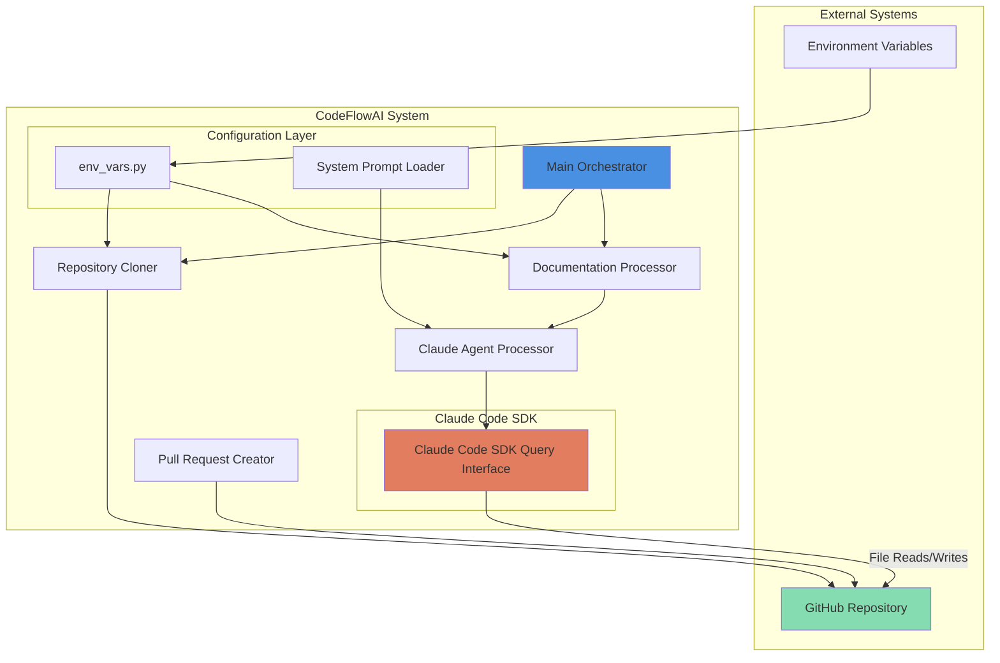
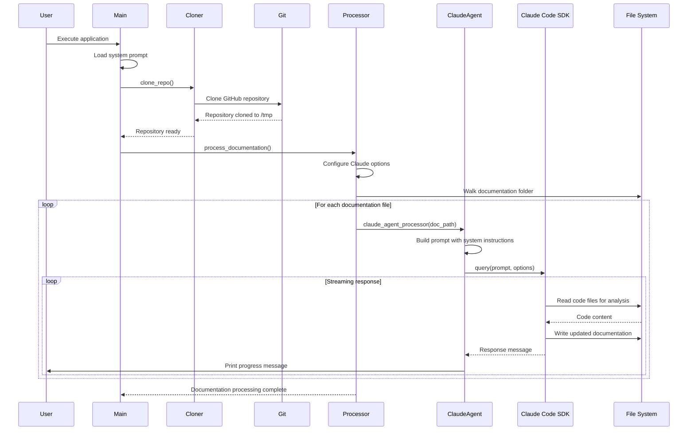

# CodeFlowAI Architecture Overview

## Table of Contents

1. [Overview](#overview)
2. [High-Level Architecture](#high-level-architecture)
3. [Core Components](#core-components)
4. [Data Flow](#data-flow)
5. [Code Implementation](#code-implementation)
6. [Integration Points](#integration-points)
7. [Configuration](#configuration)
8. [Monitoring and Operations](#monitoring-and-operations)

---

## Overview

CodeFlowAI is an automated documentation management system that leverages Anthropic's Claude AI to maintain synchronisation between code implementations and technical documentation. The system analyses documentation files, compares them against the actual codebase, and automatically generates pull requests with updated documentation when discrepancies are detected.

**Key Characteristics:**

- **AI-Powered Analysis**: Utilises Claude Code SDK to intelligently analyse and update documentation based on current code implementation
- **Asynchronous Processing**: Built with Python's asyncio for efficient concurrent processing of multiple documentation files
- **Git-Native Integration**: Directly interfaces with Git and GitHub to clone repositories, create branches, and submit pull requests automatically
- **Environment-Driven Configuration**: Uses environment variables for flexible configuration across different deployment contexts
- **Minimal Human Intervention**: Operates autonomously from repository cloning through pull request creation

---

## High-Level Architecture



**Architectural Decisions:**

1. **Asynchronous Design**: The system uses Python's `asyncio` to handle potentially long-running Claude API calls without blocking, enabling efficient processing of multiple documentation files.

2. **Stateless Operation**: Each execution clones a fresh repository copy to `/tmp`, ensuring clean state and avoiding conflicts from previous runs.

3. **SDK-Based AI Integration**: Rather than direct API calls, the system leverages Claude Code SDK, which provides structured code analysis capabilities and built-in tool support for file operations.

4. **Separation of Concerns**: Configuration, prompting, and processing logic are separated into distinct modules, promoting maintainability and testability.

---

## Core Components

### 1. Main Orchestrator (`main.py`)

**Purpose**: Coordinates the entire documentation update workflow from repository cloning through documentation processing.

**Responsibilities**:
- Loads system prompts from configuration files
- Orchestrates the execution sequence: clone → process → (optionally) create PR
- Manages global state for folder paths and Claude options
- Handles exceptions and provides user feedback

### 2. Repository Cloner (`clone_repo()`)

**Purpose**: Clones the target GitHub repository to a temporary directory for analysis.

**Responsibilities**:
- Extracts repository name from GitHub URI
- Removes existing cloned directories to ensure clean state
- Clones repository using Git command-line interface
- Dynamically updates system prompt with codebase path

### 3. Documentation Processor (`process_documentation()`)

**Purpose**: Iterates through all files in the documentation folder and submits each for AI analysis.

**Responsibilities**:
- Configures Claude Code SDK options (allowed tools, permissions, working directory)
- Walks the documentation directory tree recursively
- Invokes Claude agent processor for each documentation file
- Validates that the documentation folder exists

### 4. Claude Agent Processor (`claude_agent_processor()`)

**Purpose**: Interfaces with Claude Code SDK to analyse and update individual documentation files.

**Responsibilities**:
- Constructs prompts combining system instructions with specific documentation content
- Streams responses from Claude Code SDK asynchronously
- Handles errors gracefully during AI processing
- Outputs Claude's responses to console for visibility

### 5. Pull Request Creator (`open_pr()`)

**Purpose**: Creates a GitHub pull request with documentation changes identified and made by Claude.

**Responsibilities**:
- Generates timestamp-based branch names for uniqueness
- Configures Git user identity for commits
- Checks for actual documentation changes before committing
- Pushes branch and creates PR using GitHub CLI (`gh`)

### 6. Configuration Module (`config/env_vars.py`)

**Purpose**: Centralises environment variable loading and provides typed access to configuration.

**Responsibilities**:
- Loads `.env` file using python-dotenv
- Exports `GITHUB_URI` for repository location
- Exports `DOCUMENTATION_FOLDER` for documentation path within repository

### 7. System Prompt Loader

**Purpose**: Loads AI instructions from external text file at application startup.

**Responsibilities**:
- Reads system prompt from `src/system_prompts/document_updater.txt`
- Provides error handling for missing or unreadable prompt files
- Makes prompt available globally for use in Claude queries

---

## Data Flow

### Primary Workflow Sequence



### Data Transformation Pipeline

1. **Input Stage**:
   - Environment variables loaded from `.env` file
   - System prompt loaded from text file
   - GitHub repository URI provided by configuration

2. **Repository Acquisition**:
   - GitHub URI → Repository name extraction
   - Repository cloned to `/tmp/{repo_name}`
   - Codebase path appended to system prompt

3. **Documentation Discovery**:
   - Documentation folder path constructed: `{repo_folder}/{DOCUMENTATION_FOLDER}`
   - Directory tree walked recursively
   - File paths collected for processing

4. **AI Processing**:
   - For each documentation file:
     - File path wrapped in XML tags `<documentation>{path}</documentation>`
     - Combined with system prompt
     - Sent to Claude Code SDK
     - Claude reads code files and compares with documentation
     - Claude writes updated documentation if discrepancies found

5. **Output Stage** (when PR creation is invoked):
   - Git branch created with timestamp
   - Changes staged and committed
   - Branch pushed to GitHub
   - Pull request created via GitHub CLI

---

## Code Implementation

This section provides detailed code-level implementation tracing through the complete execution flow.

### Application Entry Point

**File: `src/main.py`**
```python
if __name__ == "__main__":
    asyncio.run(main())
```

**Explanation:** The application starts here when executed directly. It uses `asyncio.run()` to execute the asynchronous `main()` function, which is the top-level orchestrator.

---

### Main Orchestration Function

**File: `src/main.py`**
```python
async def main() -> None:
    clone_repo()
    await process_documentation()
```

**Explanation:** The `main()` function executes two sequential steps: first, it synchronously clones the repository; second, it asynchronously processes all documentation files. Note that `open_pr()` is not currently called here but exists for future integration.

---

### System Prompt Loading (Startup)

**File: `src/main.py`**
```python
project_root = Path(__file__).resolve().parent.parent
prompt_file = project_root / "src" / "system_prompts" / "document_updater.txt"

try:
    with open(prompt_file, "r", encoding="utf-8") as f:
        SYSTEM_PROMPT = f.read()
    print(f"Successfully loaded system prompt from {prompt_file}")
except FileNotFoundError as e:
    raise FileNotFoundError(
        f"Critical error: System prompt file not found at {prompt_file}"
    )
except Exception as e:
    raise Exception(f"Critical error reading system prompt file: {e}")
```

**Explanation:** Before any processing begins, the system prompt is loaded from the file system at module import time. The path is constructed relative to the script location, making it portable. If the prompt file is missing or unreadable, the application terminates with a clear error message, as this file is critical for Claude's behaviour.

---

### Environment Configuration Loading

**File: `src/config/env_vars.py`**
```python
import os
from dotenv import load_dotenv

load_dotenv()

GITHUB_URI = os.getenv("GITHUB_URI", "")
DOCUMENTATION_FOLDER = os.getenv("DOCUMENTATION_FOLDER", "")
```

**Explanation:** This module loads environment variables from a `.env` file in the project root using `python-dotenv`. The two critical configuration values are `GITHUB_URI` (the GitHub repository to analyse) and `DOCUMENTATION_FOLDER` (the relative path within that repository where documentation lives). Default empty strings are provided if variables are not set.

---

### Repository Cloning Implementation

**File: `src/main.py`**
```python
def clone_repo() -> None:
    global FOLDER
    global SYSTEM_PROMPT

    repo_name = GITHUB_URI.rstrip("/").split("/")[-1]
    if repo_name.endswith(".git"):
        repo_name = repo_name[:-4]

    FOLDER = os.path.join("/tmp", repo_name)

    if os.path.exists(FOLDER):
        subprocess.run(["rm", "-rf", FOLDER], check=True)

    subprocess.run(["git", "clone", GITHUB_URI, FOLDER], check=True)
    print("repo cloned successfully")
    SYSTEM_PROMPT += f"""
\nHere is the codebase path where you should look for the relevant code files:
<codebase_path>
{FOLDER}
</codebase_path>
"""
```

**Explanation:** This function handles repository cloning and path setup. It first extracts the repository name from the URI by taking the last path segment and removing the `.git` suffix if present. The target folder is set to `/tmp/{repo_name}`. If this folder already exists (from a previous run), it's forcefully removed to ensure a clean state. Then `git clone` is executed via subprocess. Finally, the system prompt is dynamically augmented with the codebase path wrapped in XML tags, informing Claude where to find the code files.

**Reference:** `src/main.py:62-83`

---

### Documentation Processing Workflow

**File: `src/main.py`**
```python
async def process_documentation() -> None:
    global CLAUDE_OPTIONS

    CLAUDE_OPTIONS = ClaudeCodeOptions(
        allowed_tools=["Read", "Write"], permission_mode="acceptEdits", cwd=FOLDER
    )
    documentation_path = os.path.join(FOLDER, DOCUMENTATION_FOLDER)

    if not os.path.exists(documentation_path):
        raise FileNotFoundError(f"Documentation folder not found: {documentation_path}")

    for root, _, files in os.walk(documentation_path):
        for file in files:
            file_path = os.path.join(root, file)
            await claude_agent_processor(file_path)
```

**Explanation:** This function orchestrates the documentation processing workflow. It first configures the Claude Code SDK options, restricting Claude to only use `Read` and `Write` tools and setting permission mode to `acceptEdits` (allowing Claude to write files automatically). The current working directory is set to the cloned repository folder. It then constructs the full documentation path and validates its existence. Using `os.walk()`, it recursively traverses the documentation directory, and for each file found, it asynchronously invokes the Claude agent processor.

**Reference:** `src/main.py:45-59`

---

### Claude Agent Processing

**File: `src/main.py`**
```python
async def claude_agent_processor(doc: str) -> None:
    prompt = f"""{SYSTEM_PROMPT}

Here is the documentation file that you need to analyze:
<documentation>
{doc}
</documentation>
"""
    try:
        async for message in query(prompt=prompt, options=CLAUDE_OPTIONS):
            print(message)
    except Exception as e:
        print(f"Error processing {doc}: {e}")
```

**Explanation:** This function interfaces with the Claude Code SDK to process individual documentation files. It constructs a prompt by combining the pre-loaded system prompt (which includes instructions and codebase path) with the specific documentation file path wrapped in XML tags. The `query()` function from Claude Code SDK is called with this prompt and the configured options. The function uses `async for` to stream responses from Claude as they arrive, printing each message to the console. Error handling ensures that failures in processing one file don't crash the entire workflow.

**Reference:** `src/main.py:30-42`

---

### Claude Code SDK Import

**File: `src/main.py`**
```python
from claude_code_sdk import ClaudeCodeOptions, query
```

**Explanation:** The application imports two key components from the Claude Code SDK: `ClaudeCodeOptions` for configuring Claude's behaviour (allowed tools, permissions, working directory), and `query` for submitting prompts and receiving streamed responses.

**Reference:** `src/main.py:7`

---

### Pull Request Creation (Optional Workflow)

**File: `src/main.py`**
```python
def open_pr():
    """
    open a pull request with the doc changes
    """
    now = datetime.datetime.now()
    branch_name = f"docu-jarvis{now.day:02d}{now.month:02d}{now.year}{now.hour:02d}{now.minute:02d}"

    try:
        os.chdir(FOLDER)

        subprocess.run(["git", "config", "user.name", "Docu Jarvis"], check=True)
        subprocess.run(
            ["git", "config", "user.email", "docu-jarvis@automation.local"], check=True
        )
        subprocess.run(["git", "checkout", "-b", branch_name], check=True)
        subprocess.run(["git", "add", DOCUMENTATION_FOLDER + "/"], check=True)
        result = subprocess.run(
            ["git", "diff", "--cached", "--quiet"], capture_output=True
        )
        if result.returncode == 0:
            print("No changes to commit in documentation directory")
            return
        commit_message = "docs: automated documentation improvements by docu-jarvis"
        subprocess.run(["git", "commit", "-m", commit_message], check=True)
        print(f"Pushing branch: {branch_name}")
        subprocess.run(["git", "push", "origin", branch_name], check=True)

        pr_title = "Documentation Update"
        pr_description = "Automated docu-jarvis suggestions"

        subprocess.run(
            [
                "gh",
                "pr",
                "create",
                "--title",
                pr_title,
                "--body",
                pr_description,
                "--head",
                branch_name,
                "--base",
                "main",
            ],
            check=True,
        )

        print(f"Successfully created PR with branch: {branch_name}")

    except subprocess.CalledProcessError as e:
        raise Exception(f"Error creating PR: {e}")
    except Exception as e:
        raise Exception(f"Unexpected error: {e}")
    finally:
        os.chdir(project_root)
```

**Explanation:** This function automates the creation of a pull request with documentation changes. It generates a unique branch name using the current timestamp in format `docu-jarvisddMMyyyyHHmm`. After changing to the repository directory, it configures Git with an identity ("Docu Jarvis" with email `docu-jarvis@automation.local`), creates a new branch, and stages only files in the documentation folder. It then checks if there are any staged changes using `git diff --cached --quiet` - if no changes exist, it returns early. If changes are found, it commits them with a conventional commit message, pushes the branch to the remote, and uses the GitHub CLI (`gh pr create`) to create a pull request. The `finally` block ensures the working directory is restored to the project root, preventing side effects.

**Reference:** `src/main.py:85-139`

---

### System Prompt Content

**File: `src/system_prompts/document_updater.txt`**
```
You are a code validation and synchronization agent. Your task is to read a documentation file, analyze the related code in the codebase, and ensure the code matches what is described in the documentation. If the code has changed since the documentation was written, you should update the documentation specifications to match the code.

Follow these steps to complete the task:

1. **Analyze the documentation**: Read through the documentation file and identify:
   - What code files, functions, classes, or modules are being documented
   - The expected behavior, interfaces, parameters, return values, and implementation details described
   - Any code examples or specifications provided

2. **Locate the relevant code**: Based on the documentation, identify and examine the actual code files in the provided codebase path that correspond to what is documented.

3. **Compare documentation vs. code**: Determine if the current code implementation matches what is described in the documentation.

4. **Take appropriate action**:
   - If the code matches the documentation: No changes needed
   - If the code differs from the documentation: Update the documentation specifications to match the code
   - Do NOT modify the code files under any circumstances

Important rules:
- Only make changes to documentation files, never to code files
- Only update documentation when there are actual discrepancies between the documentation and current implementation
- Preserve existing documentation structure and style as much as possible when making updates
- If you cannot locate the code files mentioned in the documentation, report this as an issue
- If the documentation is unclear or ambiguous about implementation details, note this but do not make assumptions
```

**Explanation:** This prompt instructs Claude on its role as a code validation and synchronisation agent. It provides a clear four-step methodology: analyse documentation, locate relevant code, compare them, and take appropriate action. Critical constraints are specified: Claude must never modify code files, only update documentation when actual discrepancies exist, and preserve existing documentation style. This prompt serves as the behavioural foundation for all Claude interactions within the system.

**Reference:** `src/system_prompts/document_updater.txt:1-35`

---

## Integration Points

### 1. GitHub Integration

**Type**: Git and GitHub CLI

**Purpose**: Source repository access and pull request management

**Implementation Details**:
- **Git Command Line**: Used via `subprocess.run()` for cloning repositories, creating branches, committing changes, and pushing to remotes
- **GitHub CLI (`gh`)**: Used for creating pull requests programmatically
- **Authentication**: Relies on system-configured Git credentials and GitHub CLI authentication (must be pre-configured on host system)

**Dependencies**:
- Git must be installed on the system
- GitHub CLI (`gh`) must be installed and authenticated for PR creation
- Network access to `github.com`

**Configuration**:
- Repository URL specified via `GITHUB_URI` environment variable
- Supports both HTTPS and SSH Git URLs

---

### 2. Claude Code SDK

**Type**: AI Language Model API

**Purpose**: AI-powered code analysis and documentation generation

**Implementation Details**:
- **Package**: `claude-code-sdk` (version >=0.0.23, <0.0.24)
- **API Function**: `query(prompt, options)` - streams responses asynchronously
- **Configuration Object**: `ClaudeCodeOptions` - configures allowed tools, permissions, and working directory
- **Tool Permissions**: Restricted to `Read` and `Write` tools only
- **Permission Mode**: `acceptEdits` - allows Claude to write files automatically without confirmation

**Authentication**:
- SDK authentication handled internally (typically via API keys in environment or configuration)

**Data Exchanged**:
- **Input**: System prompt + documentation file path
- **Output**: Streamed text messages and file write operations

---

### 3. File System

**Type**: Local storage

**Purpose**: Temporary repository storage and file operations

**Implementation Details**:
- **Clone Location**: `/tmp/{repo_name}` - repositories cloned to temporary directory
- **Documentation Access**: Files read from `{clone_location}/{DOCUMENTATION_FOLDER}`
- **Write Operations**: Claude Code SDK writes updated documentation directly to file system

**Considerations**:
- `/tmp` directory is ephemeral on most systems (cleared on reboot)
- Requires sufficient disk space for repository cloning
- File permissions must allow read/write operations

---

### 4. Environment Configuration

**Type**: Environment variables via `.env` file

**Purpose**: Runtime configuration management

**Implementation Details**:
- **Library**: `python-dotenv` (version >=0.9.9, <0.10.0)
- **Loading**: `load_dotenv()` called at module import time
- **File Location**: `.env` file expected in project root directory

**Required Variables**:
- `GITHUB_URI` - GitHub repository URL to analyse
- `DOCUMENTATION_FOLDER` - Relative path to documentation within repository

---

## Configuration

### Environment Variables

The system is configured entirely through environment variables defined in a `.env` file located in the project root directory.

#### Required Configuration

| Variable | Type | Description | Example |
|----------|------|-------------|---------|
| `GITHUB_URI` | String | GitHub repository URL to clone and analyse | `https://github.com/user/repo.git` |
| `DOCUMENTATION_FOLDER` | String | Relative path within repository to documentation folder | `docs` or `documentation` |

#### Configuration File Location

**File: `.env`** (project root directory)

```bash
GITHUB_URI=https://github.com/username/repository.git
DOCUMENTATION_FOLDER=documentation
```

**Note**: The `.env` file is excluded from version control via `.gitignore` to prevent accidental exposure of sensitive configuration.

---

### Claude Code SDK Configuration

Claude's behaviour is configured programmatically within the application.

**File: `src/main.py`**
```python
CLAUDE_OPTIONS = ClaudeCodeOptions(
    allowed_tools=["Read", "Write"],
    permission_mode="acceptEdits",
    cwd=FOLDER
)
```

**Configuration Parameters**:

- **`allowed_tools`**: `["Read", "Write"]` - Restricts Claude to only reading and writing files; prevents execution of shell commands or other potentially dangerous operations
- **`permission_mode`**: `"acceptEdits"` - Automatically accepts Claude's file edits without requiring manual approval for each change
- **`cwd`**: `FOLDER` - Sets the working directory to the cloned repository root, ensuring relative paths work correctly

---

### Project Configuration

**File: `pyproject.toml`**

```toml
[project]
name = "documentation-updater"
version = "0.1.0"
requires-python = ">=3.12"
dependencies = [
    "dotenv (>=0.9.9,<0.10.0)",
    "isort (>=6.0.1,<7.0.0)",
    "claude-code-sdk (>=0.0.23,<0.0.24)"
]

[tool.poetry.group.dev.dependencies]
black = "^25.1.0"

[build-system]
requires = ["poetry-core>=2.0.0,<3.0.0"]
build-backend = "poetry.core.masonry.api"
```

**Key Configuration**:
- **Python Version**: Requires Python 3.12 or higher
- **Dependency Management**: Uses Poetry for dependency resolution and virtual environment management
- **Build System**: Poetry Core for building distributable packages

---

### CI/CD Configuration

**File: `.github/workflows/test.yml`**

```yaml
name: Run Unit Tests

on:
  push:
    branches:
      - main
  pull_request:
    branches:
      - main

jobs:
  test:
    runs-on: ubuntu-latest

    steps:
      - name: Checkout repository
        uses: actions/checkout@v4

      - name: Set up Python 3.11
        uses: actions/setup-python@v4
        with:
          python-version: '3.11'

      - name: Install dependencies
        run: |
          python -m pip install --upgrade pip
          pip install -r requirements.txt

      - name: Run tests
        run: pytest
```

**Configuration Details**:
- **Triggers**: Executes on pushes to `main` branch and pull requests targeting `main`
- **Runner**: Ubuntu latest
- **Python Version**: 3.11 (slightly lower than production requirement for broader compatibility testing)
- **Dependencies**: Installed via `requirements.txt`
- **Test Framework**: pytest

---

### System Prompt Configuration

The AI agent's behaviour is configured through a text-based system prompt file.

**File: `src/system_prompts/document_updater.txt`**

This file contains natural language instructions for Claude, defining:
- Its role as a code validation and synchronisation agent
- The four-step process it should follow
- Constraints (never modify code, only update documentation, preserve style)
- Error handling expectations

**Modification**: To change Claude's behaviour, edit this text file. Changes take effect on next application execution.

---

## Monitoring and Operations

### Logging

**Current Implementation**: Basic console output logging

**Log Output Locations**:

1. **System Prompt Loading**:
   ```python
   print(f"Successfully loaded system prompt from {prompt_file}")
   ```
   Indicates successful startup configuration.

2. **Repository Cloning**:
   ```python
   print("repo cloned successfully")
   ```
   Confirms repository has been cloned to `/tmp`.

3. **Claude Processing**:
   ```python
   async for message in query(prompt=prompt, options=CLAUDE_OPTIONS):
       print(message)
   ```
   Streams Claude's responses in real-time, providing visibility into AI analysis and actions.

4. **Error Handling**:
   ```python
   print(f"Error processing {doc}: {e}")
   ```
   Logs errors encountered during documentation processing without crashing the application.

5. **PR Creation**:
   ```python
   print(f"Pushing branch: {branch_name}")
   print(f"Successfully created PR with branch: {branch_name}")
   print("No changes to commit in documentation directory")
   ```
   Provides feedback on PR workflow status.

**Recommendations for Production**:
- Implement structured logging using Python's `logging` module
- Add log levels (DEBUG, INFO, WARNING, ERROR, CRITICAL)
- Output logs to files for persistence and analysis
- Include timestamps and contextual information in all log entries

---

### Health Checks

**Current Implementation**: None

**Recommended Health Checks**:

1. **Environment Configuration Validation**:
   - Check that `GITHUB_URI` and `DOCUMENTATION_FOLDER` are set and non-empty
   - Validate that `GITHUB_URI` is a well-formed URL

2. **Dependency Availability**:
   - Verify Git is installed and accessible
   - Verify GitHub CLI (`gh`) is installed and authenticated (if PR creation is enabled)
   - Check that Claude Code SDK can be imported

3. **File System Access**:
   - Ensure `/tmp` directory exists and is writable
   - Verify system prompt file is readable

4. **Network Connectivity**:
   - Confirm ability to reach GitHub.com
   - Validate Claude API endpoints are accessible

---

### Metrics

**Current Implementation**: No metrics collection

**Recommended Metrics**:

1. **Execution Metrics**:
   - Total execution time per run
   - Time spent cloning repositories
   - Time spent processing each documentation file
   - Number of documentation files processed

2. **Claude API Metrics**:
   - Number of API calls made
   - Total tokens consumed
   - API response times
   - API error rates

3. **Outcome Metrics**:
   - Number of documentation files updated
   - Number of discrepancies found
   - Number of pull requests created
   - Number of processing errors

4. **Cost Metrics**:
   - Estimated API costs per execution
   - Cost per documentation file processed

---

### Error Handling

**Critical Error Handling**:

1. **System Prompt Loading Failure** (`src/main.py:18-27`):
   ```python
   try:
       with open(prompt_file, "r", encoding="utf-8") as f:
           SYSTEM_PROMPT = f.read()
   except FileNotFoundError as e:
       raise FileNotFoundError(
           f"Critical error: System prompt file not found at {prompt_file}"
       )
   ```
   Application terminates immediately if system prompt cannot be loaded, as it's essential for Claude's operation.

2. **Documentation Folder Not Found** (`src/main.py:53-54`):
   ```python
   if not os.path.exists(documentation_path):
       raise FileNotFoundError(f"Documentation folder not found: {documentation_path}")
   ```
   Terminates processing if the specified documentation folder doesn't exist in the cloned repository.

3. **Individual File Processing Errors** (`src/main.py:41-42`):
   ```python
   except Exception as e:
       print(f"Error processing {doc}: {e}")
   ```
   Logs error but continues processing remaining files, ensuring one failure doesn't stop the entire workflow.

4. **PR Creation Errors** (`src/main.py:134-137`):
   ```python
   except subprocess.CalledProcessError as e:
       raise Exception(f"Error creating PR: {e}")
   except Exception as e:
       raise Exception(f"Unexpected error: {e}")
   ```
   Provides detailed error messages for debugging PR creation failures.

---

### Operational Considerations

#### Deployment Requirements

1. **Runtime Environment**:
   - Python 3.12 or higher
   - Git command-line tool
   - GitHub CLI (`gh`) if PR creation is used
   - Network access to GitHub and Claude API endpoints

2. **Authentication**:
   - Git credentials configured (SSH key or HTTPS token)
   - GitHub CLI authenticated (`gh auth login`)
   - Claude Code SDK credentials (API keys)

3. **Disk Space**:
   - Sufficient space in `/tmp` for repository cloning
   - Repositories can range from MB to GB depending on project size

#### Execution Modes

**Current Mode**: Single execution per invocation
- Clone repository
- Process all documentation
- Exit

**Potential Future Modes**:
- **Scheduled Execution**: Cron job or task scheduler for periodic updates
- **Webhook-Triggered**: Respond to GitHub webhook events (pushes, PR creation)
- **Continuous Monitoring**: Watch for repository changes and trigger processing

#### Scalability Considerations

1. **Large Repositories**: Cloning very large repositories can be time-consuming and disk-intensive. Consider shallow clones (`git clone --depth 1`) for repositories with extensive history.

2. **Many Documentation Files**: Asynchronous processing helps, but API rate limits may be encountered. Implement rate limiting and retry logic if processing hundreds of files.

3. **Concurrent Executions**: Current implementation uses global state (`FOLDER`, `CLAUDE_OPTIONS`), which prevents safe concurrent execution. Refactor to instance-based design for parallel processing of multiple repositories.

#### Security Considerations

1. **Untrusted Repositories**: Cloning and executing code from arbitrary GitHub repositories poses security risks. Implement sandboxing or restrict to trusted repository sources.

2. **Credential Management**: Ensure `.env` file and API keys are never committed to version control. Use secret management systems in production.

3. **File System Access**: Claude has `Write` permissions within the cloned repository directory. Ensure this directory is properly isolated to prevent accidental modification of system files.

---

### Testing

**Test Framework**: pytest

**Test Location**: `/tmp/CodeFlowAI/tests/test_basic.py`

**Current Test Coverage**:

1. **Basic Functionality Test**:
   ```python
   def test_basic():
       """A simple test to verify pytest is working."""
       assert True
   ```
   Ensures test framework is operational.

2. **Import Test**:
   ```python
   def test_imports():
       """Test that core modules can be imported."""
       import main
       assert True
   ```
   Validates that the main module can be imported without errors.

**Test Execution**:
- **Local**: `pytest` from project root
- **CI/CD**: Automated execution on every push and pull request via GitHub Actions

**Recommendations for Enhanced Testing**:
- Add integration tests that clone actual test repositories
- Mock Claude Code SDK calls to test prompt construction
- Test error handling paths (missing files, invalid configuration)
- Validate Git operations (branch creation, commit formatting)
- Test PR creation logic with mocked GitHub CLI

---

**Document Version**: 1.0
**Last Updated**: 2026-04-09
**Codebase Version**: Based on commit `718175c` (Fix CI: Add requirements.txt and basic test file)
