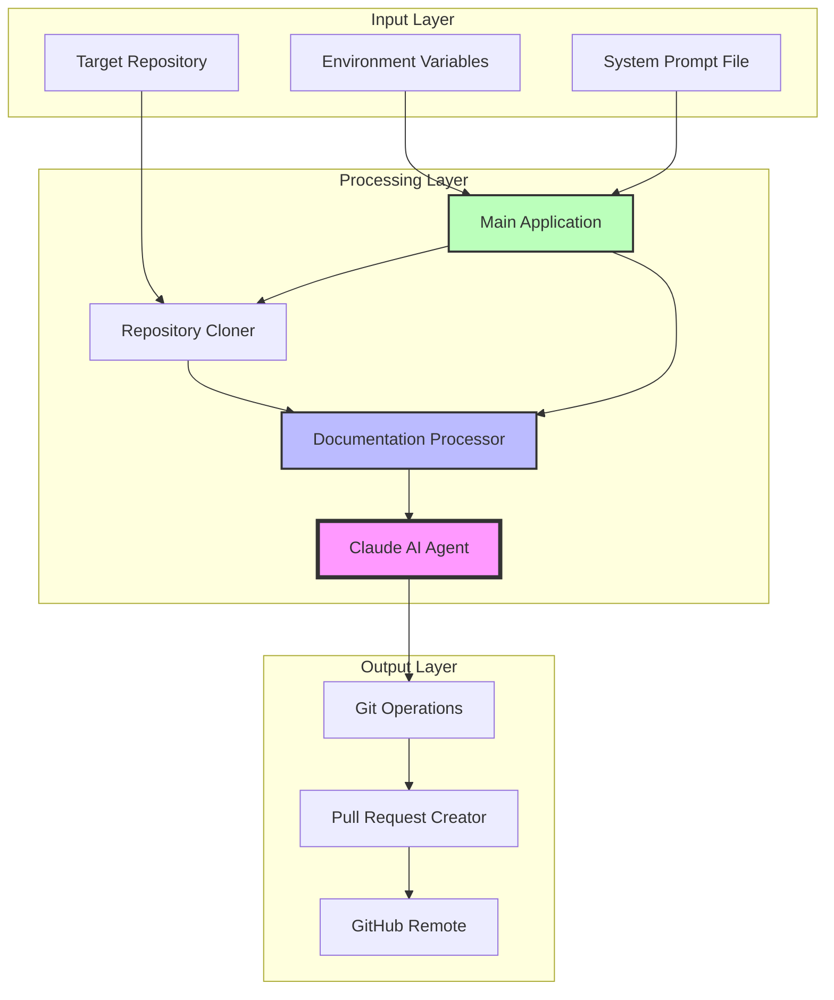
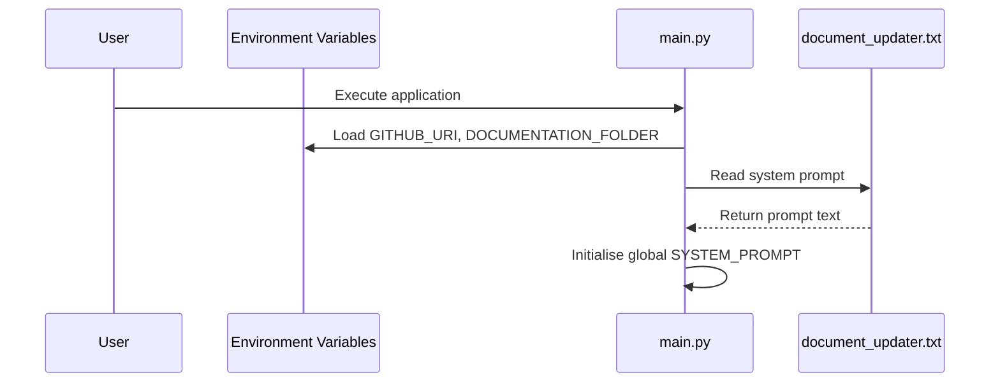
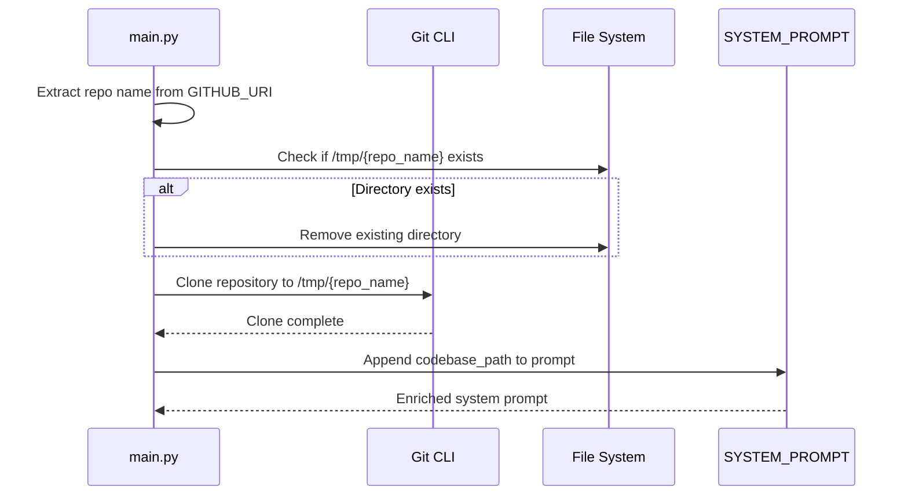
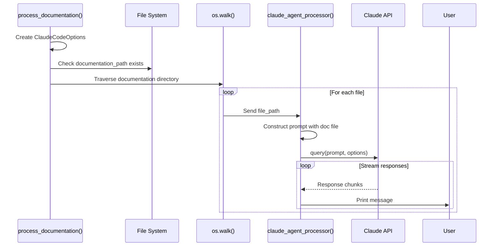
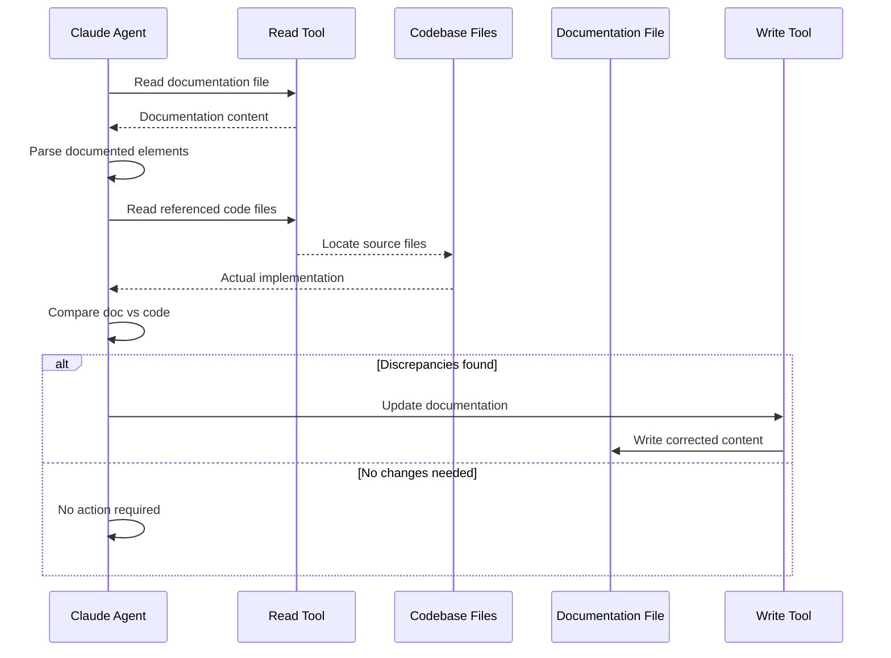
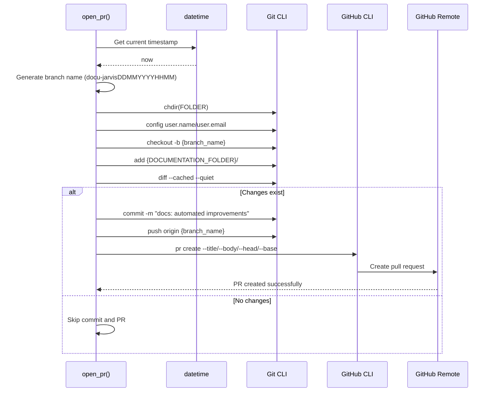

# CodeFlowAI Data Flow Documentation

## Table of Contents

1. [Overview](#overview)
2. [High-Level Architecture](#high-level-architecture)
3. [Core Components](#core-components)
4. [Data Flow](#data-flow)
5. [Code Implementation](#code-implementation)
6. [Integration Points](#integration-points)
7. [Configuration](#configuration)
8. [Monitoring and Operations](#monitoring-and-operations)

---

## Overview

CodeFlowAI is an automated documentation synchronisation system that leverages AI to maintain up-to-date technical documentation. The system clones target repositories, analyses existing documentation files, validates them against actual codebase implementation, and automatically creates pull requests with documentation improvements.

**Key Characteristics:**

- **Asynchronous Processing**: Concurrent analysis of multiple documentation files using Python's asyncio
- **AI-Powered Validation**: Uses Claude Code SDK to intelligently compare documentation against source code
- **GitHub Integration**: Automated pull request creation with timestamped branch naming
- **Configurable Behaviour**: System prompts and environment variables control agent behaviour
- **Non-Invasive**: Only modifies documentation files, never touches source code

---

## High-Level Architecture



**Architectural Decisions:**

- **Asynchronous Design**: The system uses `asyncio` to process multiple documentation files concurrently, improving throughput for repositories with extensive documentation
- **Temporary Repository Cloning**: Repositories are cloned to `/tmp` to avoid cluttering the local filesystem and enable clean, isolated processing
- **Prompt Enrichment**: The system prompt is dynamically enriched with the codebase path at runtime, allowing the AI agent to locate and analyse relevant code files
- **Immutable Code Principle**: The Claude agent is restricted to Read/Write tools with permission mode set to "acceptEdits", ensuring only documentation files can be modified

---

## Core Components

### 1. **Configuration Module** (`src/config/env_vars.py`)
   - **Purpose**: Centralised environment variable management
   - **Responsibilities**:
     - Loads `.env` configuration file using `python-dotenv`
     - Exposes `GITHUB_URI` (target repository URL)
     - Exposes `DOCUMENTATION_FOLDER` (path to documentation within repository)

### 2. **System Prompt Template** (`src/system_prompts/document_updater.txt`)
   - **Purpose**: Defines Claude AI agent behaviour
   - **Responsibilities**:
     - Instructs agent to validate documentation against code
     - Enforces documentation-only modification policy
     - Provides step-by-step analysis methodology

### 3. **Main Application** (`src/main.py`)
   - **Purpose**: Orchestrates the entire documentation synchronisation workflow
   - **Key Functions**:
     - `clone_repo()`: Clones target repository and enriches system prompt
     - `process_documentation()`: Iterates through documentation files asynchronously
     - `claude_agent_processor()`: Sends individual files to Claude for analysis
     - `open_pr()`: Creates timestamped branch and GitHub pull request
     - `main()`: Orchestrates workflow execution

### 4. **Claude Code SDK Integration**
   - **Purpose**: Provides AI-powered code analysis and documentation editing capabilities
   - **Responsibilities**:
     - Executes queries against Claude AI with custom system prompts
     - Streams responses asynchronously
     - Provides Read/Write file tools to the agent

### 5. **GitHub CLI Integration**
   - **Purpose**: Automates pull request creation
   - **Responsibilities**:
     - Creates new branches with timestamped naming
     - Commits documentation changes
     - Pushes to remote repository
     - Opens pull request via `gh` command

---

## Data Flow

The data flow through CodeFlowAI follows a sequential pipeline with asynchronous processing for documentation analysis:

### 1. **Initialisation Phase**



**Data Elements:**
- **Input**: Environment variables (`.env` file)
- **Processing**: File read operation for system prompt
- **Output**: Initialised global variables (`GITHUB_URI`, `DOCUMENTATION_FOLDER`, `SYSTEM_PROMPT`)

---

### 2. **Repository Cloning Phase**



**Data Transformations:**

| Step | Input Data | Transformation | Output Data |
|------|-----------|----------------|-------------|
| 1 | `GITHUB_URI` | Extract repository name | `repo_name` |
| 2 | `repo_name` | Construct path | `FOLDER = /tmp/{repo_name}` |
| 3 | `FOLDER` | Git clone operation | Local repository copy |
| 4 | `SYSTEM_PROMPT`, `FOLDER` | String concatenation | Enriched prompt with codebase path |

---

### 3. **Documentation Processing Phase**



**Data Flow Details:**

1. **Configuration Object Creation**:
   ```python
   ClaudeCodeOptions(
       allowed_tools=["Read", "Write"],
       permission_mode="acceptEdits",
       cwd=FOLDER
   )
   ```

2. **File Discovery**:
   - Input: `documentation_path = {FOLDER}/{DOCUMENTATION_FOLDER}`
   - Process: Recursive directory traversal via `os.walk()`
   - Output: List of file paths

3. **Asynchronous Processing**:
   - Each file path is processed concurrently
   - Prompt construction includes original system prompt + file path
   - Claude agent receives full context for analysis

**Data Structure Example**:
```python
# Prompt sent to Claude
prompt = f"""
{SYSTEM_PROMPT}  # Contains instructions + codebase path

Here is the documentation file that you need to analyze:
<documentation>
{doc}  # File path to documentation file
</documentation>
"""
```

---

### 4. **AI Agent Analysis Phase**



**Data Analysis Steps** (as per system prompt):

1. **Analysis**: Extract documented code elements (functions, classes, modules)
2. **Location**: Identify corresponding code files in codebase
3. **Comparison**: Validate documentation against actual implementation
4. **Action**: Update documentation if discrepancies exist

**Data Modification Rules**:
- Only documentation files can be modified (enforced by `allowed_tools=["Read", "Write"]`)
- Code files are read-only
- Original structure and style are preserved

---

### 5. **Pull Request Creation Phase**



**Data Elements**:

| Element | Format | Example |
|---------|--------|---------|
| Branch Name | `docu-jarvis{DDMMYYYYHHMM}` | `docu-jarvis0904202614:30` |
| Commit Message | Static string | `docs: automated documentation improvements by docu-jarvis` |
| PR Title | Static string | `Documentation Update` |
| PR Description | Static string | `Automated docu-jarvis suggestions` |

**Git Configuration**:
```python
user.name = "Docu Jarvis"
user.email = "docu-jarvis@automation.local"
```

---

## Code Implementation

This section provides detailed code tracing through the entire system execution path.

### Entry Point: Application Startup

**File: `src/main.py`**
```python
if __name__ == "__main__":
    asyncio.run(main())
```

**Explanation:** The application entry point uses Python's asyncio to run the asynchronous `main()` function, which orchestrates the entire workflow.

---

### Global Initialisation

**File: `src/main.py`**
```python
import asyncio
import datetime
import os
import subprocess
from pathlib import Path

from claude_code_sdk import ClaudeCodeOptions, query

from config.env_vars import DOCUMENTATION_FOLDER, GITHUB_URI

FOLDER = ""
CLAUDE_OPTIONS = ""
```

**Explanation:** Imports necessary modules and initialises global variables. The `FOLDER` variable will store the cloned repository path, and `CLAUDE_OPTIONS` will hold the Claude SDK configuration.

---

**File: `src/main.py`**
```python
project_root = Path(__file__).resolve().parent.parent
prompt_file = project_root / "src" / "system_prompts" / "document_updater.txt"

try:
    with open(prompt_file, "r", encoding="utf-8") as f:
        SYSTEM_PROMPT = f.read()
    print(f"Successfully loaded system prompt from {prompt_file}")
except FileNotFoundError as e:
    raise FileNotFoundError(
        f"Critical error: System prompt file not found at {prompt_file}"
    )
except Exception as e:
    raise Exception(f"Critical error reading system prompt file: {e}")
```

**Explanation:** Loads the system prompt template from the file system. The prompt file path is constructed using `pathlib.Path` for cross-platform compatibility. Error handling ensures the application fails fast if the critical prompt file is missing.

---

### Configuration Loading

**File: `src/config/env_vars.py`**
```python
import os

from dotenv import load_dotenv

load_dotenv()

GITHUB_URI = os.getenv("GITHUB_URI", "")
DOCUMENTATION_FOLDER = os.getenv("DOCUMENTATION_FOLDER", "")
```

**Explanation:** Uses `python-dotenv` to load environment variables from a `.env` file. The `os.getenv()` function provides a default empty string if variables are not set, though the application will fail later if these critical values are missing.

---

### Main Orchestration Function

**File: `src/main.py`**
```python
async def main() -> None:
    clone_repo()
    await process_documentation()
```

**Explanation:** The main orchestration function executes two primary steps: cloning the target repository and processing its documentation. Note that `clone_repo()` is synchronous (uses subprocess for git operations), whilst `process_documentation()` is asynchronous (uses async Claude API calls).

---

### Step 1: Repository Cloning

**File: `src/main.py`**
```python
def clone_repo() -> None:
    global FOLDER
    global SYSTEM_PROMPT

    repo_name = GITHUB_URI.rstrip("/").split("/")[-1]
    if repo_name.endswith(".git"):
        repo_name = repo_name[:-4]

    FOLDER = os.path.join("/tmp", repo_name)

    if os.path.exists(FOLDER):
        subprocess.run(["rm", "-rf", FOLDER], check=True)

    subprocess.run(["git", "clone", GITHUB_URI, FOLDER], check=True)
    print("repo cloned successfully")
```

**Explanation:**
- Extracts the repository name from the GitHub URI by taking the last path segment
- Removes `.git` suffix if present
- Constructs the target folder path in `/tmp`
- Removes any existing directory to ensure a clean clone
- Executes `git clone` via subprocess
- The `check=True` parameter ensures subprocess raises an exception on failure

---

**File: `src/main.py`** (continued)
```python
    SYSTEM_PROMPT += f"""
\nHere is the codebase path where you should look for the relevant code files:
<codebase_path>
{FOLDER}
</codebase_path>
"""
```

**Explanation:** Enriches the system prompt with the actual codebase path. This dynamic injection allows the Claude agent to locate and read code files from the cloned repository during analysis.

---

### Step 2: Documentation Processing Setup

**File: `src/main.py`**
```python
async def process_documentation() -> None:
    global CLAUDE_OPTIONS

    CLAUDE_OPTIONS = ClaudeCodeOptions(
        allowed_tools=["Read", "Write"],
        permission_mode="acceptEdits",
        cwd=FOLDER
    )
    documentation_path = os.path.join(FOLDER, DOCUMENTATION_FOLDER)

    if not os.path.exists(documentation_path):
        raise FileNotFoundError(f"Documentation folder not found: {documentation_path}")
```

**Explanation:**
- Creates a `ClaudeCodeOptions` object that restricts the AI agent to only Read and Write tools
- Sets `permission_mode="acceptEdits"` to allow the agent to modify files
- Sets the current working directory to the cloned repository folder
- Validates that the documentation folder exists before processing

---

**File: `src/main.py`** (continued)
```python
    for root, _, files in os.walk(documentation_path):
        for file in files:
            file_path = os.path.join(root, file)
            await claude_agent_processor(file_path)
```

**Explanation:** Uses `os.walk()` to recursively traverse the documentation directory tree. For each file found, calls the `claude_agent_processor()` function asynchronously. The use of `await` ensures each file is processed sequentially (though the Claude API itself may process streaming responses asynchronously).

---

### Step 3: Claude Agent Processing

**File: `src/main.py`**
```python
async def claude_agent_processor(doc: str) -> None:
    prompt = f"""{SYSTEM_PROMPT}

Here is the documentation file that you need to analyze:
<documentation>
{doc}
</documentation>
"""
    try:
        async for message in query(prompt=prompt, options=CLAUDE_OPTIONS):
            print(message)
    except Exception as e:
        print(f"Error processing {doc}: {e}")
```

**Explanation:**
- Constructs a complete prompt by combining the enriched system prompt with the documentation file path
- Uses the Claude Code SDK's `query()` function to send the prompt
- The `query()` function returns an async generator that yields response messages as they stream from the API
- Each message is printed to stdout for real-time visibility
- Error handling ensures one file's failure doesn't stop processing of other files

**What happens inside the Claude agent:**
1. Claude receives the system prompt instructing it to validate documentation
2. Claude reads the documentation file using the Read tool
3. Claude analyses the documentation to identify what code elements are described
4. Claude uses the Read tool to examine the actual code files in the codebase
5. Claude compares the documentation against the code
6. If discrepancies exist, Claude uses the Write tool to update the documentation
7. Claude responds with status messages about its actions

---

### Step 4: Pull Request Creation (Optional)

The `open_pr()` function is defined but not called in the current `main()` function. It would be invoked manually or as part of an extended workflow.

**File: `src/main.py`**
```python
def open_pr():
    """
    open a pull request with the doc changes
    """
    now = datetime.datetime.now()
    branch_name = f"docu-jarvis{now.day:02d}{now.month:02d}{now.year}{now.hour:02d}{now.minute:02d}"
```

**Explanation:** Generates a unique branch name using the current timestamp in format `docu-jarvisDDMMYYYYHHMM`. The `:02d` formatting ensures two-digit padding (e.g., `05` instead of `5`).

---

**File: `src/main.py`** (continued)
```python
    try:
        os.chdir(FOLDER)

        subprocess.run(["git", "config", "user.name", "Docu Jarvis"], check=True)
        subprocess.run(
            ["git", "config", "user.email", "docu-jarvis@automation.local"], check=True
        )
```

**Explanation:** Changes the current working directory to the cloned repository and configures Git identity. These configurations are local to the repository and don't affect global Git settings.

---

**File: `src/main.py`** (continued)
```python
        subprocess.run(["git", "checkout", "-b", branch_name], check=True)
        subprocess.run(["git", "add", DOCUMENTATION_FOLDER + "/"], check=True)
        result = subprocess.run(
            ["git", "diff", "--cached", "--quiet"], capture_output=True
        )
        if result.returncode == 0:
            print("No changes to commit in documentation directory")
            return
```

**Explanation:**
- Creates and checks out a new branch
- Stages all files in the documentation folder
- Uses `git diff --cached --quiet` to check if there are any staged changes
- The command returns 0 if there are no changes, in which case the function exits early

---

**File: `src/main.py`** (continued)
```python
        commit_message = "docs: automated documentation improvements by docu-jarvis"
        subprocess.run(["git", "commit", "-m", commit_message], check=True)
        print(f"Pushing branch: {branch_name}")
        subprocess.run(["git", "push", "origin", branch_name], check=True)
```

**Explanation:** Creates a commit with a standardised message following conventional commits format (`docs:` prefix), then pushes the branch to the remote repository.

---

**File: `src/main.py`** (continued)
```python
        pr_title = "Documentation Update"
        pr_description = "Automated docu-jarvis suggestions"

        subprocess.run(
            [
                "gh",
                "pr",
                "create",
                "--title",
                pr_title,
                "--body",
                pr_description,
                "--head",
                branch_name,
                "--base",
                "main",
            ],
            check=True,
        )

        print(f"Successfully created PR with branch: {branch_name}")
```

**Explanation:** Uses the GitHub CLI (`gh`) to create a pull request. The PR is created from the new branch (`--head`) targeting the main branch (`--base`).

---

**File: `src/main.py`** (continued)
```python
    except subprocess.CalledProcessError as e:
        raise Exception(f"Error creating PR: {e}")
    except Exception as e:
        raise Exception(f"Unexpected error: {e}")
    finally:
        os.chdir(project_root)
```

**Explanation:** Error handling catches subprocess failures and unexpected errors. The `finally` block ensures the working directory is restored to the project root regardless of success or failure.

---

### System Prompt Behaviour

**File: `src/system_prompts/document_updater.txt`**
```
You are a code validation and synchronization agent. Your task is to read a documentation file, analyze the related code in the codebase, and ensure the code matches what is described in the documentation. If the code has changed since the documentation was written, you should update the documentation specifications to match the code.

Follow these steps to complete the task:

1. **Analyze the documentation**: Read through the documentation file and identify:
   - What code files, functions, classes, or modules are being documented
   - The expected behavior, interfaces, parameters, return values, and implementation details described
   - Any code examples or specifications provided

2. **Locate the relevant code**: Based on the documentation, identify and examine the actual code files in the provided codebase path that correspond to what is documented.

3. **Compare documentation vs. code**: Determine if the current code implementation matches what is described in the documentation.

4. **Take appropriate action**:
   - If the code matches the documentation: No changes needed
   - If the code differs from the documentation: Update the documentation specifications to match the code
   - Do NOT modify the code files under any circumstances
```

**Explanation:** This system prompt defines the Claude agent's behaviour as a documentation synchronisation agent. It provides a clear 4-step methodology and emphasises the critical constraint that only documentation files should be modified.

---

## Integration Points

### 1. **Claude Code SDK**

**Purpose:** AI-powered code analysis and documentation editing

**Configuration:**
```python
from claude_code_sdk import ClaudeCodeOptions, query

options = ClaudeCodeOptions(
    allowed_tools=["Read", "Write"],
    permission_mode="acceptEdits",
    cwd="/path/to/codebase"
)

async for message in query(prompt=prompt_text, options=options):
    # Process streaming responses
    pass
```

**API Details:**
- **Endpoint:** Anthropic's Claude API (via SDK)
- **Authentication:** Managed by the SDK (requires API key in environment)
- **Rate Limiting:** Subject to API tier limits
- **Response Format:** Asynchronous generator yielding message objects

---

### 2. **Git CLI**

**Purpose:** Version control operations for repository cloning and branch management

**Commands Used:**
```bash
git clone <GITHUB_URI> <FOLDER>
git config user.name "Docu Jarvis"
git config user.email "docu-jarvis@automation.local"
git checkout -b <branch_name>
git add <DOCUMENTATION_FOLDER>/
git diff --cached --quiet
git commit -m "<message>"
git push origin <branch_name>
```

**Requirements:**
- Git must be installed and available in system PATH
- Repository must be accessible (public or authenticated)

---

### 3. **GitHub CLI (`gh`)**

**Purpose:** Pull request automation

**Command Used:**
```bash
gh pr create \
  --title "Documentation Update" \
  --body "Automated docu-jarvis suggestions" \
  --head <branch_name> \
  --base main
```

**Requirements:**
- GitHub CLI must be installed
- User must be authenticated (`gh auth login`)
- Repository must allow PR creation

**Authentication:** Uses stored GitHub credentials from `gh auth login`

---

### 4. **File System**

**Purpose:** Local storage for cloned repositories and system prompts

**Directories Used:**
- `/tmp/{repo_name}`: Temporary storage for cloned repositories
- `{project_root}/src/system_prompts/`: System prompt template storage

**File Operations:**
- Read: System prompt loading, documentation file reading (via Claude)
- Write: Documentation file updates (via Claude)
- Delete: Existing repository directory cleanup

---

### 5. **Environment Variables**

**Purpose:** External configuration injection

**Required Variables:**
```bash
GITHUB_URI=https://github.com/username/repository.git
DOCUMENTATION_FOLDER=documentation
```

**Loading Mechanism:**
- `.env` file in project root
- Loaded via `python-dotenv` package
- Accessed via `os.getenv()`

---

## Configuration

### Environment Variables

Create a `.env` file in the project root:

```bash
# Target repository to process
GITHUB_URI=https://github.com/your-org/your-repo.git

# Path to documentation folder within the repository
DOCUMENTATION_FOLDER=docs
```

**Variable Descriptions:**

| Variable | Type | Required | Description | Example |
|----------|------|----------|-------------|---------|
| `GITHUB_URI` | String (URL) | Yes | Full GitHub repository URL (HTTPS or SSH) | `https://github.com/acme/project.git` |
| `DOCUMENTATION_FOLDER` | String (Path) | Yes | Relative path to documentation directory within repository | `documentation` or `docs/api` |

---

### System Prompt Customisation

**File:** `src/system_prompts/document_updater.txt`

**Purpose:** Customise Claude agent behaviour for specific documentation styles or requirements.

**Customisation Options:**
- Modify analysis steps to focus on specific documentation elements
- Add style guidelines for documentation updates
- Include examples of desired documentation format
- Add constraints for specific documentation types

**Example Customisation:**
```
You are a code validation and synchronization agent. Your task is to read a documentation file, analyze the related code in the codebase, and ensure the code matches what is described in the documentation.

[CUSTOM SECTION: Documentation Style]
When updating documentation, follow these style guidelines:
- Use British English spelling
- Format code examples with syntax highlighting
- Include file path references for all code snippets
- Maintain the existing section structure
```

---

### Claude Code SDK Configuration

**File:** `src/main.py` (lines 48-50)

```python
CLAUDE_OPTIONS = ClaudeCodeOptions(
    allowed_tools=["Read", "Write"],
    permission_mode="acceptEdits",
    cwd=FOLDER
)
```

**Configuration Parameters:**

| Parameter | Value | Purpose |
|-----------|-------|---------|
| `allowed_tools` | `["Read", "Write"]` | Restricts agent to file read/write operations only |
| `permission_mode` | `"acceptEdits"` | Automatically accepts file edits without manual confirmation |
| `cwd` | `FOLDER` | Sets working directory to cloned repository |

**Security Considerations:**
- The `allowed_tools` restriction prevents the agent from executing arbitrary commands
- The `cwd` constraint limits file access to the cloned repository
- No elevated permissions are granted to the agent

---

### Git Configuration

**File:** `src/main.py` (lines 95-98)

```python
subprocess.run(["git", "config", "user.name", "Docu Jarvis"], check=True)
subprocess.run(
    ["git", "config", "user.email", "docu-jarvis@automation.local"], check=True
)
```

**Customisation:**
- Modify `user.name` to change commit author name
- Modify `user.email` to change commit author email
- These settings are local to each cloned repository

---

### Pull Request Configuration

**File:** `src/main.py` (lines 112-127)

```python
pr_title = "Documentation Update"
pr_description = "Automated docu-jarvis suggestions"

# Branch naming pattern
branch_name = f"docu-jarvis{now.day:02d}{now.month:02d}{now.year}{now.hour:02d}{now.minute:02d}"

# Target branch
--base main
```

**Customisation Options:**
- `pr_title`: Customise pull request title
- `pr_description`: Add detailed description or links
- `branch_name` pattern: Modify naming convention
- `--base`: Change target branch (e.g., `develop`, `staging`)

---

### Python Dependencies

**File:** `pyproject.toml`

```toml
[project]
name = "documentation-updater"
version = "0.1.0"
requires-python = ">=3.12"
dependencies = [
    "dotenv (>=0.9.9,<0.10.0)",
    "isort (>=6.0.1,<7.0.0)",
    "claude-code-sdk (>=0.0.23,<0.0.24)"
]
```

**Installation Methods:**

**Using pip:**
```bash
pip install -r requirements.txt
```

**Using Poetry:**
```bash
poetry install
```

---

## Monitoring and Operations

### Logging

**Current Implementation:**
The system uses basic `print()` statements for logging to stdout.

**Log Points:**

1. **System Prompt Loading** (`src/main.py:21`):
   ```python
   print(f"Successfully loaded system prompt from {prompt_file}")
   ```

2. **Repository Cloning** (`src/main.py:76`):
   ```python
   print("repo cloned successfully")
   ```

3. **Claude Agent Responses** (`src/main.py:40`):
   ```python
   async for message in query(prompt=prompt, options=CLAUDE_OPTIONS):
       print(message)
   ```

4. **Pull Request Creation** (`src/main.py:109`, `132`):
   ```python
   print(f"Pushing branch: {branch_name}")
   print(f"Successfully created PR with branch: {branch_name}")
   ```

5. **Error Handling** (`src/main.py:42`):
   ```python
   print(f"Error processing {doc}: {e}")
   ```

**Production Logging Recommendations:**
- Replace `print()` with structured logging using Python's `logging` module
- Add log levels (DEBUG, INFO, WARNING, ERROR)
- Include timestamps and contextual information
- Consider log aggregation for production deployments

---

### Error Handling

**Critical Errors** (Application Termination):

1. **Missing System Prompt** (`src/main.py:23-27`):
   ```python
   except FileNotFoundError as e:
       raise FileNotFoundError(
           f"Critical error: System prompt file not found at {prompt_file}"
       )
   ```

2. **Missing Documentation Folder** (`src/main.py:53-54`):
   ```python
   if not os.path.exists(documentation_path):
       raise FileNotFoundError(f"Documentation folder not found: {documentation_path}")
   ```

3. **Git Operations Failure** (`src/main.py:75`, `95-130`):
   ```python
   subprocess.run([...], check=True)  # Raises CalledProcessError on failure
   ```

**Non-Critical Errors** (Graceful Degradation):

1. **Individual File Processing Errors** (`src/main.py:41-42`):
   ```python
   except Exception as e:
       print(f"Error processing {doc}: {e}")
   ```
   - Continues processing remaining files
   - Logs error but doesn't halt execution

2. **No Changes Detected** (`src/main.py:104-106`):
   ```python
   if result.returncode == 0:
       print("No changes to commit in documentation directory")
       return
   ```
   - Exits PR creation gracefully
   - Not considered an error condition

---

### Health Checks

**Pre-Execution Checks:**

1. **Environment Variables Validation**:
   - Check `GITHUB_URI` is not empty
   - Check `DOCUMENTATION_FOLDER` is not empty
   - Validate URI format (optional)

2. **Dependency Availability**:
   - Verify Git is installed: `git --version`
   - Verify GitHub CLI is installed: `gh --version`
   - Verify GitHub CLI authentication: `gh auth status`

3. **File System Permissions**:
   - Check write access to `/tmp`
   - Verify system prompt file exists and is readable

**Recommended Health Check Script:**
```bash
#!/bin/bash

# Check environment variables
if [ -z "$GITHUB_URI" ]; then
    echo "ERROR: GITHUB_URI not set"
    exit 1
fi

# Check dependencies
command -v git >/dev/null 2>&1 || { echo "ERROR: Git not installed"; exit 1; }
command -v gh >/dev/null 2>&1 || { echo "ERROR: GitHub CLI not installed"; exit 1; }

# Check GitHub authentication
gh auth status || { echo "ERROR: GitHub CLI not authenticated"; exit 1; }

echo "Health check passed"
```

---

### Metrics

**Key Performance Indicators:**

1. **Processing Metrics**:
   - Number of documentation files processed
   - Number of files updated
   - Average processing time per file
   - Total workflow execution time

2. **Quality Metrics**:
   - Number of discrepancies detected
   - Number of failed Claude API calls
   - Number of failed file reads/writes

3. **Integration Metrics**:
   - Git clone success rate
   - Pull request creation success rate
   - GitHub API rate limit consumption

**Recommended Instrumentation:**
```python
import time

start_time = time.time()
file_count = 0
update_count = 0

# Track during processing
for file in files:
    file_count += 1
    # Process file...
    if file_was_updated:
        update_count += 1

end_time = time.time()
duration = end_time - start_time

print(f"Processed {file_count} files in {duration:.2f}s")
print(f"Updated {update_count} files")
```

---

### Operational Considerations

**Deployment:**
- **Container Deployment**: Package as Docker container for consistent environments
- **CI/CD Integration**: Run as scheduled job in GitHub Actions or similar
- **Resource Requirements**: Minimal (single Python process, temporary disk storage)

**Scaling:**
- **Concurrency**: Already implements async processing for multiple files
- **Repository Size**: Limited by disk space in `/tmp` and API rate limits
- **Documentation Volume**: Can process large documentation sets efficiently

**Security:**
- **Credentials**: GitHub CLI credentials stored securely by `gh` tool
- **API Keys**: Claude API key managed by SDK (environment variable or config file)
- **Repository Access**: Requires appropriate GitHub permissions for cloning and PR creation

**Maintenance:**
- **Dependency Updates**: Regularly update `claude-code-sdk` and other dependencies
- **System Prompt Tuning**: Refine prompts based on documentation quality feedback
- **Cleanup**: `/tmp` directories are automatically cleaned on system reboot

**Disaster Recovery:**
- **Idempotent Operations**: Re-running the workflow is safe (creates new branch each time)
- **Rollback**: Pull requests can be closed without merging
- **Backup**: Original repository is never modified (only cloned copies in `/tmp`)

---

### CI/CD Integration

**File:** `.github/workflows/test.yml`

```yaml
name: Run Unit Tests

on:
  push:
    branches:
      - main
  pull_request:
    branches:
      - main

jobs:
  test:
    runs-on: ubuntu-latest

    steps:
      - name: Checkout repository
        uses: actions/checkout@v4

      - name: Set up Python 3.11
        uses: actions/setup-python@v4
        with:
          python-version: '3.11'

      - name: Install dependencies
        run: |
          python -m pip install --upgrade pip
          pip install -r requirements.txt

      - name: Run tests
        run: pytest
```

**Explanation:** GitHub Actions workflow that runs automated tests on every push or pull request to the main branch. Ensures code quality and prevents regressions.

**Future CI/CD Enhancements:**
- Add linting checks (black, isort, mypy)
- Add integration tests with mock Claude API
- Add deployment workflow for automated documentation runs
- Add notification workflows for PR creation

---

**Document Version:** 1.0
**Last Updated:** 2026-04-09
**Maintained By:** CodeFlowAI Team
