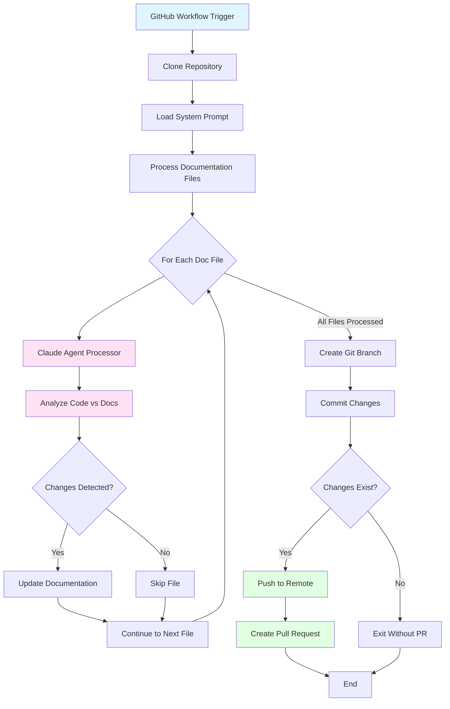
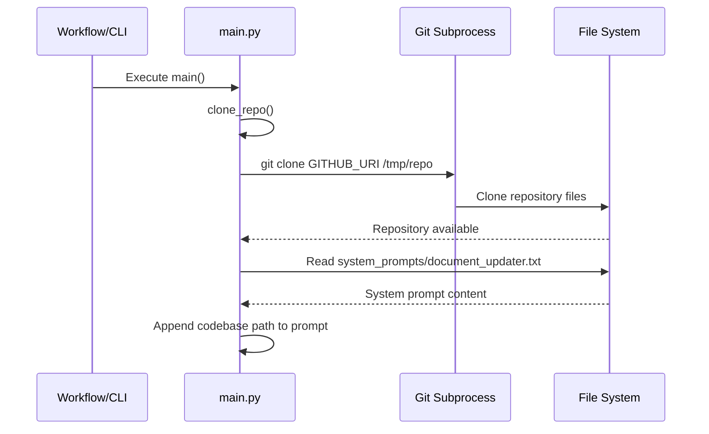
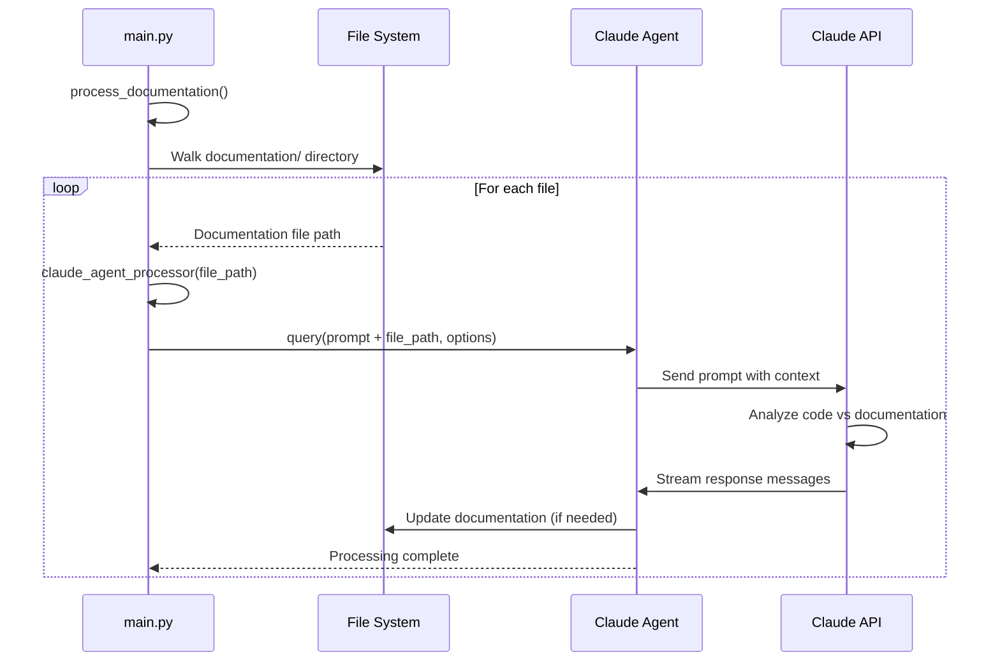
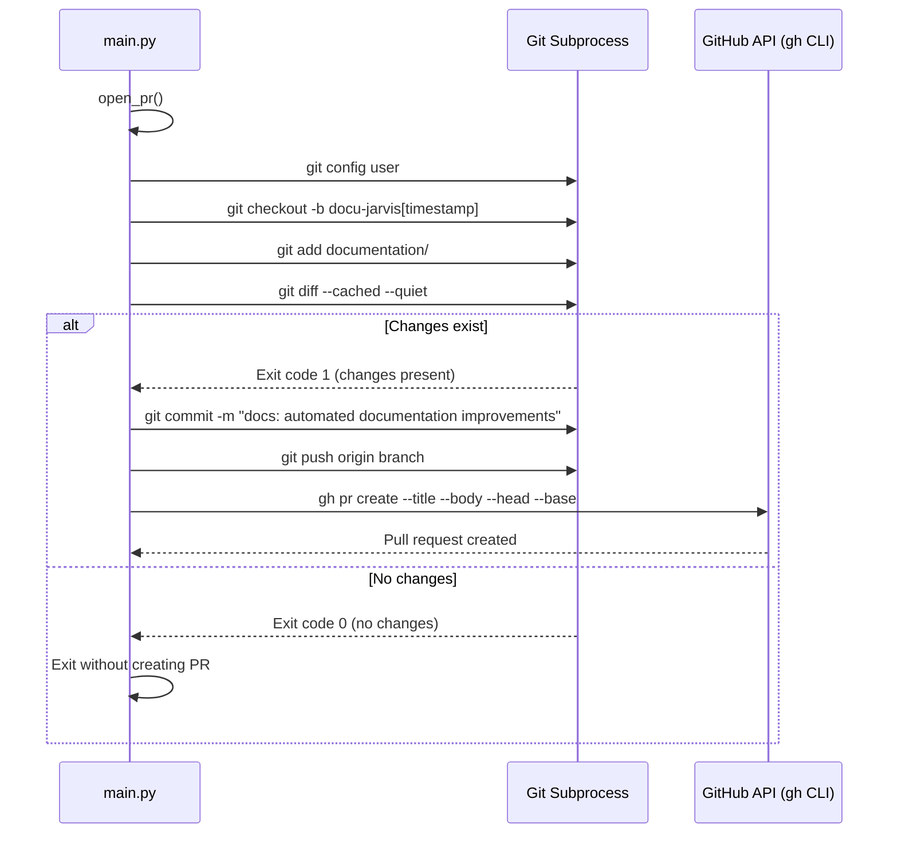

# CodeFlowAI Documentation System: Data Flow Architecture

## Table of Contents

1. [Overview](#overview)
2. [High-Level Architecture](#high-level-architecture)
3. [Core Components](#core-components)
4. [Data Flow](#data-flow)
5. [Code Implementation](#code-implementation)
6. [Integration Points](#integration-points)
7. [Configuration](#configuration)
8. [Monitoring and Operations](#monitoring-and-operations)

## Overview

CodeFlowAI is an automated documentation management system that maintains up-to-date technical documentation through automated pull requests. The system analyses existing documentation files, compares them against the current codebase implementation, and generates pull requests with necessary updates when discrepancies are detected.

**Key Characteristics:**

- **Automated Documentation Validation**: Continuously validates documentation against source code to detect outdated information
- **AI-Powered Analysis**: Leverages Claude AI through the Claude Code SDK to perform intelligent code-to-documentation comparison
- **Git Integration**: Automatically creates branches and pull requests with suggested documentation improvements
- **Configurable Workflow**: Uses customisable system prompts to enforce consistent documentation standards
- **Zero-Touch Operation**: Designed to run as a scheduled workflow without manual intervention

## High-Level Architecture



**Architectural Decisions:**

- **Asynchronous Processing**: Utilises Python's `asyncio` to handle Claude API interactions efficiently
- **Stateless Execution**: Each workflow run starts fresh by cloning the repository, ensuring no state corruption
- **Separation of Concerns**: Configuration, processing logic, and Git operations are isolated into distinct functions
- **Permission-Controlled AI**: Claude agent is restricted to Read and Write operations only, preventing unintended code modifications

## Core Components

### 1. Main Orchestrator (`src/main.py`)

The central entry point that coordinates the entire documentation update workflow. It orchestrates three primary operations:
- Repository cloning and setup
- Documentation file processing via Claude AI
- Pull request creation and submission

### 2. Configuration Manager (`src/config/env_vars.py`)

Manages environment-specific configuration using the dotenv pattern:
- GitHub repository URI configuration
- Documentation folder path configuration
- Environment variable loading and validation

### 3. System Prompt Template (`src/system_prompts/document_updater.txt`)

Defines the behaviour and instructions for the Claude AI agent:
- Establishes validation and synchronisation rules
- Specifies documentation update procedures
- Enforces code-first philosophy (never modify code, only documentation)

### 4. GitHub Workflow (`/.github/workflows/test.yml`)

Continuous integration pipeline that currently runs unit tests but can be extended to trigger documentation updates on schedule or specific events.

## Data Flow

The data flow through the CodeFlowAI system follows a linear pipeline with distinct phases:

### Phase 1: Initialisation and Repository Acquisition



### Phase 2: Documentation Processing Loop



### Phase 3: Pull Request Creation



### Data Transformation Points

1. **Environment Variables → Configuration Objects**: Raw environment strings are loaded and exposed as Python constants
2. **System Prompt File → Augmented Prompt**: Static template is enhanced with dynamic codebase path information
3. **Documentation Files → Analysis Prompts**: Each documentation file is embedded into a structured prompt for Claude
4. **Claude Responses → File Modifications**: Streamed AI responses result in documentation file updates
5. **File Changes → Git Commits**: Modified files are staged, committed, and pushed as atomic units
6. **Git Commits → Pull Requests**: Committed changes are formalised into reviewable pull requests

## Code Implementation

### Entry Point and Main Execution Flow

**File: `src/main.py`**
```python
async def main() -> None:
    clone_repo()
    await process_documentation()


if __name__ == "__main__":
    asyncio.run(main())
```

**Explanation:** The application entry point uses Python's `asyncio.run()` to execute the asynchronous `main()` function. This function performs two sequential operations: cloning the target repository and processing its documentation files. The asynchronous pattern enables efficient handling of Claude API calls which involve I/O-bound operations.

---

### Repository Cloning and Setup

**File: `src/main.py`**
```python
def clone_repo() -> None:
    global FOLDER
    global SYSTEM_PROMPT

    repo_name = GITHUB_URI.rstrip("/").split("/")[-1]
    if repo_name.endswith(".git"):
        repo_name = repo_name[:-4]

    FOLDER = os.path.join("/tmp", repo_name)

    if os.path.exists(FOLDER):
        subprocess.run(["rm", "-rf", FOLDER], check=True)

    subprocess.run(["git", "clone", GITHUB_URI, FOLDER], check=True)
    print("repo cloned successfully")
    SYSTEM_PROMPT += f"""
\nHere is the codebase path where you should look for the relevant code files:
<codebase_path>
{FOLDER}
</codebase_path>
"""
```

**Explanation:** The `clone_repo()` function establishes the working environment by:
1. Extracting the repository name from the GitHub URI (handling both standard and `.git` suffixed URIs)
2. Defining a temporary directory path in `/tmp/`
3. Removing any existing directory to ensure a clean state
4. Cloning the repository using Git subprocess
5. Dynamically augmenting the system prompt with the codebase location, allowing Claude to access the correct file paths

This function modifies global state (`FOLDER` and `SYSTEM_PROMPT`) which is subsequently used by the documentation processing pipeline.

---

### System Prompt Loading

**File: `src/main.py`**
```python
project_root = Path(__file__).resolve().parent.parent
prompt_file = project_root / "src" / "system_prompts" / "document_updater.txt"

try:
    with open(prompt_file, "r", encoding="utf-8") as f:
        SYSTEM_PROMPT = f.read()
    print(f"Successfully loaded system prompt from {prompt_file}")
except FileNotFoundError as e:
    raise FileNotFoundError(
        f"Critical error: System prompt file not found at {prompt_file}"
    )
except Exception as e:
    raise Exception(f"Critical error reading system prompt file: {e}")
```

**Explanation:** The system prompt is loaded at module initialisation time (before `main()` executes). The code:
1. Resolves the project root directory relative to the current file location
2. Constructs an absolute path to the prompt template file
3. Reads the entire prompt content with UTF-8 encoding
4. Implements comprehensive error handling for file access issues, treating prompt loading failure as a critical error that prevents execution

This early loading ensures the prompt is available when `clone_repo()` needs to augment it with the codebase path.

---

### Documentation Processing Pipeline

**File: `src/main.py`**
```python
async def process_documentation() -> None:
    global CLAUDE_OPTIONS

    CLAUDE_OPTIONS = ClaudeCodeOptions(
        allowed_tools=["Read", "Write"], permission_mode="acceptEdits", cwd=FOLDER
    )
    documentation_path = os.path.join(FOLDER, DOCUMENTATION_FOLDER)

    if not os.path.exists(documentation_path):
        raise FileNotFoundError(f"Documentation folder not found: {documentation_path}")

    for root, _, files in os.walk(documentation_path):
        for file in files:
            file_path = os.path.join(root, file)
            await claude_agent_processor(file_path)
```

**Explanation:** The `process_documentation()` function orchestrates the analysis of all documentation files:
1. **Security Configuration**: Initialises `ClaudeCodeOptions` with restrictive permissions—only `Read` and `Write` tools are allowed, preventing the AI from executing arbitrary commands or accessing network resources
2. **Permission Mode**: Sets `acceptEdits` to automatically apply Claude's suggested changes without manual approval
3. **Working Directory**: Configures the cloned repository folder as the working directory for file operations
4. **Directory Validation**: Verifies the documentation folder exists before attempting to process files
5. **Recursive Processing**: Uses `os.walk()` to traverse the documentation directory structure, processing each file through the Claude agent

---

### Claude Agent Integration

**File: `src/main.py`**
```python
async def claude_agent_processor(doc: str) -> None:
    prompt = f"""{SYSTEM_PROMPT}

Here is the documentation file that you need to analyze:
<documentation>
{doc}
</documentation>
"""
    try:
        async for message in query(prompt=prompt, options=CLAUDE_OPTIONS):
            print(message)
    except Exception as e:
        print(f"Error processing {doc}: {e}")
```

**Explanation:** The `claude_agent_processor()` function handles individual documentation files:
1. **Prompt Construction**: Embeds the file path within the pre-loaded system prompt template, instructing Claude which documentation file to validate
2. **Asynchronous Streaming**: Uses the `query()` function from `claude-code-sdk` to send the prompt and receive streaming responses
3. **Real-time Output**: Prints each message as it arrives, providing visibility into Claude's analysis process
4. **Error Resilience**: Catches and logs exceptions for individual file processing, allowing the workflow to continue even if one file fails

The `query()` function internally handles:
- Reading the specified documentation file
- Analyzing related code files in the codebase
- Comparing documentation against implementation
- Writing updates to the documentation file when discrepancies are found

---

### Environment Configuration Loading

**File: `src/config/env_vars.py`**
```python

import os

from dotenv import load_dotenv

load_dotenv()

GITHUB_URI = os.getenv("GITHUB_URI", "")
DOCUMENTATION_FOLDER = os.getenv("DOCUMENTATION_FOLDER", "")
```

**Explanation:** The configuration module provides environment-based configuration:
1. **dotenv Integration**: Calls `load_dotenv()` to load variables from a `.env` file in the project root
2. **Variable Extraction**: Reads `GITHUB_URI` (the repository to process) and `DOCUMENTATION_FOLDER` (the directory containing documentation files)
3. **Default Values**: Provides empty string defaults, though in practice these variables must be set for the system to function correctly

This module is imported by `main.py` at line 9, making these configuration constants available throughout the application.

---

### Pull Request Creation Workflow

**File: `src/main.py`**
```python
def open_pr():
    """
    open a pull request with the doc changes
    """
    now = datetime.datetime.now()
    branch_name = f"docu-jarvis{now.day:02d}{now.month:02d}{now.year}{now.hour:02d}{now.minute:02d}"

    try:
        os.chdir(FOLDER)

        subprocess.run(["git", "config", "user.name", "Docu Jarvis"], check=True)
        subprocess.run(
            ["git", "config", "user.email", "docu-jarvis@automation.local"], check=True
        )
        subprocess.run(["git", "checkout", "-b", branch_name], check=True)
        subprocess.run(["git", "add", DOCUMENTATION_FOLDER + "/"], check=True)
        result = subprocess.run(
            ["git", "diff", "--cached", "--quiet"], capture_output=True
        )
        if result.returncode == 0:
            print("No changes to commit in documentation directory")
            return
        commit_message = "docs: automated documentation improvements by docu-jarvis"
        subprocess.run(["git", "commit", "-m", commit_message], check=True)
        print(f"Pushing branch: {branch_name}")
        subprocess.run(["git", "push", "origin", branch_name], check=True)

        pr_title = "Documentation Update"
        pr_description = "Automated docu-jarvis suggestions"

        subprocess.run(
            [
                "gh",
                "pr",
                "create",
                "--title",
                pr_title,
                "--body",
                pr_description,
                "--head",
                branch_name,
                "--base",
                "main",
            ],
            check=True,
        )

        print(f"Successfully created PR with branch: {branch_name}")

    except subprocess.CalledProcessError as e:
        raise Exception(f"Error creating PR: {e}")
    except Exception as e:
        raise Exception(f"Unexpected error: {e}")
    finally:
        os.chdir(project_root)
```

**Explanation:** The `open_pr()` function handles Git operations and pull request creation:

1. **Unique Branch Naming**: Generates timestamp-based branch names (e.g., `docu-jarvis09042026143005`) to avoid conflicts
2. **Git Configuration**: Sets the commit author as "Docu Jarvis" with an automation email address
3. **Branch Creation**: Creates a new branch from the current state (typically `main`)
4. **Selective Staging**: Only stages files within the documentation folder, ignoring any other changes
5. **Change Detection**: Uses `git diff --cached --quiet` to detect if any changes were actually made:
   - Exit code 0 = no changes → function returns early without creating a PR
   - Exit code 1 = changes present → proceeds with commit and PR creation
6. **Conventional Commits**: Uses the `docs:` prefix following conventional commit standards
7. **GitHub CLI Integration**: Leverages the `gh` command-line tool to create pull requests via GitHub's API
8. **Error Handling**: Wraps all Git operations in try-except blocks to provide meaningful error messages
9. **State Restoration**: The `finally` block ensures the working directory is restored to the project root, even if errors occur

**Note:** This function is defined but not currently called in the `main()` workflow. To enable automatic PR creation, the `main()` function would need to be modified to call `open_pr()` after `process_documentation()` completes.

---

### System Prompt Instructions

**File: `src/system_prompts/document_updater.txt`**
```
You are a code validation and synchronization agent. Your task is to read a documentation file, analyze the related code in the codebase, and ensure the code matches what is described in the documentation. If the code has changed since the documentation was written, you should update the documentation specifications to match the code.

Follow these steps to complete the task:

1. **Analyze the documentation**: Read through the documentation file and identify:
   - What code files, functions, classes, or modules are being documented
   - The expected behavior, interfaces, parameters, return values, and implementation details described
   - Any code examples or specifications provided

2. **Locate the relevant code**: Based on the documentation, identify and examine the actual code files in the provided codebase path that correspond to what is documented.

3. **Compare documentation vs. code**: Determine if the current code implementation matches what is described in the documentation.

4. **Take appropriate action**:
   - If the code matches the documentation: No changes needed
   - If the code differs from the documentation: Update the documentation specifications to match the code
   - Do NOT modify the code files under any circumstances

Important rules:
- Only make changes to documentation files, never to code files
- Only update documentation when there are actual discrepancies between the documentation and current implementation
- Preserve existing documentation structure and style as much as possible when making updates
- If you cannot locate the code files mentioned in the documentation, report this as an issue
- If the documentation is unclear or ambiguous about implementation details, note this but do not make assumptions
```

**Explanation:** The system prompt establishes the AI agent's behaviour and constraints:
1. **Code-First Philosophy**: Enforces that code is the source of truth; documentation must be updated to match code, never vice versa
2. **Structured Analysis Process**: Provides a step-by-step methodology for validation
3. **Safety Constraints**: Explicitly prohibits code modifications, preventing accidental changes to implementation
4. **Preservation Directive**: Instructs the agent to maintain existing documentation structure and style
5. **Error Handling Guidance**: Defines how to handle missing files or ambiguous documentation

This prompt is dynamically augmented with the codebase path during execution (see `clone_repo()` function above).

---

### Complete Data Flow Example

To illustrate the complete data flow, consider a scenario where the system processes a documentation file:

**Step 1: Configuration Loading (Module Initialisation)**

When `main.py` is imported, the configuration is loaded:

```python
# From env_vars.py (imported at main.py:9)
GITHUB_URI = "https://github.com/user/project.git"
DOCUMENTATION_FOLDER = "documentation"
```

**Step 2: System Prompt Loading (Module Initialisation)**

```python
# main.py lines 15-27
SYSTEM_PROMPT = """You are a code validation and synchronization agent..."""
```

**Step 3: Repository Cloning**

```python
# main.py clone_repo()
# Clones to: /tmp/project
# Augments SYSTEM_PROMPT with: <codebase_path>/tmp/project</codebase_path>
FOLDER = "/tmp/project"
```

**Step 4: Documentation Processing**

```python
# main.py process_documentation()
# Constructs path: /tmp/project/documentation
# Walks directory and finds: api-guide.md, architecture.md
# For each file, calls claude_agent_processor()
```

**Step 5: Claude Analysis**

```python
# main.py claude_agent_processor("api-guide.md")
# Constructs prompt:
prompt = """You are a code validation and synchronization agent...
<codebase_path>/tmp/project</codebase_path>

Here is the documentation file that you need to analyze:
<documentation>
api-guide.md
</documentation>
"""

# Calls Claude Code SDK
async for message in query(prompt=prompt, options=CLAUDE_OPTIONS):
    # Claude:
    # 1. Reads api-guide.md
    # 2. Identifies documented APIs (e.g., /api/users endpoint)
    # 3. Searches codebase for implementation
    # 4. Compares implementation vs documentation
    # 5. Updates api-guide.md if discrepancies found
    print(message)  # Outputs Claude's analysis and actions
```

**Step 6: Git Operations** (when `open_pr()` is called)

```python
# main.py open_pr()
# Creates branch: docu-jarvis09042026143005
# Stages changes: git add documentation/
# Checks for changes: git diff --cached --quiet
# If changes exist:
#   - Commits: "docs: automated documentation improvements by docu-jarvis"
#   - Pushes to origin
#   - Creates PR via gh CLI
```

## Integration Points

### 1. Claude AI API

**Integration Type:** External AI Service
**Protocol:** HTTPS REST API (abstracted through `claude-code-sdk`)
**Purpose:** Provides natural language understanding and code analysis capabilities

**Integration Details:**
- **SDK**: `claude-code-sdk` package version 0.0.23
- **Authentication**: Managed by the SDK (typically via API keys in environment variables)
- **Data Sent**: System prompts, documentation file paths, codebase context
- **Data Received**: Streaming analysis results and file modification instructions
- **Rate Limiting**: Handled transparently by the SDK
- **Error Handling**: Connection errors are caught and logged per file

**Configuration:**
```python
CLAUDE_OPTIONS = ClaudeCodeOptions(
    allowed_tools=["Read", "Write"],
    permission_mode="acceptEdits",
    cwd=FOLDER
)
```

---

### 2. GitHub Repository

**Integration Type:** Version Control System
**Protocol:** Git over HTTPS/SSH
**Purpose:** Source repository for code and documentation

**Integration Details:**
- **Operations**: Clone, checkout, commit, push
- **Authentication**: Typically SSH keys or HTTPS tokens (configured in environment)
- **Repository URI**: Configurable via `GITHUB_URI` environment variable
- **Target Branch**: `main` (hardcoded in PR creation logic)

**Git Commands Used:**
```bash
git clone <GITHUB_URI> <FOLDER>
git config user.name "Docu Jarvis"
git config user.email "docu-jarvis@automation.local"
git checkout -b <branch_name>
git add documentation/
git commit -m "docs: automated documentation improvements by docu-jarvis"
git push origin <branch_name>
```

---

### 3. GitHub API

**Integration Type:** REST API
**Protocol:** HTTPS
**Purpose:** Pull request creation and management

**Integration Details:**
- **Tool**: GitHub CLI (`gh`) version 2.x or higher
- **Authentication**: GitHub token (typically stored in `~/.config/gh/hosts.yml`)
- **Operations**: Pull request creation
- **Permissions Required**: Repository write access, PR creation

**PR Creation Command:**
```bash
gh pr create \
  --title "Documentation Update" \
  --body "Automated docu-jarvis suggestions" \
  --head <branch_name> \
  --base main
```

---

### 4. File System

**Integration Type:** Local Storage
**Purpose:** Temporary workspace for repository and processing

**Integration Details:**
- **Working Directory**: `/tmp/<repo_name>/`
- **Documentation Path**: `/tmp/<repo_name>/<DOCUMENTATION_FOLDER>/`
- **Prompt File**: Project-relative path `src/system_prompts/document_updater.txt`
- **Cleanup**: Old clones are removed before new operations

**File Operations:**
- Read: System prompt template, documentation files
- Write: Updated documentation files
- Delete: Temporary repository folders (cleanup)

---

### 5. Python Environment

**Integration Type:** Runtime Dependencies
**Purpose:** Execution environment and libraries

**Key Dependencies:**
```
python-dotenv (0.9.9) - Environment variable management
claude-code-sdk (0.0.23) - Claude AI integration
pytest (7.0.0+) - Testing framework
black (25.1.0+) - Code formatting
isort (6.0.1+) - Import sorting
```

**Python Version:** ≥3.12 (as specified in `pyproject.toml`)

## Configuration

### Environment Variables

The system is configured entirely through environment variables, typically stored in a `.env` file in the project root.

**Required Variables:**

| Variable | Description | Example | Required |
|----------|-------------|---------|----------|
| `GITHUB_URI` | Full URI to the target repository | `https://github.com/org/repo.git` | Yes |
| `DOCUMENTATION_FOLDER` | Relative path to documentation directory | `documentation` or `docs` | Yes |

**Claude SDK Configuration:**

The Claude Code SDK may require additional environment variables for authentication:

| Variable | Description | Required |
|----------|-------------|----------|
| `ANTHROPIC_API_KEY` | Claude API authentication token | Likely Yes |
| `CLAUDE_MODEL` | Specific Claude model to use | No (SDK default) |

---

### Configuration Files

**File: `.env`**
```bash
# Target repository to process
GITHUB_URI=https://github.com/your-org/your-repo.git

# Documentation folder within the repository
DOCUMENTATION_FOLDER=documentation

# Claude API credentials (if required by SDK)
ANTHROPIC_API_KEY=sk-ant-...
```

**File: `src/config/env_vars.py`**

This module loads and exposes configuration:
```python
from dotenv import load_dotenv
import os

load_dotenv()

GITHUB_URI = os.getenv("GITHUB_URI", "")
DOCUMENTATION_FOLDER = os.getenv("DOCUMENTATION_FOLDER", "")
```

---

### System Prompt Customisation

The AI behaviour can be customised by editing:

**File: `src/system_prompts/document_updater.txt`**

This file defines:
- Validation rules
- Documentation update policies
- Analysis procedures
- Safety constraints

**Customisation Examples:**

To enforce stricter documentation standards, add rules like:
```
Additional rules:
- All API endpoints must include example requests and responses
- All functions must document their parameter types
- All classes must include usage examples
```

To change the update policy:
```
4. **Take appropriate action**:
   - If the code matches the documentation: No changes needed
   - If the code differs from the documentation: Create a summary report but do NOT update files
   - Log all discrepancies for manual review
```

---

### Runtime Configuration

**Claude Agent Permissions:**

Configured in `src/main.py:48-50`:
```python
CLAUDE_OPTIONS = ClaudeCodeOptions(
    allowed_tools=["Read", "Write"],  # Restrict to file operations only
    permission_mode="acceptEdits",     # Auto-apply changes
    cwd=FOLDER                         # Limit scope to cloned repo
)
```

**Modification Examples:**

For manual review before changes:
```python
permission_mode="requireApproval"  # Requires human approval for edits
```

For read-only analysis:
```python
allowed_tools=["Read"]  # Disable write operations
```

---

### GitHub Workflow Configuration

**File: `.github/workflows/test.yml`**

Currently configured for testing only. To enable automated documentation updates, a new workflow could be added:

**Proposed: `.github/workflows/doc-sync.yml`**
```yaml
name: Synchronise Documentation

on:
  schedule:
    - cron: '0 2 * * 1'  # Weekly on Mondays at 2am
  workflow_dispatch:      # Allow manual triggers

jobs:
  sync-docs:
    runs-on: ubuntu-latest
    steps:
      - name: Checkout repository
        uses: actions/checkout@v4

      - name: Set up Python
        uses: actions/setup-python@v4
        with:
          python-version: '3.12'

      - name: Install dependencies
        run: |
          python -m pip install --upgrade pip
          pip install -r requirements.txt

      - name: Run documentation sync
        env:
          GITHUB_URI: ${{ github.repository }}
          DOCUMENTATION_FOLDER: documentation
          ANTHROPIC_API_KEY: ${{ secrets.ANTHROPIC_API_KEY }}
          GH_TOKEN: ${{ secrets.GITHUB_TOKEN }}
        run: python src/main.py
```

## Monitoring and Operations

### Logging

**Current Implementation:**

The system uses basic `print()` statements for logging:

**File: `src/main.py`**
```python
# Successful operations
print(f"Successfully loaded system prompt from {prompt_file}")  # Line 21
print("repo cloned successfully")                               # Line 76
print(f"Pushing branch: {branch_name}")                        # Line 109
print(f"Successfully created PR with branch: {branch_name}")   # Line 132

# Error conditions
print(f"Error processing {doc}: {e}")                          # Line 42
print("No changes to commit in documentation directory")       # Line 105
```

**Stream Output from Claude:**
```python
async for message in query(prompt=prompt, options=CLAUDE_OPTIONS):
    print(message)  # Line 40 - Streams Claude's analysis in real-time
```

**Operational Visibility:**

When executed, the system provides visibility into:
1. System prompt loading status
2. Repository clone completion
3. Claude's analysis messages for each file
4. Git operation progress
5. Pull request creation results

---

### Error Handling

**File Access Errors:**

**File: `src/main.py:18-27`**
```python
try:
    with open(prompt_file, "r", encoding="utf-8") as f:
        SYSTEM_PROMPT = f.read()
except FileNotFoundError as e:
    raise FileNotFoundError(
        f"Critical error: System prompt file not found at {prompt_file}"
    )
except Exception as e:
    raise Exception(f"Critical error reading system prompt file: {e}")
```

**Processing Errors:**

Per-file error isolation prevents total workflow failure:
```python
try:
    async for message in query(prompt=prompt, options=CLAUDE_OPTIONS):
        print(message)
except Exception as e:
    print(f"Error processing {doc}: {e}")
    # Continues to next file rather than crashing
```

**Git Operation Errors:**

**File: `src/main.py:134-137`**
```python
except subprocess.CalledProcessError as e:
    raise Exception(f"Error creating PR: {e}")
except Exception as e:
    raise Exception(f"Unexpected error: {e}")
```

---

### Health Checks

**Pre-Execution Validation:**

```python
# Verify documentation folder exists
if not os.path.exists(documentation_path):
    raise FileNotFoundError(f"Documentation folder not found: {documentation_path}")
```

**Change Detection:**

Before creating unnecessary PRs, the system verifies changes exist:
```python
result = subprocess.run(["git", "diff", "--cached", "--quiet"], capture_output=True)
if result.returncode == 0:
    print("No changes to commit in documentation directory")
    return  # Exit without creating PR
```

---

### Operational Metrics

**Key Performance Indicators:**

Currently not explicitly tracked, but can be derived from logs:

1. **Processing Time**: Time from clone to PR creation
2. **File Count**: Number of documentation files processed
3. **Change Detection Rate**: Percentage of runs resulting in PRs
4. **Error Rate**: Number of files failing processing
5. **PR Merge Rate**: Percentage of created PRs that are merged (requires manual tracking)

**Proposed Monitoring Enhancements:**

```python
import time
import logging

logger = logging.getLogger(__name__)

async def process_documentation() -> None:
    start_time = time.time()
    processed = 0
    errors = 0

    for root, _, files in os.walk(documentation_path):
        for file in files:
            file_path = os.path.join(root, file)
            try:
                await claude_agent_processor(file_path)
                processed += 1
            except Exception as e:
                errors += 1
                logger.error(f"Failed to process {file_path}: {e}")

    duration = time.time() - start_time
    logger.info(f"Processed {processed} files in {duration:.2f}s with {errors} errors")
```

---

### Operational Procedures

**Manual Execution:**

```bash
# Set environment variables
export GITHUB_URI=https://github.com/your-org/repo.git
export DOCUMENTATION_FOLDER=documentation
export ANTHROPIC_API_KEY=sk-ant-...

# Run the documentation sync
cd /path/to/CodeFlowAI
python src/main.py
```

**Scheduled Execution (via cron):**

```bash
# Edit crontab
crontab -e

# Add weekly execution (Mondays at 2am)
0 2 * * 1 cd /path/to/CodeFlowAI && /usr/bin/python3 src/main.py >> /var/log/docu-jarvis.log 2>&1
```

**GitHub Actions Execution:**

Create `.github/workflows/doc-sync.yml` (see Configuration section) and enable the workflow in repository settings.

---

### Troubleshooting Guide

**Issue: "System prompt file not found"**

*Cause:* `src/system_prompts/document_updater.txt` is missing
*Solution:* Verify the file exists and the working directory is correct

**Issue: "Documentation folder not found"**

*Cause:* `DOCUMENTATION_FOLDER` path is incorrect or folder doesn't exist in the cloned repo
*Solution:* Verify the environment variable matches the actual folder name in the target repository

**Issue: "No changes to commit"**

*Cause:* Documentation already matches code implementation
*Solution:* This is normal behaviour; no action required

**Issue: Git push fails with authentication error**

*Cause:* Git credentials not configured or insufficient permissions
*Solution:* Configure SSH keys or HTTPS tokens with repository write access

**Issue: "gh pr create" fails**

*Cause:* GitHub CLI not authenticated or insufficient permissions
*Solution:* Run `gh auth login` and ensure the token has PR creation permissions

**Issue: Claude API timeout or rate limit**

*Cause:* Too many requests or slow response from Claude API
*Solution:* Implement retry logic with exponential backoff, or reduce the number of concurrent requests

---

### Security Considerations

**Credential Management:**

- Never commit `.env` files containing API keys or tokens
- Use GitHub Secrets for workflow credentials
- Rotate API keys regularly

**Permission Boundaries:**

The system is designed with defence-in-depth:
1. Claude agent restricted to `Read` and `Write` tools only
2. Working directory limited to `/tmp/<repo>/`
3. Git operations scoped to documentation folder only
4. No execution of arbitrary code from documentation files

**Audit Trail:**

All changes are tracked through Git history:
- Commit author: "Docu Jarvis"
- Commit message: Standardised format
- Pull requests: Provide review checkpoints before merging

**Recommended Security Enhancements:**

```python
# Validate repository URI to prevent malicious clones
import re

def validate_github_uri(uri: str) -> bool:
    pattern = r'^https://github\.com/[\w-]+/[\w-]+(\.git)?$'
    return bool(re.match(pattern, uri))

if not validate_github_uri(GITHUB_URI):
    raise ValueError(f"Invalid GitHub URI: {GITHUB_URI}")
```
