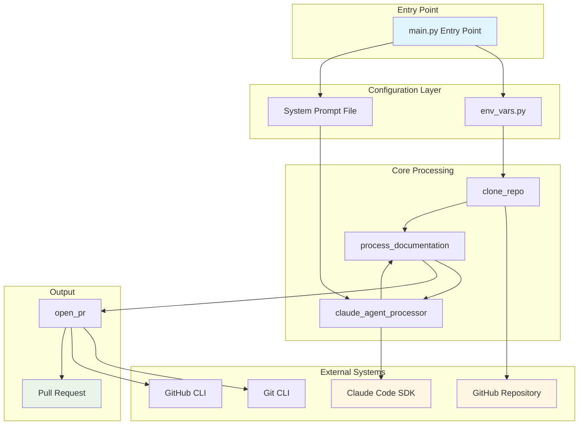
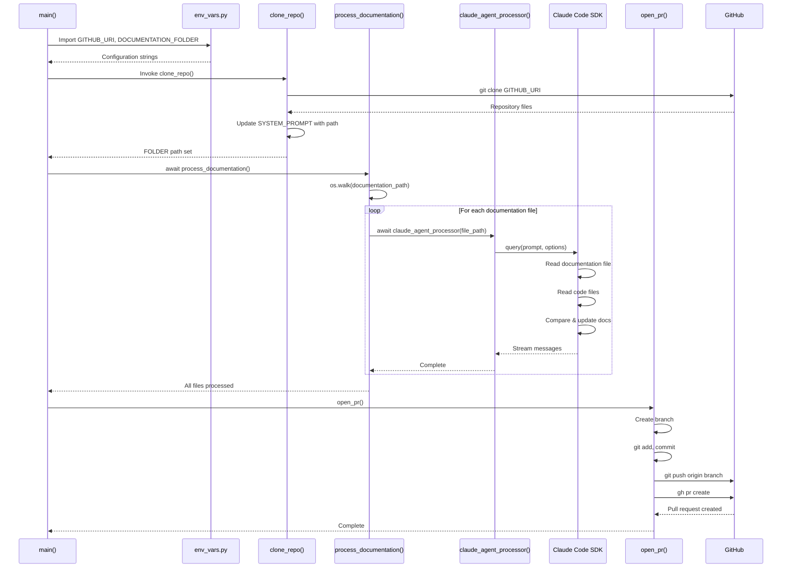

# CodeFlowAI Data Flow Documentation

## Table of Contents

1. [Overview](#overview)
2. [Repo Use Cases](#repo-use-cases)
3. [High-Level Architecture](#high-level-architecture)
4. [Core Components](#core-components)
5. [Data Flow](#data-flow)
6. [Code Implementation](#code-implementation)
7. [Integration Points](#integration-points)
8. [Configuration](#configuration)
9. [Monitoring and Operations](#monitoring-and-operations)

## Overview

CodeFlowAI is an automated documentation management system designed to maintain synchronised and up-to-date technical documentation through automated pull requests. The system analyses documentation files, compares them against actual code implementation, and generates pull requests when discrepancies are detected. The data flow subsystem manages the complete lifecycle of repository cloning, documentation processing, AI-powered analysis, and pull request creation.

The data flow operates within a Python-based asynchronous architecture, orchestrating interactions between GitHub repositories, the Claude Code SDK for AI-powered document analysis, and Git operations for version control integration.

Key characteristics:
- **Asynchronous Processing**: Leverages Python's `asyncio` for non-blocking document analysis operations
- **AI-Driven Analysis**: Integrates with Claude Code SDK to perform intelligent documentation validation
- **Automated Git Workflow**: Manages complete Git lifecycle from clone to pull request creation
- **Environment-Based Configuration**: Separates configuration from code using environment variables
- **Single-Purpose Design**: Focused specifically on documentation synchronisation without broader feature scope

## Repo Use Cases

### 1. Automated Documentation Validation and Update

**Trigger**: Manual execution of `main.py` script or scheduled automation trigger

**Code Path**: `main()` → `clone_repo()` → `process_documentation()` → `claude_agent_processor()` → `open_pr()`

**Process**:
1. System clones the target repository specified in `GITHUB_URI` environment variable to `/tmp/{repo_name}`
2. Iterates through all files in the documentation folder
3. For each documentation file, invokes Claude Code SDK with the system prompt and documentation content
4. AI agent reads documentation, locates corresponding code, identifies discrepancies
5. AI agent updates documentation files if code has diverged from documented behaviour
6. System commits changes and creates pull request with updated documentation

**Output**: GitHub pull request containing synchronised documentation updates

**Constraints**:
- Requires valid GitHub repository URI with access credentials
- Documentation folder must exist in target repository
- GitHub CLI (`gh`) must be installed and authenticated for pull request creation
- Repository must allow push access for creating branches

### 2. Repository Clone and Workspace Preparation

**Trigger**: Invocation of `clone_repo()` function at start of documentation processing workflow

**Code Path**: `clone_repo()` function in `src/main.py:62-82`

**Process**:
1. Extracts repository name from `GITHUB_URI` by splitting on `/` and removing `.git` suffix if present
2. Constructs target directory path as `/tmp/{repo_name}`
3. Removes existing directory if present to ensure clean state
4. Executes `git clone` command via subprocess
5. Appends codebase path to system prompt for AI agent context

**Output**: Cloned repository in `/tmp` directory and updated system prompt with codebase path

**Constraints**:
- Requires network connectivity to GitHub
- Requires disk space in `/tmp` directory
- Overwrites any existing directory with same name

### 3. Pull Request Creation for Documentation Changes

**Trigger**: Completion of documentation processing when changes are detected

**Code Path**: `open_pr()` function in `src/main.py:85-139`

**Process**:
1. Generates timestamped branch name in format `docu-jarvis{DDMMYYYYHHMM}`
2. Configures Git user as "Docu Jarvis" with email `docu-jarvis@automation.local`
3. Creates new branch from current HEAD
4. Stages all changes in documentation folder
5. Checks for staged changes using `git diff --cached --quiet`
6. Commits changes if modifications exist
7. Pushes branch to origin
8. Creates pull request using GitHub CLI with title "Documentation Update" targeting main branch

**Output**: GitHub pull request or notification if no changes detected

**Failure Cases**:
- No changes to commit: Function returns early without creating PR
- Git operations failure: Raises exception with error details
- GitHub CLI authentication failure: Subprocess command fails
- Network connectivity issues: Push or PR creation fails

## High-Level Architecture



**Architectural Decisions**:

1. **Asynchronous Design**: The system uses `asyncio` for document processing to handle potentially long-running AI agent operations without blocking. This is evidenced by the `async def` declarations for `main()`, `process_documentation()`, and `claude_agent_processor()` in `src/main.py`.

2. **Subprocess-Based Git Operations**: Git operations are executed via `subprocess.run()` rather than using a Git library. This provides direct control over Git commands and simplified error handling visible in `src/main.py:73-75` (clone) and `src/main.py:85-139` (PR creation).

3. **Temporary Workspace Pattern**: Repositories are cloned to `/tmp` directory with cleanup on each run (`src/main.py:72-73`), ensuring clean state and avoiding disk accumulation.

4. **Environment-Based Configuration**: Configuration is loaded from environment variables via `python-dotenv` (`src/config/env_vars.py`), separating deployment configuration from code logic.

## Core Components

### 1. Main Orchestrator (`src/main.py`)

**Purpose**: Primary entry point and workflow orchestration for the automated documentation system.

**Responsibilities**:
- Loads system prompt from file system (`src/main.py:18-27`)
- Orchestrates complete workflow from repository clone to pull request creation
- Manages global state for folder path and Claude options
- Provides error handling and logging for critical operations

**Key Functions**:
- `main()`: Top-level async entry point coordinating clone and processing
- `clone_repo()`: Repository acquisition and workspace setup
- `process_documentation()`: Document file discovery and processing loop
- `claude_agent_processor()`: AI agent invocation for individual documents
- `open_pr()`: Pull request creation workflow

### 2. Configuration Module (`src/config/env_vars.py`)

**Purpose**: Centralised configuration loading from environment variables.

**Responsibilities**:
- Loads environment variables using `python-dotenv` library
- Provides configuration values to main processing module
- Defines `GITHUB_URI` for target repository location
- Defines `DOCUMENTATION_FOLDER` for documentation directory path within repository

**Exported Variables**:
- `GITHUB_URI`: Full GitHub repository URL (format: `https://github.com/org/repo.git` or `git@github.com:org/repo.git`)
- `DOCUMENTATION_FOLDER`: Relative path to documentation directory within repository

### 3. System Prompt Template (`src/system_prompts/document_updater.txt`)

**Purpose**: Provides instruction template for Claude AI agent to validate and synchronise documentation.

**Responsibilities**:
- Defines agent's role as "code validation and synchronisation agent"
- Specifies four-step process: analyse documentation, locate code, compare, take action
- Enforces constraint that only documentation files may be modified
- Provides structured thinking framework via scratchpad directive

**Usage**: Loaded at module initialisation (`src/main.py:18-21`) and appended with codebase path during clone operation (`src/main.py:77-82`).

### 4. Claude Code SDK Integration

**Purpose**: Provides AI-powered document analysis and editing capabilities.

**Responsibilities**:
- Executes AI agent with system prompt and documentation content
- Provides file read/write tools to agent for documentation updates
- Streams processing messages for observability
- Manages agent permissions via `ClaudeCodeOptions`

**Configuration** (`src/main.py:48-50`):
```python
ClaudeCodeOptions(
    allowed_tools=["Read", "Write"],
    permission_mode="acceptEdits",
    cwd=FOLDER
)
```

### 5. Git Operations Module (Inline)

**Purpose**: Manages all Git and GitHub CLI interactions for version control workflow.

**Responsibilities**:
- Repository cloning via `git clone`
- Branch creation and checkout
- File staging and committing
- Remote push operations
- Pull request creation via `gh` CLI
- Git configuration for commits

**Location**: Implemented directly in `src/main.py` functions `clone_repo()` and `open_pr()` using `subprocess` module.

## Data Flow

The data flow in CodeFlowAI follows a linear pipeline pattern with clear input, transformation, and output stages. Data moves through the system in the following sequence:

### Stage 1: Configuration Loading

**Input**: Environment variables from `.env` file or system environment

**Transformation**: `python-dotenv` library loads variables into `os.environ`, which are then accessed via `os.getenv()` in `src/config/env_vars.py:8-9`.

**Output**:
- `GITHUB_URI`: String containing repository URL
- `DOCUMENTATION_FOLDER`: String containing documentation directory path

**Data Format**: Raw string values

### Stage 2: System Prompt Preparation

**Input**: Text file at `src/system_prompts/document_updater.txt`

**Transformation**: File read operation with UTF-8 encoding (`src/main.py:19-20`), stored in module-level variable `SYSTEM_PROMPT`.

**Output**: Multi-line string containing AI agent instructions

**Error Handling**: Raises `FileNotFoundError` if prompt file missing, raises generic `Exception` for read errors

### Stage 3: Repository Acquisition

**Input**:
- `GITHUB_URI` from configuration
- Destination path derived from repository name

**Transformation**:
1. Repository name extraction via string splitting (`src/main.py:66-68`)
2. Target folder path construction (`src/main.py:70`)
3. Existing directory removal if present (`src/main.py:72-73`)
4. Git clone subprocess execution (`src/main.py:75`)
5. System prompt augmentation with codebase path (`src/main.py:77-82`)

**Output**:
- Cloned repository files on disk at `/tmp/{repo_name}`
- Updated `SYSTEM_PROMPT` string with embedded codebase path
- Global `FOLDER` variable set to clone location

**Data Format**: File system hierarchy and updated string template

### Stage 4: Documentation File Discovery

**Input**:
- `FOLDER` variable containing clone path
- `DOCUMENTATION_FOLDER` from configuration

**Transformation**: `os.walk()` iteration over documentation directory tree (`src/main.py:56-59`)

**Output**: Sequence of absolute file paths for each documentation file

**Data Format**: List of file path strings

### Stage 5: AI-Powered Document Analysis (Per File)

**Input**:
- File path string for individual documentation file
- `SYSTEM_PROMPT` with instructions and codebase path
- `CLAUDE_OPTIONS` with tool permissions and working directory

**Transformation**:
1. Prompt construction combining system prompt with file path (`src/main.py:31-37`)
2. Async invocation of `query()` from Claude Code SDK (`src/main.py:39`)
3. AI agent reads documentation file content
4. AI agent locates corresponding code files in repository
5. AI agent compares documentation specifications against actual code
6. AI agent updates documentation if discrepancies found
7. Message streaming for progress visibility

**Output**:
- Modified documentation files on disk (if changes needed)
- Processing messages to stdout

**Data Format**: Modified markdown/text files, string messages

**Error Handling**: Exceptions caught and logged with file name (`src/main.py:41-42`)

### Stage 6: Change Detection and Git Commit

**Input**: Modified documentation files in cloned repository

**Transformation**:
1. Git user configuration (`src/main.py:95-98`)
2. Branch creation with timestamp (`src/main.py:89-90, 99`)
3. File staging for documentation folder (`src/main.py:100`)
4. Diff check for actual changes (`src/main.py:101-106`)
5. Commit creation if changes exist (`src/main.py:107-108`)

**Output**:
- New Git branch with committed changes
- Return early if no changes detected

**Data Format**: Git objects (commits, trees, blobs)

### Stage 7: Pull Request Creation

**Input**:
- Git branch with documentation changes
- Hardcoded PR title and description (`src/main.py:112-113`)

**Transformation**:
1. Branch push to origin remote (`src/main.py:110`)
2. GitHub CLI PR creation command execution (`src/main.py:115-130`)

**Output**: GitHub pull request in target repository

**Data Format**: GitHub API objects

### Data Flow Diagram



### State Transitions

The system maintains minimal stateful data during execution:

1. **Module Initialisation**: `SYSTEM_PROMPT` loaded from file (immutable after initial append)
2. **Clone Phase**: `FOLDER` global variable set to clone path
3. **Processing Phase**: `CLAUDE_OPTIONS` object created with permissions
4. **Per-File Processing**: Individual file paths passed to AI agent
5. **Git Operations Phase**: Working directory changed to `FOLDER` (`src/main.py:93`)
6. **Cleanup Phase**: Working directory restored to `project_root` (`src/main.py:139`)

**Observed Constraint**: The system does not persist state between executions. Each run starts fresh by cloning the repository anew.

## Code Implementation

This section traces the complete execution flow from programme entry to pull request creation.

### Entry Point and Initialisation

**File: `src/main.py`**
```python
if __name__ == "__main__":
    asyncio.run(main())
```

**Explanation**: Programme execution begins at line 147-148. The `asyncio.run()` function creates an event loop and executes the async `main()` coroutine, enabling asynchronous document processing operations.

---

**File: `src/main.py`**
```python
project_root = Path(__file__).resolve().parent.parent
prompt_file = project_root / "src" / "system_prompts" / "document_updater.txt"

try:
    with open(prompt_file, "r", encoding="utf-8") as f:
        SYSTEM_PROMPT = f.read()
    print(f"Successfully loaded system prompt from {prompt_file}")
except FileNotFoundError as e:
    raise FileNotFoundError(
        f"Critical error: System prompt file not found at {prompt_file}"
    )
except Exception as e:
    raise Exception(f"Critical error reading system prompt file: {e}")
```

**Explanation**: Lines 15-27 execute during module import, before `main()` runs. The system prompt is loaded from the file system and stored in the module-level `SYSTEM_PROMPT` variable. The programme halts with a critical error if the prompt file cannot be read, as it is essential for AI agent operation.

---

**File: `src/config/env_vars.py`**
```python
import os

from dotenv import load_dotenv

load_dotenv()

GITHUB_URI = os.getenv("GITHUB_URI", "")
DOCUMENTATION_FOLDER = os.getenv("DOCUMENTATION_FOLDER", "")
```

**Explanation**: Configuration module loads environment variables during import. The `load_dotenv()` function reads `.env` file from the project root (if present) and populates `os.environ`. Default empty strings are used if variables are not set, which may cause failures in downstream operations that depend on these values.

---

### Main Workflow Orchestration

**File: `src/main.py`**
```python
async def main() -> None:
    clone_repo()
    await process_documentation()
```

**Explanation**: Lines 142-144 define the main workflow. The `clone_repo()` function is synchronous and must complete before `process_documentation()` begins, ensuring the repository is available on disk before document processing. Note that `open_pr()` is not called from `main()` in the current implementation, suggesting it may be invoked manually or the workflow is incomplete.

---

### Repository Clone and Workspace Setup

**File: `src/main.py`**
```python
def clone_repo() -> None:
    global FOLDER
    global SYSTEM_PROMPT

    repo_name = GITHUB_URI.rstrip("/").split("/")[-1]
    if repo_name.endswith(".git"):
        repo_name = repo_name[:-4]

    FOLDER = os.path.join("/tmp", repo_name)

    if os.path.exists(FOLDER):
        subprocess.run(["rm", "-rf", FOLDER], check=True)

    subprocess.run(["git", "clone", GITHUB_URI, FOLDER], check=True)
    print("repo cloned successfully")
```

**Explanation**: Lines 62-76 handle repository cloning. The function extracts the repository name from the URI by splitting on `/` and taking the last component, removing `.git` suffix if present. This name becomes the directory name in `/tmp`. Any existing directory with the same name is forcibly removed to ensure a clean clone. The `check=True` parameter causes subprocess to raise `CalledProcessError` if Git commands fail.

---

**File: `src/main.py`**
```python
    SYSTEM_PROMPT += f"""
\nHere is the codebase path where you should look for the relevant code files:
<codebase_path>
{FOLDER}
</codebase_path>
"""
```

**Explanation**: Lines 77-82 append the clone path to the system prompt. This provides the AI agent with the absolute path where code files can be found for comparison against documentation. The XML-style tags provide structured context that the Claude model can parse.

---

### Documentation File Discovery and Processing

**File: `src/main.py`**
```python
async def process_documentation() -> None:
    global CLAUDE_OPTIONS

    CLAUDE_OPTIONS = ClaudeCodeOptions(
        allowed_tools=["Read", "Write"], permission_mode="acceptEdits", cwd=FOLDER
    )
    documentation_path = os.path.join(FOLDER, DOCUMENTATION_FOLDER)

    if not os.path.exists(documentation_path):
        raise FileNotFoundError(f"Documentation folder not found: {documentation_path}")

    for root, _, files in os.walk(documentation_path):
        for file in files:
            file_path = os.path.join(root, file)
            await claude_agent_processor(file_path)
```

**Explanation**: Lines 45-59 implement the document processing loop. Claude options are configured to allow only "Read" and "Write" tools, restricting the AI agent's capabilities to file operations. The `permission_mode="acceptEdits"` setting automatically accepts file edits without manual approval. The `os.walk()` function recursively traverses the documentation directory, processing every file including those in subdirectories. Each file path is passed to `claude_agent_processor()` for AI analysis.

---

### AI Agent Invocation for Document Analysis

**File: `src/main.py`**
```python
async def claude_agent_processor(doc: str) -> None:
    prompt = f"""{SYSTEM_PROMPT}

Here is the documentation file that you need to analyze:
<documentation>
{doc}
</documentation>
"""
    try:
        async for message in query(prompt=prompt, options=CLAUDE_OPTIONS):
            print(message)
    except Exception as e:
        print(f"Error processing {doc}: {e}")
```

**Explanation**: Lines 30-42 construct the agent prompt and invoke the Claude Code SDK. The prompt combines the pre-loaded system instructions with the specific documentation file path wrapped in XML tags. The `query()` function from `claude_code_sdk` returns an async generator that yields processing messages, which are printed to stdout for observability. The agent has access to Read and Write tools as configured, enabling it to read documentation, examine code files, and update documentation files when discrepancies are found. Errors are caught and logged but do not halt processing of subsequent files.

---

### Pull Request Creation Workflow

**File: `src/main.py`**
```python
def open_pr():
    """
    open a pull request with the doc changes
    """
    now = datetime.datetime.now()
    branch_name = f"docu-jarvis{now.day:02d}{now.month:02d}{now.year}{now.hour:02d}{now.minute:02d}"

    try:
        os.chdir(FOLDER)

        subprocess.run(["git", "config", "user.name", "Docu Jarvis"], check=True)
        subprocess.run(
            ["git", "config", "user.email", "docu-jarvis@automation.local"], check=True
        )
```

**Explanation**: Lines 85-98 initialise the pull request workflow. A unique branch name is generated using the current timestamp in format `docu-jarvisDDMMYYYYHHMM`. The working directory is changed to the cloned repository location. Git user configuration is set for the commit author, using a bot identity "Docu Jarvis" with a non-existent email domain to clearly identify automated commits.

---

**File: `src/main.py`**
```python
        subprocess.run(["git", "checkout", "-b", branch_name], check=True)
        subprocess.run(["git", "add", DOCUMENTATION_FOLDER + "/"], check=True)
        result = subprocess.run(
            ["git", "diff", "--cached", "--quiet"], capture_output=True
        )
        if result.returncode == 0:
            print("No changes to commit in documentation directory")
            return
```

**Explanation**: Lines 99-106 handle branch creation and change detection. A new branch is created from the current HEAD. All files in the documentation folder are staged. The `git diff --cached --quiet` command checks for staged changes, returning exit code 0 if no changes exist. If no changes are detected, the function returns early without creating a commit or pull request, avoiding empty PRs.

---

**File: `src/main.py`**
```python
        commit_message = "docs: automated documentation improvements by docu-jarvis"
        subprocess.run(["git", "commit", "-m", commit_message], check=True)
        print(f"Pushing branch: {branch_name}")
        subprocess.run(["git", "push", "origin", branch_name], check=True)
```

**Explanation**: Lines 107-110 create and push the commit. A standardised commit message with "docs:" prefix follows conventional commit format. The commit is pushed to the `origin` remote, which points to the original GitHub repository URL.

---

**File: `src/main.py`**
```python
        pr_title = "Documentation Update"
        pr_description = "Automated docu-jarvis suggestions"

        subprocess.run(
            [
                "gh",
                "pr",
                "create",
                "--title",
                pr_title,
                "--body",
                pr_description,
                "--head",
                branch_name,
                "--base",
                "main",
            ],
            check=True,
        )

        print(f"Successfully created PR with branch: {branch_name}")
```

**Explanation**: Lines 112-132 create the pull request using GitHub CLI. The `gh pr create` command targets the `main` branch as the base, with the timestamped branch as the head. Hardcoded title and description are used for all PRs. The `check=True` parameter ensures the function raises an exception if PR creation fails.

---

**File: `src/main.py`**
```python
    except subprocess.CalledProcessError as e:
        raise Exception(f"Error creating PR: {e}")
    except Exception as e:
        raise Exception(f"Unexpected error: {e}")
    finally:
        os.chdir(project_root)
```

**Explanation**: Lines 134-139 provide error handling and cleanup. Subprocess errors are caught and re-raised with descriptive messages. The `finally` block ensures the working directory is restored to the project root regardless of success or failure, preventing side effects on subsequent operations.

---

### Test Coverage

**File: `tests/test_basic.py`**
```python
def test_imports():
    """Test that core modules can be imported."""
    try:
        import sys
        from pathlib import Path

        # Add src to path
        src_path = Path(__file__).parent.parent / "src"
        sys.path.insert(0, str(src_path))

        # Try importing main module
        import main
        assert True
    except ImportError as e:
        # If main.py has dependencies that aren't met, that's okay for now
        assert True
```

**Explanation**: Lines 10-26 in `tests/test_basic.py` provide basic import validation. The test attempts to import the main module after adding `src` to the Python path. However, the test passes even if import fails, providing limited validation value. This suggests test coverage is minimal and primarily serves CI pipeline validation rather than comprehensive functionality testing.

---

### System Prompt Instructions

**File: `src/system_prompts/document_updater.txt`**
```
You are a code validation and synchronization agent. Your task is to read a documentation file, analyze the related code in the codebase, and ensure the code matches what is described in the documentation. If the code has changed since the documentation was written, you should update the documentation specifications to match the code.

Follow these steps to complete the task:

1. **Analyze the documentation**: Read through the documentation file and identify:
   - What code files, functions, classes, or modules are being documented
   - The expected behavior, interfaces, parameters, return values, and implementation details described
   - Any code examples or specifications provided

2. **Locate the relevant code**: Based on the documentation, identify and examine the actual code files in the provided codebase path that correspond to what is documented.

3. **Compare documentation vs. code**: Determine if the current code implementation matches what is described in the documentation.

4. **Take appropriate action**:
   - If the code matches the documentation: No changes needed
   - If the code differs from the documentation: Update the documentation specifications to match the code
   - Do NOT modify the code files under any circumstances
```

**Explanation**: Lines 1-18 of the system prompt define the AI agent's operational instructions. The prompt establishes a four-step process ensuring documentation reflects actual code implementation. The critical constraint "Do NOT modify the code files under any circumstances" is explicitly stated, preventing the agent from making code changes. This prompt is provided to the Claude Code SDK on every invocation, governing agent behaviour during document analysis.

## Integration Points

### 1. Claude Code SDK

**Type**: Python SDK for AI agent orchestration

**Usage**: The system integrates with the Claude Code SDK to provide AI-powered document analysis and editing capabilities.

**Evidence**:
- Import statement: `from claude_code_sdk import ClaudeCodeOptions, query` (`src/main.py:7`)
- Dependency declaration: `claude-code-sdk>=0.0.23,<0.0.24` in `requirements.txt:3` and `pyproject.toml:13`

**Integration Points**:
- **Agent Invocation**: `query(prompt=prompt, options=CLAUDE_OPTIONS)` at `src/main.py:39`
- **Configuration**: `ClaudeCodeOptions` object creation at `src/main.py:48-50`
- **Message Streaming**: Async iteration over query results at `src/main.py:39-40`

**Configuration**:
```python
ClaudeCodeOptions(
    allowed_tools=["Read", "Write"],
    permission_mode="acceptEdits",
    cwd=FOLDER
)
```

**Data Exchange**:
- **Input to SDK**: Multi-line string prompt combining system instructions with documentation file path
- **Output from SDK**: Async generator yielding message strings
- **Side Effects**: Documentation files modified on disk via Write tool

### 2. GitHub Repository (Git Protocol)

**Type**: Version control system hosting target documentation and code

**Usage**: Source of code and documentation to be analysed and updated.

**Evidence**:
- Configuration: `GITHUB_URI` environment variable in `src/config/env_vars.py:8`
- Clone operation: `subprocess.run(["git", "clone", GITHUB_URI, FOLDER], check=True)` at `src/main.py:75`
- Push operation: `subprocess.run(["git", "push", "origin", branch_name], check=True)` at `src/main.py:110`

**Authentication**: Not visible in code. Authentication is handled by Git's credential system (SSH keys or credential helper for HTTPS).

**Operations**:
- Clone repository to local filesystem
- Create branches
- Stage and commit changes
- Push branches to remote

### 3. GitHub API (via GitHub CLI)

**Type**: Pull request creation and management

**Usage**: Automated creation of pull requests for documentation updates.

**Evidence**:
- CLI invocation: `subprocess.run(["gh", "pr", "create", ...], check=True)` at `src/main.py:115-130`

**Authentication**: GitHub CLI (`gh`) manages authentication independently, typically via `gh auth login` or `GITHUB_TOKEN` environment variable. Authentication mechanism is not configured within the codebase.

**Operations**:
- Create pull request with specified title, body, head branch, and base branch

**API Endpoint**: Not directly visible. GitHub CLI abstracts API calls.

### 4. Python Dotenv

**Type**: Environment variable loading library

**Usage**: Loads configuration from `.env` file or system environment.

**Evidence**:
- Import and usage: `from dotenv import load_dotenv` and `load_dotenv()` in `src/config/env_vars.py:4-6`
- Dependency: `python-dotenv>=0.9.9,<0.10.0` in `requirements.txt:1`

**Data Flow**: Reads `.env` file from project root (if exists) and populates `os.environ` dictionary, making variables available via `os.getenv()`.

### 5. Operating System (Subprocess Operations)

**Type**: System command execution

**Usage**: Git operations, directory management, and GitHub CLI invocation.

**Evidence**: Multiple `subprocess.run()` calls throughout `src/main.py`

**Commands Executed**:
- `rm -rf {FOLDER}`: Directory removal at `src/main.py:73`
- `git clone {GITHUB_URI} {FOLDER}`: Repository clone at `src/main.py:75`
- `git config user.name "Docu Jarvis"`: Git user configuration at `src/main.py:95`
- `git config user.email "docu-jarvis@automation.local"`: Git email configuration at `src/main.py:96-98`
- `git checkout -b {branch_name}`: Branch creation at `src/main.py:99`
- `git add {DOCUMENTATION_FOLDER}/`: File staging at `src/main.py:100`
- `git diff --cached --quiet`: Change detection at `src/main.py:101-103`
- `git commit -m {message}`: Commit creation at `src/main.py:108`
- `git push origin {branch_name}`: Remote push at `src/main.py:110`
- `gh pr create ...`: Pull request creation at `src/main.py:115-130`

**Dependencies**: Requires `git` and `gh` CLI tools installed and available in system PATH.

### 6. File System

**Type**: Local storage for repository clone and documentation files

**Usage**: Repository storage, documentation file access, system prompt storage.

**Evidence**:
- Directory operations: `os.path.exists()`, `os.walk()`, `os.chdir()` throughout `src/main.py`
- File read: `open(prompt_file, "r", encoding="utf-8")` at `src/main.py:19`

**Locations**:
- `/tmp/{repo_name}`: Cloned repository working directory
- `src/system_prompts/document_updater.txt`: System prompt template
- `.env`: Configuration file (optional, loaded by dotenv)

### Integration Dependencies Summary

No database, message queue, cache, monitoring service, or external API integrations beyond those listed above are evident in the codebase. The system operates with file system, Git, GitHub, and Claude Code SDK as its sole external dependencies.

## Configuration

### Environment Variables

Configuration is managed exclusively through environment variables loaded via `python-dotenv` library.

**Configuration File**: `.env` (optional, located in project root)

**Loading Mechanism**: `src/config/env_vars.py:4-6`
```python
from dotenv import load_dotenv

load_dotenv()
```

**Configuration Parameters**:

#### `GITHUB_URI`

**Purpose**: Specifies the GitHub repository to clone and process

**Type**: String

**Format**: Git URL (HTTPS or SSH)
- HTTPS format: `https://github.com/organisation/repository.git`
- SSH format: `git@github.com:organisation/repository.git`

**Default**: Empty string (`""`)

**Usage**:
- Repository cloning at `src/main.py:75`
- Repository name extraction at `src/main.py:66`

**Evidence**: `src/config/env_vars.py:8`
```python
GITHUB_URI = os.getenv("GITHUB_URI", "")
```

**Behaviour if Not Set**: Clone operation will fail with Git error when attempting to clone empty URL.

---

#### `DOCUMENTATION_FOLDER`

**Purpose**: Specifies the relative path to the documentation directory within the target repository

**Type**: String

**Format**: Relative directory path (e.g., `documentation`, `docs`, `documentation/api`)

**Default**: Empty string (`""`)

**Usage**:
- Documentation path construction at `src/main.py:51`
- File staging for commit at `src/main.py:100`

**Evidence**: `src/config/env_vars.py:9`
```python
DOCUMENTATION_FOLDER = os.getenv("DOCUMENTATION_FOLDER", "")
```

**Behaviour if Not Set**: `os.walk()` will attempt to traverse empty path, likely causing `FileNotFoundError` at `src/main.py:53-54`.

---

### Claude Code SDK Configuration

**Configuration Object**: `ClaudeCodeOptions`

**Location**: `src/main.py:48-50`

**Parameters**:

- **`allowed_tools`**: `["Read", "Write"]`
  - Restricts AI agent to file read and write operations only
  - Prevents execution of bash commands, web searches, or other tools

- **`permission_mode`**: `"acceptEdits"`
  - Automatically accepts file edits without manual approval
  - Enables fully automated operation without human intervention

- **`cwd`**: `FOLDER` (resolved to `/tmp/{repo_name}`)
  - Sets working directory for agent operations
  - Scopes file operations to cloned repository

**Evidence**:
```python
CLAUDE_OPTIONS = ClaudeCodeOptions(
    allowed_tools=["Read", "Write"], permission_mode="acceptEdits", cwd=FOLDER
)
```

---

### Git Configuration

**Git User Identity**: Set programmatically during PR creation workflow

**Location**: `src/main.py:95-98`

**Parameters**:
- **User Name**: `"Docu Jarvis"` (hardcoded)
- **User Email**: `"docu-jarvis@automation.local"` (hardcoded)

**Evidence**:
```python
subprocess.run(["git", "config", "user.name", "Docu Jarvis"], check=True)
subprocess.run(
    ["git", "config", "user.email", "docu-jarvis@automation.local"], check=True
)
```

**Scope**: Local repository configuration only (does not affect global Git config)

---

### Pull Request Configuration

**PR Metadata**: Hardcoded in `src/main.py:112-113`

**Parameters**:
- **Title**: `"Documentation Update"` (static)
- **Description**: `"Automated docu-jarvis suggestions"` (static)
- **Base Branch**: `"main"` (hardcoded)

**Evidence**:
```python
pr_title = "Documentation Update"
pr_description = "Automated docu-jarvis suggestions"
```

**Branch Naming**: Dynamic timestamp-based naming
```python
now = datetime.datetime.now()
branch_name = f"docu-jarvis{now.day:02d}{now.month:02d}{now.year}{now.hour:02d}{now.minute:02d}"
```

Format: `docu-jarvisDDMMYYYYHHMM` (e.g., `docu-jarvis110420261432`)

---

### System Prompt Configuration

**Template File**: `src/system_prompts/document_updater.txt`

**Loading**: Occurs at module import time (`src/main.py:18-27`)

**Modification**: Codebase path is appended during `clone_repo()` execution (`src/main.py:77-82`)

**Evidence**:
```python
SYSTEM_PROMPT += f"""
\nHere is the codebase path where you should look for the relevant code files:
<codebase_path>
{FOLDER}
</codebase_path>
"""
```

**Usage**: Combined with documentation file path to create per-file agent prompts

---

### Workspace Configuration

**Clone Location**: `/tmp/{repo_name}` (hardcoded)

**Evidence**: `src/main.py:70`
```python
FOLDER = os.path.join("/tmp", repo_name)
```

**Cleanup Strategy**: Existing directory forcibly removed before each clone (`src/main.py:72-73`)

**Working Directory Management**: Changed to `FOLDER` during PR creation, restored to `project_root` in finally block (`src/main.py:93, 139`)

---

### Configuration Summary

No configuration files beyond `.env` are present in the repository. All settings are either:
1. Environment variables (repository URI, documentation folder)
2. Hardcoded constants (PR title, user identity, clone location)
3. Programmatically generated (branch names)

**Configuration Differences Across Environments**: Not evident from the codebase. The same hardcoded values and environment variable names are used regardless of deployment environment.

## Monitoring and Operations

### Logging

**Logging Mechanism**: Standard output (`print()` statements)

**Location and Evidence**:

1. **System Prompt Load Success**: `src/main.py:21`
   ```python
   print(f"Successfully loaded system prompt from {prompt_file}")
   ```
   **Purpose**: Confirms system prompt file was read successfully during module initialisation.

2. **Repository Clone Success**: `src/main.py:76`
   ```python
   print("repo cloned successfully")
   ```
   **Purpose**: Confirms Git clone operation completed without error.

3. **AI Agent Processing Messages**: `src/main.py:40`
   ```python
   async for message in query(prompt=prompt, options=CLAUDE_OPTIONS):
       print(message)
   ```
   **Purpose**: Streams AI agent processing updates, providing visibility into document analysis operations.

4. **Processing Error**: `src/main.py:42`
   ```python
   except Exception as e:
       print(f"Error processing {doc}: {e}")
   ```
   **Purpose**: Logs errors during document processing without halting execution of remaining files.

5. **No Changes Detected**: `src/main.py:105`
   ```python
   print("No changes to commit in documentation directory")
   ```
   **Purpose**: Indicates PR creation was skipped due to absence of documentation changes.

6. **Branch Push Notification**: `src/main.py:109`
   ```python
   print(f"Pushing branch: {branch_name}")
   ```
   **Purpose**: Confirms branch push operation is executing.

7. **PR Creation Success**: `src/main.py:132`
   ```python
   print(f"Successfully created PR with branch: {branch_name}")
   ```
   **Purpose**: Confirms pull request was created successfully on GitHub.

**Log Format**: Unstructured plain text messages to stdout

**Log Levels**: Not implemented. All messages are informational without severity classification.

**Structured Logging**: Not evident in the codebase. No logging library (e.g., `logging`, `structlog`) is used.

---

### Metrics and Monitoring

**Metrics Collection**: Not evident from the codebase.

**Observability Tools**: No integration with monitoring systems (Prometheus, DataDog, CloudWatch, etc.) is visible.

**Performance Tracking**: No timing, duration, or performance metrics are captured.

---

### Error Handling and Failure Modes

#### 1. System Prompt Load Failure

**Location**: `src/main.py:22-27`

**Behaviour**: Raises `FileNotFoundError` or generic `Exception`, halting programme before `main()` executes.

**Evidence**:
```python
except FileNotFoundError as e:
    raise FileNotFoundError(
        f"Critical error: System prompt file not found at {prompt_file}"
    )
except Exception as e:
    raise Exception(f"Critical error reading system prompt file: {e}")
```

**Recovery**: None. Programme terminates immediately.

---

#### 2. Git Clone Failure

**Location**: `src/main.py:75`

**Behaviour**: `subprocess.run()` with `check=True` raises `CalledProcessError` if clone fails.

**Causes**:
- Invalid or inaccessible repository URI
- Authentication failure
- Network connectivity issues
- Insufficient disk space

**Evidence**:
```python
subprocess.run(["git", "clone", GITHUB_URI, FOLDER], check=True)
```

**Recovery**: None. Exception propagates to caller, terminating programme.

---

#### 3. Documentation Folder Not Found

**Location**: `src/main.py:53-54`

**Behaviour**: Raises `FileNotFoundError` with descriptive message.

**Evidence**:
```python
if not os.path.exists(documentation_path):
    raise FileNotFoundError(f"Documentation folder not found: {documentation_path}")
```

**Recovery**: None. Programme terminates.

---

#### 4. Document Processing Error

**Location**: `src/main.py:41-42`

**Behaviour**: Exception caught and logged. Processing continues with next file.

**Evidence**:
```python
except Exception as e:
    print(f"Error processing {doc}: {e}")
```

**Impact**: Individual file failures do not halt processing of remaining documentation files. This provides partial success behaviour.

---

#### 5. Pull Request Creation Failure

**Location**: `src/main.py:134-137`

**Behaviour**: Subprocess errors and general exceptions caught, re-raised with descriptive messages.

**Evidence**:
```python
except subprocess.CalledProcessError as e:
    raise Exception(f"Error creating PR: {e}")
except Exception as e:
    raise Exception(f"Unexpected error: {e}")
```

**Causes**:
- Git authentication failure
- Network issues
- GitHub CLI not installed or not authenticated
- Branch already exists on remote
- Merge conflicts
- API rate limiting

**Recovery**: Working directory restored to `project_root` in `finally` block. No retry mechanism.

---

### Health Checks and Diagnostics

**Health Endpoints**: Not applicable. This is a batch script, not a service.

**Diagnostic Tools**: Not evident in the codebase.

**Status Reporting**: Exit code is the only programmatic status indicator (0 for success, non-zero for failure).

---

### Operational Notes

1. **No Persistent State**: Each execution starts fresh by cloning repository anew. No state is carried between runs.

2. **Workspace Cleanup**: `/tmp/{repo_name}` is removed and recreated on each run. Disk space is not accumulated across executions.

3. **Working Directory Restoration**: `finally` block at `src/main.py:139` ensures working directory is restored even if PR creation fails, preventing side effects.

4. **Authentication Requirements**:
   - Git must be configured with credentials for cloning and pushing to `GITHUB_URI`
   - GitHub CLI must be authenticated (typically via `gh auth login`)
   - No authentication configuration is managed by the codebase itself

5. **Dependencies on External Tools**:
   - `git` CLI must be installed and in PATH
   - `gh` CLI must be installed and in PATH
   - Missing tools will cause subprocess commands to fail with "command not found" errors

6. **No Retry Logic**: All operations execute once. Transient failures (network timeouts, rate limits) are not retried.

7. **No Rollback**: If PR creation fails after pushing branch, the branch remains on remote without associated PR.

8. **Concurrency**: Not addressed. Running multiple instances simultaneously could cause conflicts in `/tmp/{repo_name}` directory if processing same repository.

9. **File Processing Order**: `os.walk()` processes files in arbitrary filesystem order (not alphabetical, not by modification time). Processing order is not deterministic.

10. **Empty Documentation Folder**: If documentation folder contains no files, loop completes without processing anything. No warning is logged.

---

### Debugging Capabilities

**Debug Mode**: Not implemented. No verbose logging flag or debug configuration option is available.

**Exception Stack Traces**: Visible in stdout when exceptions are not caught (e.g., clone failure, system prompt load failure).

**AI Agent Transparency**: Agent processing messages are streamed to stdout, providing visibility into AI decision-making process.

**Git Operations Visibility**: No verbose flag passed to Git commands. Git output is not captured or logged.

---

### Operational Constraints

1. **Platform Dependency**: Hardcoded use of `rm -rf` command (`src/main.py:73`) assumes Unix-like operating system. Will fail on Windows.

2. **Temporary Storage**: Requires write access to `/tmp` directory with sufficient space for repository clone.

3. **Memory Constraints**: Not addressed. Large repositories or numerous large documentation files may exhaust memory during processing.

4. **Network Requirements**: Requires internet connectivity for:
   - GitHub repository clone
   - Claude Code SDK API calls (assumed)
   - Git push operations
   - GitHub API calls via CLI

5. **Branch Name Collisions**: If script runs multiple times in same minute, branch names collide. No collision handling is implemented.

6. **Base Branch Assumption**: Hardcoded `"main"` as base branch. Repositories using `master`, `develop`, or other default branches will have PRs target wrong branch.
