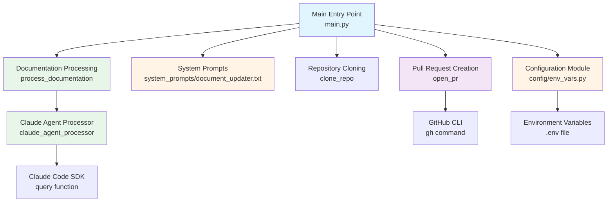
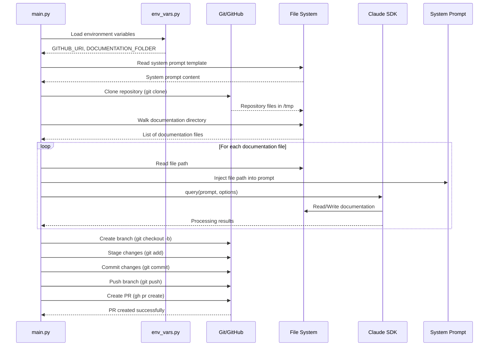

# CodeFlowAI Module Structure

## Table of Contents

1. [Overview](#overview)
2. [High-Level Architecture](#high-level-architecture)
3. [Core Components](#core-components)
4. [Data Flow](#data-flow)
5. [Code Implementation](#code-implementation)
6. [Integration Points](#integration-points)
7. [Configuration](#configuration)
8. [Monitoring and Operations](#monitoring-and-operations)

---

## Overview

The CodeFlowAI system is an automated documentation management tool designed to maintain synchronisation between codebases and their technical documentation. The system employs a modular architecture that separates concerns across configuration, orchestration, and external integrations.

### Key Characteristics

- **Asynchronous Processing**: Uses Python's `asyncio` for concurrent documentation processing
- **Modular Design**: Clear separation between configuration, system prompts, and orchestration logic
- **Git Integration**: Automated repository cloning, branching, and pull request creation
- **AI-Powered**: Leverages Claude Code SDK for intelligent documentation analysis and updates
- **Environment-Driven**: Configuration managed through environment variables for flexibility across deployments

---

## High-Level Architecture



### Architectural Decisions

**Separation of Concerns**: The codebase is organised into three primary modules:
- **Configuration** (`src/config/`): Centralised environment variable management
- **System Prompts** (`src/system_prompts/`): Templated instructions for AI processing
- **Orchestration** (`src/main.py`): Main workflow coordination and execution

**Dependency Management**: The project uses Poetry for dependency management with a fallback `requirements.txt` for CI/CD compatibility. This dual approach ensures both development flexibility and deployment reliability.

**Asynchronous Execution**: The documentation processing pipeline is built on `asyncio`, enabling efficient concurrent processing of multiple documentation files.

---

## Core Components

### 1. Main Orchestration Module (`src/main.py`)

The central orchestration module coordinates the entire documentation update workflow. It manages four primary functions:

- **Repository Management**: Clones target repositories into temporary directories
- **System Prompt Loading**: Reads and prepares AI processing instructions
- **Documentation Processing**: Iterates through documentation files and processes them via Claude
- **Pull Request Automation**: Creates and submits pull requests with documentation updates

### 2. Configuration Module (`src/config/env_vars.py`)

A lightweight configuration module that loads environment variables using `python-dotenv`. It exposes two critical configuration parameters:

- **`GITHUB_URI`**: The target repository URL for documentation processing
- **`DOCUMENTATION_FOLDER`**: The relative path to the documentation directory within the repository

### 3. System Prompts Module (`src/system_prompts/document_updater.txt`)

Contains the structured prompt template that instructs the Claude AI agent on how to validate and synchronise documentation. This prompt defines the validation workflow, comparison logic, and update rules.

### 4. Test Suite (`tests/test_basic.py`)

Provides basic test coverage to verify:
- Python module importability
- Test framework functionality
- Core module structure integrity

### 5. CI/CD Configuration (`.github/workflows/test.yml`)

Defines automated testing workflow triggered on pushes and pull requests to the main branch. Ensures code quality through automated test execution.

### 6. Dependency Management

- **`pyproject.toml`**: Poetry configuration defining project metadata and dependencies
- **`requirements.txt`**: Pip-compatible dependency list for CI/CD and simplified deployments

---

## Data Flow

The data flow through the CodeFlowAI system follows a sequential pipeline with distinct phases:



### Key Data Transformations

1. **Environment Loading**: Environment variables are loaded from `.env` file and transformed into Python string constants
2. **System Prompt Augmentation**: Base system prompt is augmented with codebase path information after repository cloning
3. **Documentation File Iteration**: Directory tree traversal converts filesystem structure into iterable file paths
4. **Claude Options Construction**: Configuration parameters are transformed into `ClaudeCodeOptions` object with specific permissions and working directory
5. **Git Branch Naming**: Timestamp data is transformed into unique branch names using format `docu-jarvis{DD}{MM}{YYYY}{HH}{MM}`

---

## Code Implementation

This section provides a detailed walkthrough of the complete code implementation, tracing execution paths from entry point to completion.

### Entry Point and Initialisation

**File: `src/main.py`**
```python
if __name__ == "__main__":
    asyncio.run(main())
```

**Explanation:** The application entry point uses `asyncio.run()` to execute the asynchronous `main()` function, establishing the event loop for concurrent operations.

---

**File: `src/main.py`**
```python
async def main() -> None:
    clone_repo()
    await process_documentation()
```

**Explanation:** The main function orchestrates the two-phase workflow: first cloning the target repository, then processing its documentation files asynchronously.

---

### Configuration Loading

**File: `src/config/env_vars.py`**
```python
import os

from dotenv import load_dotenv

load_dotenv()

GITHUB_URI = os.getenv("GITHUB_URI", "")
DOCUMENTATION_FOLDER = os.getenv("DOCUMENTATION_FOLDER", "")
```

**Explanation:** The configuration module loads environment variables from a `.env` file using `python-dotenv`. It exposes two constants: `GITHUB_URI` (the repository URL) and `DOCUMENTATION_FOLDER` (the documentation directory path). Default values are empty strings if not configured.

---

### System Prompt Loading

**File: `src/main.py`**
```python
project_root = Path(__file__).resolve().parent.parent
prompt_file = project_root / "src" / "system_prompts" / "document_updater.txt"

try:
    with open(prompt_file, "r", encoding="utf-8") as f:
        SYSTEM_PROMPT = f.read()
    print(f"Successfully loaded system prompt from {prompt_file}")
except FileNotFoundError as e:
    raise FileNotFoundError(
        f"Critical error: System prompt file not found at {prompt_file}"
    )
except Exception as e:
    raise Exception(f"Critical error reading system prompt file: {e}")
```

**Explanation:** At module initialisation, the system prompt template is loaded from `src/system_prompts/document_updater.txt`. The code uses `Path` for cross-platform path resolution, starting from the script's location and navigating to the project root. Error handling ensures the application fails fast if the critical system prompt file is missing, preventing silent failures downstream.

---

### Repository Cloning

**File: `src/main.py`**
```python
def clone_repo() -> None:
    global FOLDER
    global SYSTEM_PROMPT

    repo_name = GITHUB_URI.rstrip("/").split("/")[-1]
    if repo_name.endswith(".git"):
        repo_name = repo_name[:-4]

    FOLDER = os.path.join("/tmp", repo_name)

    if os.path.exists(FOLDER):
        subprocess.run(["rm", "-rf", FOLDER], check=True)

    subprocess.run(["git", "clone", GITHUB_URI, FOLDER], check=True)
    print("repo cloned successfully")
    SYSTEM_PROMPT += f"""
\nHere is the codebase path where you should look for the relevant code files:
<codebase_path>
{FOLDER}
</codebase_path>
"""
```

**Explanation:** This function extracts the repository name from the URI, creates a temporary directory path in `/tmp`, removes any existing directory with the same name, and clones the repository using Git. After successful cloning, it augments the system prompt with the codebase path information enclosed in XML-style tags. This augmented prompt provides context to the Claude AI about where to find source files. The use of global variables (`FOLDER` and `SYSTEM_PROMPT`) allows other functions to access these values.

---

### Documentation Processing Pipeline

**File: `src/main.py`**
```python
async def process_documentation() -> None:
    global CLAUDE_OPTIONS

    CLAUDE_OPTIONS = ClaudeCodeOptions(
        allowed_tools=["Read", "Write"], permission_mode="acceptEdits", cwd=FOLDER
    )
    documentation_path = os.path.join(FOLDER, DOCUMENTATION_FOLDER)

    if not os.path.exists(documentation_path):
        raise FileNotFoundError(f"Documentation folder not found: {documentation_path}")

    for root, _, files in os.walk(documentation_path):
        for file in files:
            file_path = os.path.join(root, file)
            await claude_agent_processor(file_path)
```

**Explanation:** This asynchronous function configures Claude Code SDK options with restricted permissions (only "Read" and "Write" tools allowed) and sets the working directory to the cloned repository. It constructs the full path to the documentation folder, validates its existence, and then walks through all files in the documentation directory tree. For each file, it invokes the `claude_agent_processor` asynchronously, enabling concurrent processing of documentation files.

---

### Claude Agent Processing

**File: `src/main.py`**
```python
async def claude_agent_processor(doc: str) -> None:
    prompt = f"""{SYSTEM_PROMPT}

Here is the documentation file that you need to analyze:
<documentation>
{doc}
</documentation>
"""
    try:
        async for message in query(prompt=prompt, options=CLAUDE_OPTIONS):
            print(message)
    except Exception as e:
        print(f"Error processing {doc}: {e}")
```

**Explanation:** This function constructs a complete prompt by combining the system prompt with the specific documentation file path, enclosed in XML tags. It then invokes the Claude Code SDK's `query` function, which returns an async generator of messages. The function streams these messages to stdout, providing real-time feedback on the processing status. Error handling ensures that failures in processing individual files don't crash the entire pipeline.

---

**File: `src/main.py`**
```python
from claude_code_sdk import ClaudeCodeOptions, query

from config.env_vars import DOCUMENTATION_FOLDER, GITHUB_URI
```

**Explanation:** Import statement showing the integration with Claude Code SDK. The `query` function is the primary interface for interacting with Claude AI, whilst `ClaudeCodeOptions` provides configuration for tool permissions and working directory settings.

---

### Pull Request Creation

**File: `src/main.py`**
```python
def open_pr():
    """
    open a pull request with the doc changes
    """
    now = datetime.datetime.now()
    branch_name = f"docu-jarvis{now.day:02d}{now.month:02d}{now.year}{now.hour:02d}{now.minute:02d}"

    try:
        os.chdir(FOLDER)

        subprocess.run(["git", "config", "user.name", "Docu Jarvis"], check=True)
        subprocess.run(
            ["git", "config", "user.email", "docu-jarvis@automation.local"], check=True
        )
        subprocess.run(["git", "checkout", "-b", branch_name], check=True)
        subprocess.run(["git", "add", DOCUMENTATION_FOLDER + "/"], check=True)
        result = subprocess.run(
            ["git", "diff", "--cached", "--quiet"], capture_output=True
        )
        if result.returncode == 0:
            print("No changes to commit in documentation directory")
            return
        commit_message = "docs: automated documentation improvements by docu-jarvis"
        subprocess.run(["git", "commit", "-m", commit_message], check=True)
        print(f"Pushing branch: {branch_name}")
        subprocess.run(["git", "push", "origin", branch_name], check=True)

        pr_title = "Documentation Update"
        pr_description = "Automated docu-jarvis suggestions"

        subprocess.run(
            [
                "gh",
                "pr",
                "create",
                "--title",
                pr_title,
                "--body",
                pr_description,
                "--head",
                branch_name,
                "--base",
                "main",
            ],
            check=True,
        )

        print(f"Successfully created PR with branch: {branch_name}")

    except subprocess.CalledProcessError as e:
        raise Exception(f"Error creating PR: {e}")
    except Exception as e:
        raise Exception(f"Unexpected error: {e}")
    finally:
        os.chdir(project_root)
```

**Explanation:** This function automates the complete pull request workflow. It generates a unique branch name using a timestamp format, configures Git with the "Docu Jarvis" bot identity, creates a new branch, stages documentation changes, and checks if any changes exist. If changes are present, it commits them with a standardised message, pushes the branch to the remote repository, and creates a pull request using the GitHub CLI (`gh`). The `finally` block ensures the working directory is restored to the project root, preventing side effects. The function uses `check=True` on subprocess calls to ensure Git command failures propagate as exceptions.

---

### System Prompt Template

**File: `src/system_prompts/document_updater.txt`**
```text
You are a code validation and synchronization agent. Your task is to read a documentation file, analyze the related code in the codebase, and ensure the code matches what is described in the documentation. If the code has changed since the documentation was written, you should update the documentation specifications to match the code.

Follow these steps to complete the task:

1. **Analyze the documentation**: Read through the documentation file and identify:
   - What code files, functions, classes, or modules are being documented
   - The expected behavior, interfaces, parameters, return values, and implementation details described
   - Any code examples or specifications provided

2. **Locate the relevant code**: Based on the documentation, identify and examine the actual code files in the provided codebase path that correspond to what is documented.

3. **Compare documentation vs. code**: Determine if the current code implementation matches what is described in the documentation.

4. **Take appropriate action**:
   - If the code matches the documentation: No changes needed
   - If the code differs from the documentation: Update the documentation specifications to match the code
   - Do NOT modify the code files under any circumstances

Important rules:
- Only make changes to documentation files, never to code files
- Only update documentation when there are actual discrepancies between the documentation and current implementation
- Preserve existing documentation structure and style as much as possible when making updates
- If you cannot locate the code files mentioned in the documentation, report this as an issue
- If the documentation is unclear or ambiguous about implementation details, note this but do not make assumptions
```

**Explanation:** The system prompt defines the AI agent's role as a validation and synchronisation agent. It provides structured instructions for analysing documentation, locating corresponding code, comparing them, and taking appropriate action. The prompt emphasises that code should never be modified—only documentation can be updated to reflect code changes. This ensures the system maintains code integrity whilst keeping documentation accurate.

---

### Test Suite Implementation

**File: `tests/test_basic.py`**
```python
"""
Basic test file to verify the test framework is working.
"""

def test_basic():
    """A simple test to verify pytest is working."""
    assert True


def test_imports():
    """Test that core modules can be imported."""
    try:
        import sys
        from pathlib import Path

        # Add src to path
        src_path = Path(__file__).parent.parent / "src"
        sys.path.insert(0, str(src_path))

        # Try importing main module
        import main
        assert True
    except ImportError as e:
        # If main.py has dependencies that aren't met, that's okay for now
        assert True
```

**Explanation:** The test suite provides two basic tests. `test_basic()` verifies pytest functionality with a trivial assertion. `test_imports()` attempts to import the main module, adding the `src` directory to the Python path to enable imports. The graceful error handling allows tests to pass even if dependencies aren't installed, providing a basic smoke test for module structure integrity.

---

## Integration Points

### External Dependencies

**Claude Code SDK** (`claude-code-sdk>=0.0.23,<0.0.24`)
- **Purpose**: AI-powered code and documentation analysis
- **Integration Method**: Python SDK with asynchronous query interface
- **Usage**: Processes documentation files and compares them against codebase
- **Configuration**: `ClaudeCodeOptions` with tool permissions and working directory

**Python-dotenv** (`python-dotenv>=0.9.9,<0.10.0`)
- **Purpose**: Environment variable management
- **Integration Method**: File-based `.env` configuration
- **Usage**: Loads `GITHUB_URI` and `DOCUMENTATION_FOLDER` configuration
- **Location**: `src/config/env_vars.py`

**Git** (System Dependency)
- **Purpose**: Repository cloning, branching, committing, and pushing
- **Integration Method**: Subprocess calls to `git` CLI
- **Usage**: Manages repository lifecycle and version control operations
- **Configuration**: Git user identity set to "Docu Jarvis" bot account

**GitHub CLI** (`gh` - System Dependency)
- **Purpose**: Pull request creation and management
- **Integration Method**: Subprocess calls to `gh` CLI
- **Usage**: Creates pull requests programmatically
- **Authentication**: Requires `gh` to be authenticated (typically via `gh auth login`)

**Pytest** (`pytest>=7.0.0`)
- **Purpose**: Test framework for unit and integration testing
- **Integration Method**: Test discovery and execution
- **Usage**: Validates module imports and basic functionality
- **Location**: `tests/` directory

### API Interfaces

**Claude Code SDK Query Interface**
```python
async for message in query(prompt=prompt, options=CLAUDE_OPTIONS):
    print(message)
```
- Asynchronous generator-based interface
- Accepts prompt string and options object
- Streams processing messages in real-time

### File System Integration

- **Repository Cloning Target**: `/tmp/{repository_name}/`
- **Documentation Source**: `{FOLDER}/{DOCUMENTATION_FOLDER}/`
- **System Prompt Location**: `src/system_prompts/document_updater.txt`
- **Configuration File**: `.env` (project root)

---

## Configuration

### Environment Variables

Configuration is managed through environment variables defined in a `.env` file at the project root.

**File: `src/config/env_vars.py`**

| Variable | Type | Required | Description | Example |
|----------|------|----------|-------------|---------|
| `GITHUB_URI` | String | Yes | The full URL of the target GitHub repository to process | `https://github.com/user/repo.git` |
| `DOCUMENTATION_FOLDER` | String | Yes | Relative path to the documentation directory within the repository | `documentation` or `docs` |

### Configuration Example

**File: `.env`**
```bash
GITHUB_URI=https://github.com/organisation/project.git
DOCUMENTATION_FOLDER=documentation
```

### Dependency Configuration

**File: `pyproject.toml`**
```toml
[project]
name = "documentation-updater"
version = "0.1.0"
description = ""
authors = [
    {name = "Your Name",email = "you@example.com"}
]
readme = "README.md"
requires-python = ">=3.12"
dependencies = [
    "dotenv (>=0.9.9,<0.10.0)",
    "isort (>=6.0.1,<7.0.0)",
    "claude-code-sdk (>=0.0.23,<0.0.24)"
]
```

**Explanation:** Poetry configuration requires Python 3.12 or higher and defines core dependencies. The project uses semantic versioning with tight version constraints to ensure reproducible builds.

**File: `requirements.txt`**
```text
python-dotenv>=0.9.9,<0.10.0
isort>=6.0.1,<7.0.0
claude-code-sdk>=0.0.23,<0.0.24
pytest>=7.0.0
black>=25.1.0
```

**Explanation:** Pip-compatible dependency list used by CI/CD workflows. Includes both runtime dependencies and development tools (pytest, black).

### Claude Code SDK Configuration

**File: `src/main.py`**
```python
CLAUDE_OPTIONS = ClaudeCodeOptions(
    allowed_tools=["Read", "Write"],
    permission_mode="acceptEdits",
    cwd=FOLDER
)
```

**Configuration Parameters:**
- **`allowed_tools`**: Restricts Claude to only "Read" and "Write" operations, preventing execution of arbitrary commands
- **`permission_mode`**: Set to "acceptEdits" to automatically accept file modifications
- **`cwd`**: Sets working directory to the cloned repository folder

### Git Configuration

**File: `src/main.py`**
```python
subprocess.run(["git", "config", "user.name", "Docu Jarvis"], check=True)
subprocess.run(
    ["git", "config", "user.email", "docu-jarvis@automation.local"], check=True
)
```

**Configuration Parameters:**
- **User Name**: "Docu Jarvis" (bot identity)
- **User Email**: "docu-jarvis@automation.local" (local automation account)
- **Branch Naming**: `docu-jarvis{DD}{MM}{YYYY}{HH}{MM}` timestamp format
- **Commit Message**: "docs: automated documentation improvements by docu-jarvis"
- **Base Branch**: "main" (target for pull requests)

### CI/CD Configuration

**File: `.github/workflows/test.yml`**
```yaml
name: Run Unit Tests

on:
  push:
    branches:
      - main
  pull_request:
    branches:
      - main

jobs:
  test:
    runs-on: ubuntu-latest

    steps:
      - name: Checkout repository
        uses: actions/checkout@v4

      - name: Set up Python 3.11
        uses: actions/setup-python@v4
        with:
          python-version: '3.11'

      - name: Install dependencies
        run: |
          python -m pip install --upgrade pip
          pip install -r requirements.txt

      - name: Run tests
        run: pytest
```

**Explanation:** GitHub Actions workflow configured to run tests on every push and pull request to the main branch. Uses Ubuntu runner with Python 3.11, installs dependencies from `requirements.txt`, and executes pytest.

---

## Monitoring and Operations

### Logging and Output

The system provides console-based logging throughout its execution lifecycle:

**System Prompt Loading**
```python
print(f"Successfully loaded system prompt from {prompt_file}")
```
Confirms successful loading of the critical system prompt template.

**Repository Cloning**
```python
print("repo cloned successfully")
```
Indicates successful Git clone operation completion.

**Claude Processing Stream**
```python
async for message in query(prompt=prompt, options=CLAUDE_OPTIONS):
    print(message)
```
Streams real-time processing messages from Claude SDK, providing visibility into AI operations.

**Error Handling**
```python
except Exception as e:
    print(f"Error processing {doc}: {e}")
```
Logs errors during documentation processing without halting the pipeline.

**Pull Request Status**
```python
print(f"Pushing branch: {branch_name}")
print(f"Successfully created PR with branch: {branch_name}")
```
Tracks Git push and pull request creation progress.

**No-Change Detection**
```python
if result.returncode == 0:
    print("No changes to commit in documentation directory")
    return
```
Prevents empty commits by detecting when no documentation changes exist.

### Error Handling Strategies

**Critical Failures (Fail Fast)**
```python
raise FileNotFoundError(
    f"Critical error: System prompt file not found at {prompt_file}"
)
```
Application terminates immediately if system prompt is missing, as it's required for core functionality.

**Graceful Degradation**
```python
try:
    async for message in query(prompt=prompt, options=CLAUDE_OPTIONS):
        print(message)
except Exception as e:
    print(f"Error processing {doc}: {e}")
```
Individual documentation file processing errors are logged but don't stop processing of other files.

**Resource Cleanup**
```python
finally:
    os.chdir(project_root)
```
Ensures working directory is restored even if pull request creation fails.

### Health Checks

**File Existence Validation**
```python
if not os.path.exists(documentation_path):
    raise FileNotFoundError(f"Documentation folder not found: {documentation_path}")
```
Validates documentation folder exists before attempting processing.

**Change Detection**
```python
result = subprocess.run(
    ["git", "diff", "--cached", "--quiet"], capture_output=True
)
if result.returncode == 0:
    print("No changes to commit in documentation directory")
    return
```
Checks for staged changes before creating commits, preventing empty pull requests.

### Operational Considerations

**Temporary Directory Management**
- Repositories are cloned to `/tmp/{repo_name}/`
- Existing directories are removed before cloning: `subprocess.run(["rm", "-rf", FOLDER], check=True)`
- **Consideration**: On shared systems, ensure proper permissions and namespace isolation

**Subprocess Execution**
- All Git and GitHub CLI operations use `check=True` for automatic exception raising on failure
- **Consideration**: Requires Git and GitHub CLI (`gh`) to be installed and configured on the host system

**Asynchronous Processing**
- Documentation files are processed concurrently via asyncio
- **Consideration**: Large documentation sets may benefit from rate limiting or batching

**Authentication Requirements**
- GitHub CLI must be authenticated: `gh auth login`
- Git credentials must be configured for push operations
- **Consideration**: In CI/CD environments, use GitHub Actions tokens or deploy keys

### Test Execution

**Local Testing**
```bash
pytest
```

**CI/CD Testing**
Automated via GitHub Actions on push and pull request events to the main branch.

**Test Coverage**
Currently provides basic smoke tests:
- Framework validation (`test_basic`)
- Module import verification (`test_imports`)

### Deployment Considerations

**Python Version Requirement**: Python ≥3.12 (specified in `pyproject.toml`)

**System Dependencies**:
- Git (for repository operations)
- GitHub CLI (`gh`) (for pull request creation)

**Environment Setup**:
1. Create `.env` file with `GITHUB_URI` and `DOCUMENTATION_FOLDER`
2. Ensure GitHub CLI is authenticated: `gh auth login`
3. Install Python dependencies: `pip install -r requirements.txt` or `poetry install`
4. Run: `python src/main.py`

**Production Recommendations**:
- Run in isolated environments (containers, VMs) to prevent conflicts
- Implement retry logic for transient Git/network failures
- Add structured logging (JSON format) for production observability
- Monitor repository cloning duration and documentation processing times
- Implement alerts for critical failures (missing system prompt, authentication failures)

---

