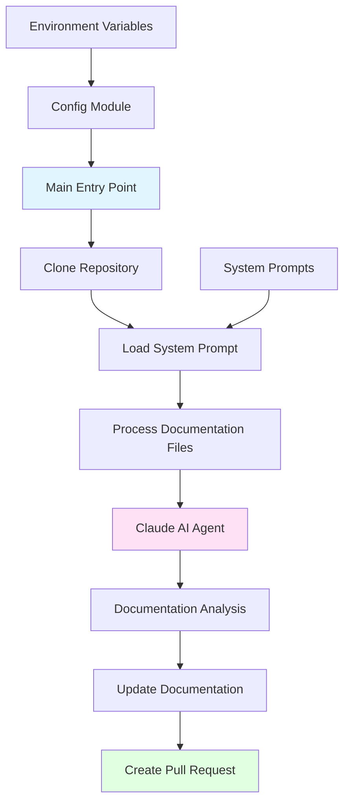
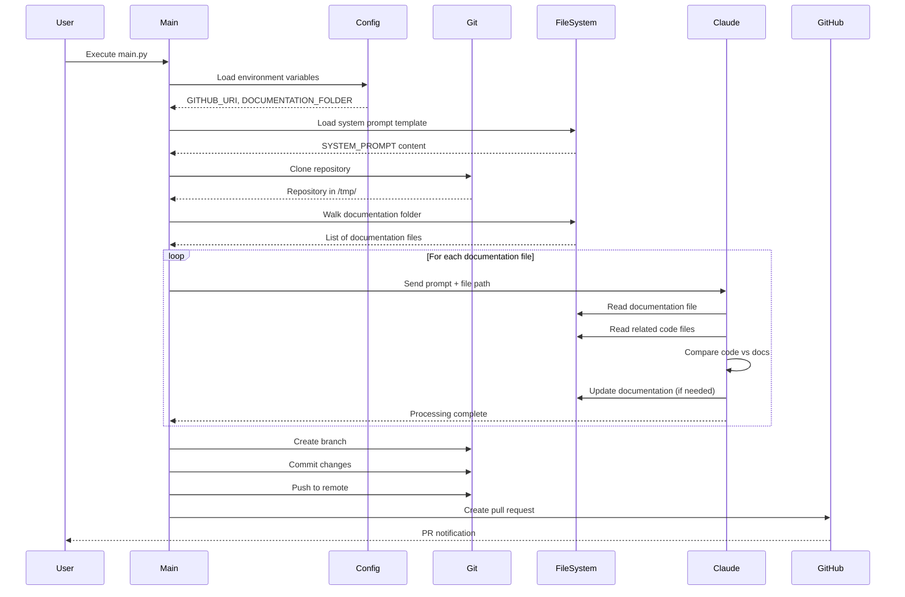

# CodeFlowAI Module Structure

## Table of Contents

1. [Overview](#overview)
2. [High-Level Architecture](#high-level-architecture)
3. [Core Components](#core-components)
4. [Data Flow](#data-flow)
5. [Code Implementation](#code-implementation)
6. [Integration Points](#integration-points)
7. [Configuration](#configuration)
8. [Monitoring and Operations](#monitoring-and-operations)

## Overview

CodeFlowAI is an automated documentation management system designed to maintain synchronised and up-to-date documentation through automated pull requests. The system leverages Claude AI's capabilities via the Claude Code SDK to analyse existing documentation, compare it against the current codebase implementation, and automatically generate pull requests with necessary documentation updates.

**Key Characteristics:**

- **Modular Python Architecture**: Clean separation of concerns across configuration, system prompts, and core processing logic
- **Asynchronous Processing**: Built on Python's asyncio for efficient concurrent documentation processing
- **Git-Integrated Workflow**: Automated repository cloning, branching, and pull request creation
- **AI-Powered Validation**: Uses Claude AI to intelligently validate and update documentation
- **Environment-Based Configuration**: Flexible configuration through environment variables and .env files

## High-Level Architecture



**Architectural Decisions:**

1. **Single Entry Point Design**: The `main.py` module serves as the sole entry point, orchestrating the entire workflow from repository cloning to pull request creation.

2. **Configuration Isolation**: Environment-specific settings are isolated in the `config` module, enabling easy deployment across different environments without code changes.

3. **Prompt-Based AI Integration**: System prompts are stored as text files rather than hardcoded, allowing non-developers to modify AI behaviour without touching Python code.

4. **Stateless Processing**: Each documentation file is processed independently, enabling parallel processing and failure isolation.

## Core Components

The CodeFlowAI system is organised into a hierarchical module structure with clear separation of responsibilities:

### 1. Root Module (`src/`)

The top-level source directory containing all application code. This module does not contain `__init__.py`, indicating it follows a namespace package structure.

**Location**: `/src/`

**Purpose**: Organises all source code into logical submodules for configuration, prompts, and main application logic.

### 2. Main Application Module (`src/main.py`)

The primary orchestration module responsible for coordinating the entire documentation update workflow.

**Key Responsibilities:**
- Repository cloning and cleanup
- System prompt loading and injection
- Documentation file discovery and iteration
- Claude AI agent invocation
- Git operations (branching, committing, pushing)
- Pull request creation via GitHub CLI

**Entry Functions:**
- `main()`: Primary async entry point
- `clone_repo()`: Repository management
- `process_documentation()`: Documentation processing orchestration
- `claude_agent_processor()`: Individual document processing
- `open_pr()`: Pull request creation

### 3. Configuration Module (`src/config/`)

Centralised configuration management module handling all environment-based settings.

**Location**: `/src/config/`

**Components:**
- `env_vars.py`: Environment variable loader and validator

**Configuration Parameters:**
- `GITHUB_URI`: Target repository URL for documentation updates
- `DOCUMENTATION_FOLDER`: Relative path to documentation directory within repository

### 4. System Prompts Module (`src/system_prompts/`)

Contains AI agent instruction templates that define how Claude AI should analyse and update documentation.

**Location**: `/src/system_prompts/`

**Components:**
- `document_updater.txt`: Master prompt template for documentation validation and synchronisation

**Prompt Capabilities:**
- Code-to-documentation comparison logic
- Update decision framework
- Documentation preservation guidelines
- Error reporting protocols

### 5. Tests Module (`tests/`)

Contains unit and integration tests for the application.

**Location**: `/tests/`

**Components:**
- `test_basic.py`: Basic smoke tests and import validation

**Test Coverage:**
- Framework validation
- Module import verification
- Basic functionality testing

### 6. Configuration Files (Root Level)

**Project Configuration:**
- `pyproject.toml`: Poetry dependency and package configuration
- `requirements.txt`: Pip-compatible dependency list
- `poetry.lock`: Locked dependency versions

**Development Configuration:**
- `.gitignore`: Git exclusion patterns
- `.github/workflows/test.yml`: CI/CD pipeline configuration

## Data Flow

The data flow through the CodeFlowAI system follows a linear pipeline with clear transformation stages:



### Data Transformation Stages

**Stage 1: Configuration Loading**
- Input: Environment variables from `.env` or system
- Transformation: String parsing and validation
- Output: Typed configuration constants (`GITHUB_URI`, `DOCUMENTATION_FOLDER`)

**Stage 2: System Prompt Preparation**
- Input: Text file from `src/system_prompts/document_updater.txt`
- Transformation: File reading, codebase path injection
- Output: Complete prompt string with embedded codebase context

**Stage 3: Repository Acquisition**
- Input: GitHub repository URI
- Transformation: Git clone operation to temporary directory
- Output: Local filesystem copy of repository

**Stage 4: Documentation Discovery**
- Input: Documentation folder path
- Transformation: Recursive directory traversal
- Output: List of documentation file paths

**Stage 5: AI Processing**
- Input: Documentation file path, system prompt, codebase access
- Transformation: Claude AI analysis and optional file updates
- Output: Updated documentation files (if discrepancies found)

**Stage 6: Pull Request Creation**
- Input: Modified documentation files
- Transformation: Git add, commit, push, PR creation
- Output: GitHub pull request with documentation changes

## Code Implementation

This section provides detailed code flows tracing the complete execution path from application startup to pull request creation.

### Entry Point and Initialisation

The application begins execution in the `main.py` module when run as a script:

**File: `src/main.py`**
```python
if __name__ == "__main__":
    asyncio.run(main())
```

**Explanation:** The standard Python entry point checks if the module is being run directly (not imported) and executes the async `main()` function using asyncio's run method.

---

**File: `src/main.py`**
```python
async def main() -> None:
    clone_repo()
    await process_documentation()
```

**Explanation:** The main function orchestrates the two primary phases: repository cloning (synchronous) and documentation processing (asynchronous).

### System Prompt Loading

Before any processing occurs, the system prompt is loaded from the filesystem at module import time:

**File: `src/main.py`**
```python
project_root = Path(__file__).resolve().parent.parent
prompt_file = project_root / "src" / "system_prompts" / "document_updater.txt"

try:
    with open(prompt_file, "r", encoding="utf-8") as f:
        SYSTEM_PROMPT = f.read()
    print(f"Successfully loaded system prompt from {prompt_file}")
except FileNotFoundError as e:
    raise FileNotFoundError(
        f"Critical error: System prompt file not found at {prompt_file}"
    )
except Exception as e:
    raise Exception(f"Critical error reading system prompt file: {e}")
```

**Explanation:** This code resolves the project root directory (two levels up from `main.py`), constructs the path to the system prompt file, and loads it into memory. If the file is missing or unreadable, the application fails fast with a descriptive error.

### Configuration Loading

Configuration values are loaded through the config module:

**File: `src/config/env_vars.py`**
```python
import os
from dotenv import load_dotenv

load_dotenv()

GITHUB_URI = os.getenv("GITHUB_URI", "")
DOCUMENTATION_FOLDER = os.getenv("DOCUMENTATION_FOLDER", "")
```

**Explanation:** The `dotenv` library loads environment variables from a `.env` file in the project root. The `os.getenv()` calls retrieve the required configuration values, defaulting to empty strings if not set. These constants are then imported by `main.py`.

---

**File: `src/main.py`**
```python
from config.env_vars import DOCUMENTATION_FOLDER, GITHUB_URI
```

**Explanation:** The main module imports the configuration constants, establishing a dependency on the config module for environment-specific settings.

### Repository Cloning Workflow

The `clone_repo()` function manages the local repository copy:

**File: `src/main.py`**
```python
def clone_repo() -> None:
    global FOLDER
    global SYSTEM_PROMPT

    repo_name = GITHUB_URI.rstrip("/").split("/")[-1]
    if repo_name.endswith(".git"):
        repo_name = repo_name[:-4]

    FOLDER = os.path.join("/tmp", repo_name)

    if os.path.exists(FOLDER):
        subprocess.run(["rm", "-rf", FOLDER], check=True)

    subprocess.run(["git", "clone", GITHUB_URI, FOLDER], check=True)
    print("repo cloned successfully")
    SYSTEM_PROMPT += f"""
\nHere is the codebase path where you should look for the relevant code files:
<codebase_path>
{FOLDER}
</codebase_path>
"""
```

**Explanation:** This function performs several operations:
1. Extracts the repository name from the GitHub URI by splitting on "/" and removing the ".git" suffix if present
2. Constructs a path in `/tmp/` for the cloned repository
3. Removes any existing directory at that path to ensure a clean clone
4. Executes `git clone` via subprocess to clone the repository
5. Augments the system prompt with the codebase path, enabling Claude AI to locate source files

The use of global variables (`FOLDER` and `SYSTEM_PROMPT`) allows these values to be shared across functions without parameter passing.

### Documentation Processing Pipeline

The asynchronous documentation processing begins after repository cloning:

**File: `src/main.py`**
```python
async def process_documentation() -> None:
    global CLAUDE_OPTIONS

    CLAUDE_OPTIONS = ClaudeCodeOptions(
        allowed_tools=["Read", "Write"], permission_mode="acceptEdits", cwd=FOLDER
    )
    documentation_path = os.path.join(FOLDER, DOCUMENTATION_FOLDER)

    if not os.path.exists(documentation_path):
        raise FileNotFoundError(f"Documentation folder not found: {documentation_path}")

    for root, _, files in os.walk(documentation_path):
        for file in files:
            file_path = os.path.join(root, file)
            await claude_agent_processor(file_path)
```

**Explanation:** This function:
1. Configures the Claude Code SDK with restricted tool access (only Read and Write) and enables automatic acceptance of edits
2. Constructs the full path to the documentation folder within the cloned repository
3. Validates that the documentation folder exists
4. Recursively walks the documentation directory tree
5. Processes each file asynchronously using the Claude agent

The `ClaudeCodeOptions` configuration is crucial for security and functionality:
- `allowed_tools=["Read", "Write"]`: Restricts the AI agent to only reading files and writing updates
- `permission_mode="acceptEdits"`: Automatically accepts file modifications without manual approval
- `cwd=FOLDER`: Sets the working directory to the cloned repository

### Individual Document Processing

Each documentation file is processed through the Claude AI agent:

**File: `src/main.py`**
```python
async def claude_agent_processor(doc: str) -> None:
    prompt = f"""{SYSTEM_PROMPT}

Here is the documentation file that you need to analyze:
<documentation>
{doc}
</documentation>
"""
    try:
        async for message in query(prompt=prompt, options=CLAUDE_OPTIONS):
            print(message)
    except Exception as e:
        print(f"Error processing {doc}: {e}")
```

**Explanation:** This function:
1. Constructs a complete prompt by combining the system prompt (loaded at module initialisation) with the specific documentation file path
2. Invokes the Claude Code SDK's `query()` function asynchronously
3. Streams responses from the AI agent and prints them to stdout
4. Catches and logs any exceptions during processing without halting the entire workflow

The `query()` function from the Claude Code SDK returns an async iterator, allowing real-time streaming of the AI's analysis and actions.

### Pull Request Creation Workflow

After all documentation has been processed, the system creates a pull request if changes were made:

**File: `src/main.py`**
```python
def open_pr():
    """
    open a pull request with the doc changes
    """
    now = datetime.datetime.now()
    branch_name = f"docu-jarvis{now.day:02d}{now.month:02d}{now.year}{now.hour:02d}{now.minute:02d}"

    try:
        os.chdir(FOLDER)

        subprocess.run(["git", "config", "user.name", "Docu Jarvis"], check=True)
        subprocess.run(
            ["git", "config", "user.email", "docu-jarvis@automation.local"], check=True
        )
        subprocess.run(["git", "checkout", "-b", branch_name], check=True)
        subprocess.run(["git", "add", DOCUMENTATION_FOLDER + "/"], check=True)
        result = subprocess.run(
            ["git", "diff", "--cached", "--quiet"], capture_output=True
        )
        if result.returncode == 0:
            print("No changes to commit in documentation directory")
            return
        commit_message = "docs: automated documentation improvements by docu-jarvis"
        subprocess.run(["git", "commit", "-m", commit_message], check=True)
        print(f"Pushing branch: {branch_name}")
        subprocess.run(["git", "push", "origin", branch_name], check=True)

        pr_title = "Documentation Update"
        pr_description = "Automated docu-jarvis suggestions"

        subprocess.run(
            [
                "gh",
                "pr",
                "create",
                "--title",
                pr_title,
                "--body",
                pr_description,
                "--head",
                branch_name,
                "--base",
                "main",
            ],
            check=True,
        )

        print(f"Successfully created PR with branch: {branch_name}")

    except subprocess.CalledProcessError as e:
        raise Exception(f"Error creating PR: {e}")
    except Exception as e:
        raise Exception(f"Unexpected error: {e}")
    finally:
        os.chdir(project_root)
```

**Explanation:** This comprehensive function handles the entire Git workflow:

1. **Branch Naming**: Generates a unique branch name using the current date and time in the format `docu-jarvisDDMMYYYYHHMM`

2. **Git Configuration**: Sets the git user name and email for the commit author (important for automated commits)

3. **Branch Creation**: Creates and checks out a new branch for the documentation changes

4. **Staging Changes**: Adds all files in the documentation folder to the staging area

5. **Change Detection**: Uses `git diff --cached --quiet` to check if there are any staged changes. Returns early if no changes exist.

6. **Committing**: Creates a commit with a conventional commit message following the "docs:" prefix convention

7. **Pushing**: Pushes the branch to the origin remote

8. **Pull Request Creation**: Uses the GitHub CLI (`gh`) to create a pull request against the main branch

9. **Cleanup**: The `finally` block ensures the working directory is restored to the project root, even if an error occurs

**Note:** This function is currently defined but not called in the `main()` workflow, suggesting it may be invoked separately or is planned for future integration.

### System Prompt Structure

The system prompt defines the AI agent's behaviour and responsibilities:

**File: `src/system_prompts/document_updater.txt`**
```
You are a code validation and synchronization agent. Your task is to read a documentation file, analyze the related code in the codebase, and ensure the code matches what is described in the documentation. If the code has changed since the documentation was written, you should update the documentation specifications to match the code.

Follow these steps to complete the task:

1. **Analyze the documentation**: Read through the documentation file and identify:
   - What code files, functions, classes, or modules are being documented
   - The expected behavior, interfaces, parameters, return values, and implementation details described
   - Any code examples or specifications provided

2. **Locate the relevant code**: Based on the documentation, identify and examine the actual code files in the provided codebase path that correspond to what is documented.

3. **Compare documentation vs. code**: Determine if the current code implementation matches what is described in the documentation.

4. **Take appropriate action**:
   - If the code matches the documentation: No changes needed
   - If the code differs from the documentation: Update the documentation specifications to match the code
   - Do NOT modify the code files under any circumstances
```

**Explanation:** This prompt establishes a clear validation and synchronisation workflow, ensuring the AI agent:
- Never modifies source code (only documentation)
- Follows a systematic analysis process
- Updates documentation to match code reality rather than vice versa
- Preserves documentation structure and style

### Testing Infrastructure

The test module provides basic validation of the application:

**File: `tests/test_basic.py`**
```python
def test_basic():
    """A simple test to verify pytest is working."""
    assert True


def test_imports():
    """Test that core modules can be imported."""
    try:
        import sys
        from pathlib import Path

        # Add src to path
        src_path = Path(__file__).parent.parent / "src"
        sys.path.insert(0, str(src_path))

        # Try importing main module
        import main
        assert True
    except ImportError as e:
        # If main.py has dependencies that aren't met, that's okay for now
        assert True
```

**Explanation:** The test suite includes:
1. A basic smoke test to ensure pytest is functioning
2. An import test that validates the main module can be loaded, with graceful handling of missing dependencies

The import test modifies `sys.path` to include the `src` directory, enabling imports of application modules without package installation.

## Integration Points

CodeFlowAI integrates with several external systems and services:

### 1. Claude AI via Claude Code SDK

**Integration Type**: Python SDK
**Module**: `claude-code-sdk`
**Configuration**: Programmatic via `ClaudeCodeOptions`

**Purpose**: Provides AI-powered code analysis and documentation updating capabilities.

**Key Functions Used:**
- `query()`: Async function for sending prompts to Claude and receiving streaming responses
- `ClaudeCodeOptions`: Configuration object for controlling agent behaviour

**Authentication**: The Claude Code SDK handles authentication internally, typically via API keys in environment variables.

**Data Exchange Format**:
- Input: String prompts with embedded XML-style tags
- Output: Async iterator of string messages

### 2. GitHub

**Integration Type**: Git protocol + GitHub CLI
**Tools**: `git` command-line tool, `gh` CLI

**Purpose**: Repository cloning, branch management, and pull request creation.

**Operations:**
- **Clone**: `git clone <GITHUB_URI> <FOLDER>`
- **Configure**: `git config user.name/user.email`
- **Branch**: `git checkout -b <branch_name>`
- **Stage**: `git add <DOCUMENTATION_FOLDER>/`
- **Commit**: `git commit -m <message>`
- **Push**: `git push origin <branch_name>`
- **PR Creation**: `gh pr create --title <title> --body <body> --head <branch> --base main`

**Authentication**:
- Git operations: SSH keys or HTTPS credentials
- GitHub CLI: OAuth token (configured via `gh auth login`)

### 3. Environment Configuration

**Integration Type**: Environment variables
**Module**: `python-dotenv`

**Purpose**: Externalise configuration for different deployment environments.

**Variables:**
- `GITHUB_URI`: Target repository URL
- `DOCUMENTATION_FOLDER`: Path to documentation directory

**Loading Mechanism**: The `dotenv` library searches for a `.env` file in the project root and loads variables into `os.environ`.

### 4. File System

**Integration Type**: Direct OS interaction
**Modules**: `os`, `pathlib`, `subprocess`

**Purpose**: Reading prompts, walking directory trees, and managing temporary files.

**Operations:**
- Recursive directory traversal via `os.walk()`
- File reading with UTF-8 encoding
- Temporary directory usage in `/tmp/`
- Subprocess execution for Git commands

### 5. CI/CD via GitHub Actions

**Integration Type**: Workflow automation
**Configuration File**: `.github/workflows/test.yml`

**Purpose**: Automated testing on push and pull request events.

**Workflow Steps:**
1. Checkout repository
2. Set up Python 3.11
3. Install dependencies from `requirements.txt`
4. Run pytest

**Triggers:**
- Push to `main` branch
- Pull requests targeting `main` branch

## Configuration

CodeFlowAI uses a multi-layered configuration approach combining environment variables, configuration files, and code constants.

### Environment Variables

Environment variables are the primary configuration mechanism, loaded via the `python-dotenv` library.

**Configuration File**: `.env` (not tracked in git)

**Required Variables:**

| Variable | Type | Description | Example |
|----------|------|-------------|---------|
| `GITHUB_URI` | String | Full URL of target GitHub repository | `https://github.com/username/repo.git` |
| `DOCUMENTATION_FOLDER` | String | Relative path to documentation directory within repository | `documentation` or `docs` |

**Loading Mechanism:**

**File: `src/config/env_vars.py`**
```python
from dotenv import load_dotenv

load_dotenv()

GITHUB_URI = os.getenv("GITHUB_URI", "")
DOCUMENTATION_FOLDER = os.getenv("DOCUMENTATION_FOLDER", "")
```

**Default Behaviour**: If variables are not set, they default to empty strings, which will cause runtime errors when used. This fail-fast approach ensures misconfiguration is caught early.

### Python Package Configuration

**File**: `pyproject.toml`

**Package Manager**: Poetry (primary) with pip fallback via `requirements.txt`

**Key Configuration Sections:**

```toml
[project]
name = "documentation-updater"
version = "0.1.0"
requires-python = ">=3.12"
dependencies = [
    "dotenv (>=0.9.9,<0.10.0)",
    "isort (>=6.0.1,<7.0.0)",
    "claude-code-sdk (>=0.0.23,<0.0.24)"
]

[tool.poetry.group.dev.dependencies]
black = "^25.1.0"
```

**Dependency Management:**
- **Production Dependencies**: `python-dotenv`, `isort`, `claude-code-sdk`, `pytest`, `black`
- **Development Dependencies**: `black` for code formatting
- **Python Version Requirement**: Python 3.12 or higher

**Installation:**
```bash
# Using Poetry (recommended)
poetry install

# Using pip
pip install -r requirements.txt
```

### Git Configuration

**File**: `.gitignore`

Defines patterns for files that should not be tracked in version control:

```
# Sensitive configuration
.env
.env.*

# Python artifacts
__pycache__/
*.py[cod]
*.pyo

# Virtual environments
.venv/
env/
venv/

# IDE files
.vscode/
.idea/
```

**Key Exclusions:**
- Environment files containing secrets
- Python bytecode and cache files
- Virtual environment directories
- IDE-specific configuration

### Claude Code SDK Configuration

**Location**: `src/main.py`
**Configuration Object**: `ClaudeCodeOptions`

```python
CLAUDE_OPTIONS = ClaudeCodeOptions(
    allowed_tools=["Read", "Write"],
    permission_mode="acceptEdits",
    cwd=FOLDER
)
```

**Parameters:**
- `allowed_tools`: Restricts the AI agent to Read and Write operations only (prevents execution of arbitrary commands)
- `permission_mode`: Set to `"acceptEdits"` to automatically approve file modifications
- `cwd`: Working directory for file operations (set to the cloned repository path)

### Runtime Configuration

**System Prompt Path**: Constructed at runtime in `src/main.py`:

```python
project_root = Path(__file__).resolve().parent.parent
prompt_file = project_root / "src" / "system_prompts" / "document_updater.txt"
```

**Temporary Directory**: Uses `/tmp/` for cloned repositories with dynamic naming based on repository name.

### CI/CD Configuration

**File**: `.github/workflows/test.yml`

**Key Settings:**
- **Python Version**: 3.11 (note: differs from package requirement of 3.12)
- **Triggers**: Push and PR events on `main` branch
- **Test Command**: `pytest`
- **Dependency Installation**: Via `requirements.txt`

## Monitoring and Operations

### Logging Strategy

CodeFlowAI uses basic console logging via Python's built-in `print()` function. All operational messages are written to stdout/stderr.

**Key Log Points:**

**File: `src/main.py`**

1. **System Prompt Loading:**
```python
print(f"Successfully loaded system prompt from {prompt_file}")
```

2. **Repository Cloning:**
```python
print("repo cloned successfully")
```

3. **Document Processing:**
```python
async for message in query(prompt=prompt, options=CLAUDE_OPTIONS):
    print(message)
```

4. **Error Handling:**
```python
print(f"Error processing {doc}: {e}")
```

5. **PR Creation:**
```python
print(f"Pushing branch: {branch_name}")
print(f"Successfully created PR with branch: {branch_name}")
```

6. **No Changes Detection:**
```python
print("No changes to commit in documentation directory")
```

**Log Levels**: The current implementation does not use structured logging levels (DEBUG, INFO, WARN, ERROR). All messages are informational.

**Log Aggregation**: In production deployments, stdout/stderr should be redirected to a log aggregation system (e.g., CloudWatch, ELK stack, or similar).

### Error Handling

The application employs defensive error handling at critical points:

**File: `src/main.py`**

1. **System Prompt Loading Failure:**
```python
try:
    with open(prompt_file, "r", encoding="utf-8") as f:
        SYSTEM_PROMPT = f.read()
except FileNotFoundError as e:
    raise FileNotFoundError(
        f"Critical error: System prompt file not found at {prompt_file}"
    )
except Exception as e:
    raise Exception(f"Critical error reading system prompt file: {e}")
```

**Behaviour**: Fail fast at startup if system prompt is missing or unreadable.

2. **Documentation Folder Validation:**
```python
if not os.path.exists(documentation_path):
    raise FileNotFoundError(f"Documentation folder not found: {documentation_path}")
```

**Behaviour**: Abort processing if the configured documentation folder doesn't exist in the cloned repository.

3. **Document Processing Errors:**
```python
try:
    async for message in query(prompt=prompt, options=CLAUDE_OPTIONS):
        print(message)
except Exception as e:
    print(f"Error processing {doc}: {e}")
```

**Behaviour**: Log error and continue processing remaining files (fault isolation).

4. **PR Creation Errors:**
```python
try:
    # ... git operations ...
except subprocess.CalledProcessError as e:
    raise Exception(f"Error creating PR: {e}")
except Exception as e:
    raise Exception(f"Unexpected error: {e}")
finally:
    os.chdir(project_root)
```

**Behaviour**: Ensure working directory is restored even if PR creation fails.

### Health Checks

**Application Health**: No built-in health check endpoints exist. The application is designed as a batch job rather than a long-running service.

**Dependency Health:**
- Git availability: Implicitly checked when subprocess commands execute
- GitHub CLI availability: Checked during PR creation
- File system access: Validated during system prompt loading

**Exit Codes**: The application uses Python's default exit code behaviour:
- `0`: Successful execution
- `1`: Unhandled exception occurred

### Operational Considerations

**Deployment Model**: Designed to run as a scheduled job or CI/CD workflow rather than a continuous service.

**Resource Usage:**
- **Disk Space**: Requires temporary space in `/tmp/` for full repository clone
- **Memory**: Minimal; processes one documentation file at a time
- **Network**: Requires outbound HTTPS access to GitHub and Claude AI API
- **CPU**: Light computational requirements; most time spent waiting for I/O and API responses

**Scalability Considerations:**
- Single-threaded repository cloning (could be parallelised for multiple repositories)
- Sequential document processing (could be parallelised with `asyncio.gather()`)
- Stateless design enables horizontal scaling across multiple repositories

**Security Considerations:**
1. **Credentials Management**: Relies on environment variables; should use secure secret storage in production
2. **Repository Access**: Requires read/write access to target repositories
3. **AI Agent Permissions**: Restricted to Read/Write operations via `allowed_tools` configuration
4. **Subprocess Injection**: Uses subprocess with list arguments (safe from shell injection)
5. **Temporary File Cleanup**: Uses `/tmp/` but includes cleanup logic before cloning

**Maintenance Tasks:**
- Monitor Claude Code SDK version for security updates
- Regularly update Python dependencies
- Review and update system prompts based on documentation quality feedback
- Monitor GitHub API rate limits if running frequently

**Disaster Recovery:**
- Repository state: Immutable; can re-clone at any time
- Documentation changes: Tracked in Git; can be reverted via standard Git operations
- No persistent state to back up

**Metrics to Monitor:**
- Documentation processing success/failure rate
- Average processing time per document
- Pull request creation rate
- Claude AI API response times and error rates
- Git operation failures
